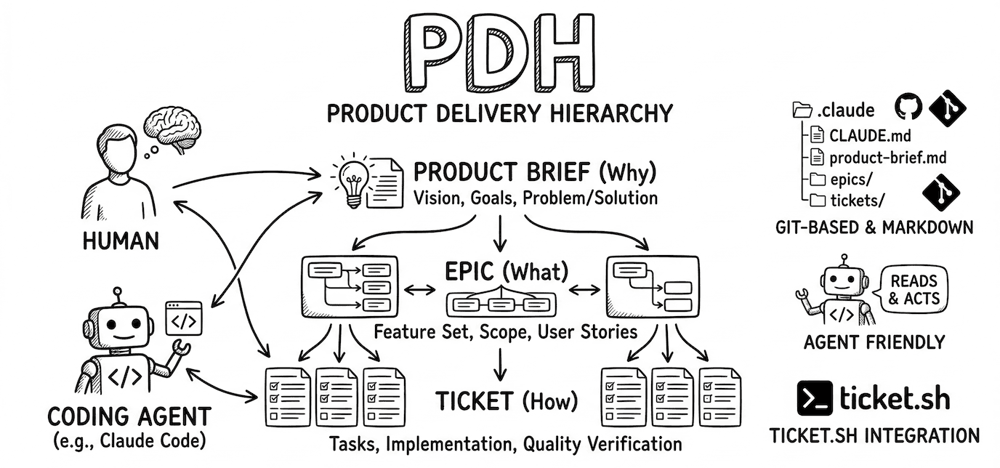

# PDH — Product Delivery Hierarchy

Product Brief / Epic / Ticket の 3 層で、**なぜ作るか**・**何を作るか**・**いま何をやるか** を構造化する仕組み。

人間と coding agent（Claude Code 等）の両方が読み、同じ文脈の中でプロダクトの方向性から日々の実装作業までを追跡する。

## 特徴

- **3 層構造**: Product Brief（why）→ Epic（what）→ Ticket（how）
- **Coding agent 対応**: Agent が読んで判断・実装できるように設計
- **Git ベース**: すべて Markdown ファイル。特別なツールは不要
- **ticket.sh 連携**: [ticket.sh](https://github.com/masuidrive/ticket.sh) でチケットのライフサイクルを管理

## セットアップ

Claude Code にこのリポジトリの内容を読ませて、自分のプロジェクトに PDH を導入できる。

### 方法 1: Claude Code に設定させる

プロジェクトのルートで Claude Code を起動し、以下のように指示する:

```
https://github.com/masuidrive/pdh の README を読んで、このプロジェクトに PDH を導入して。
```

Claude Code が以下を自動で行う:
1. ticket.sh のダウンロードと初期化
2. PDH ドキュメントの配置
3. スキル・CLAUDE.md・ticket-config の設定
4. Product Brief の雛形作成

### 方法 2: 手動でセットアップ

#### 0. PDH リポジトリを clone する

```bash
git clone https://github.com/masuidrive/pdh.git tmp/pdh
```

以降のステップでは `tmp/pdh/` のファイルをコピー元として使う。

#### 1. ticket.sh を導入する

```bash
# プロジェクトのルートで
git init  # 既存リポジトリなら不要

# ticket.sh をダウンロード・初期化
curl -sL https://raw.githubusercontent.com/masuidrive/ticket.sh/main/ticket.sh -o ticket.sh
chmod +x ticket.sh
bash ticket.sh init

# epics ディレクトリを作成
mkdir -p epics epics/done
```

#### 2. ファイルを配置する

以下のファイルを `tmp/pdh/` からプロジェクトにコピーする。
**すでにファイルが存在する場合はコピーせず、ステップ 3 のアップデート手順に従う。**

| コピー元 | コピー先 | 用途 |
|---|---|---|
| `tmp/pdh/docs/product-delivery-hierarchy.md` | `docs/product-delivery-hierarchy.md` | PDH 運用ルール・テンプレート |
| `tmp/pdh/skills/pdh-dev/SKILL.md` | `.claude/skills/pdh-dev/SKILL.md` | PDH ワークフロースキル |
| `tmp/pdh/skills/epic-creator/SKILL.md` | `.claude/skills/epic-creator/SKILL.md` | Epic 作成スキル |
| `tmp/pdh/skills/tmux-director/SKILL.md` | `.claude/skills/tmux-director/SKILL.md` | tmux Director スキル |
| `tmp/pdh/skills/pdh-update/SKILL.md` | `.claude/skills/pdh-update/SKILL.md` | PDH アップデートスキル |
| `tmp/pdh/templates/CLAUDE.md` | `CLAUDE.md` | Agent 向けルール |
| `tmp/pdh/templates/.ticket-config.yaml` | `.ticket-config.yaml` | ticket.sh 設定 |
| `tmp/pdh/templates/test-all.sh` | `scripts/test-all.sh` | テスト一括実行スクリプト |
| `tmp/pdh/templates/product-brief.md` | `product-brief.md` | Product Brief テンプレート |

コピー時に、各ファイル末尾の `based on` 行の `XXXXXXX` を `tmp/pdh` の HEAD commit ID（7 桁）に置換する。

```bash
COMMIT_ID=$(cd tmp/pdh && git rev-parse --short=7 HEAD)
# 例: sed -i '' "s/XXXXXXX/$COMMIT_ID/g" CLAUDE.md
```

#### 2.5. .claude/settings.json を設定する

Agent Teams を使うために、`.claude/settings.json` に以下を追加する:

```json
{
  "teammateMode": "in-process",
  "env": {
    "CLAUDE_CODE_EXPERIMENTAL_AGENT_TEAMS": "1"
  }
}
```

設定後、Claude Code を再起動すると有効になる。

#### 3. 既存ファイルのアップデート

すでにファイルが存在し、末尾に `based on` 行がある場合:

1. PDH リポジトリを clone する（なければ）:
   ```bash
   git clone https://github.com/masuidrive/pdh.git tmp/pdh
   ```
2. `based on` の URL から旧 commit ID を特定する
3. `tmp/pdh` で旧 commit ID と最新の間のテンプレート差分を取得する:
   ```bash
   cd tmp/pdh && git diff <旧commit-id> HEAD -- <テンプレートファイルパス>
   ```
4. 差分をカスタマイズ済みファイルに反映する（ユーザーの変更を保持しつつ、テンプレートの更新を取り込む）
5. `based on` 行の commit ID を最新に更新する
6. 変更点をまとめてユーザに報告する
7. AskUserQuestion で「既存の Epic や Ticket を新しいフォーマット・ルールに合わせて書き直すか？」を確認する。OK なら `epics/` と `tickets/` のファイルを新テンプレートに従って更新し、commit 前に変更点をユーザに伝えて確認を取る
8. 後片付け: `rm -rf tmp/pdh`

#### 4. CLAUDE.md をカスタマイズする

- `## ディレクトリ構造` をプロジェクトの実際の構造に書き換える
- テストコマンド（`uv run pytest`, `npm test` 等）をプロジェクトに合わせる
- 開発サーバーの起動方法を追記する

#### 5. .ticket-config.yaml をカスタマイズする

設定項目:
- `default_branch`: メインブランチ名（default: `main`）
- `branch_prefix`: feature ブランチのプレフィックス（default: `feature/`）
- `auto_push`: close 時に自動 push するか
- `default_content`: Ticket テンプレート（Why / What / Acceptance Criteria + 任意: Implementation Notes / Dependencies）
- `note_content`: 作業メモテンプレート（PD-2〜PD-7 等のセクション）

#### 6. scripts/test-all.sh を作成する

`tmp/pdh/templates/test-all.sh` をコピーし、プロジェクトのテストスイートに合わせてカスタマイズする。
テンプレート内のコメントアウトされた `run` 行を参考に、プロジェクトの各テストスイートを追加する。

```bash
cp tmp/pdh/templates/test-all.sh scripts/test-all.sh
chmod +x scripts/test-all.sh
# scripts/test-all.sh を編集し、プロジェクトのテストコマンドを追加
```

このスクリプトは PD-C-6（実装完了時）と PD-C-9（完了検証）で実行される。
`--parallel` フラグで並列実行が可能。

#### 7. Product Brief を書く

- **ファイルがない場合**: `tmp/pdh/templates/product-brief.md` をコピーし、`based on` 行の commit ID を置換する。内容を埋めるようユーザに促す
- **ファイルがある場合**: テンプレートと見比べて、新しいセクションが増えていたら追記するようユーザに促す

PDH の全判断は Product Brief を基準にするため、Background / Who / Problem / Solution / Constraints / Done のセクションが十分に記述されている必要がある。

#### 8. 後片付け

```bash
rm -rf tmp/pdh
```

## ワークフロー

```
Product Brief を書く
    ↓
Epic を作成 → レビュー → 確定
    ↓
Epic から Ticket を切り出す
    ↓
Ticket ごとに:
    調査 → 計画 → レビュー → 実装 → 品質検証 → 完了
    ↓
全 Ticket 完了 → Epic クローズ判定
```

詳細は `docs/product-delivery-hierarchy.md` と `skills/pdh-dev/SKILL.md` を参照。

## tmux Director

tmux 上で複数の Claude Code セッションを走らせている場合に、別 window の Claude Code を監督・指示するためのスキル。

- **Director（監督）** として振る舞い、自分ではコードを書かず、別 window の Claude Code に指示を出して作業を監視する
- PDH ワークフロー（PD-1〜PD-8）の遵守を監視し、逸脱（テスト未実行、E2E 省略、AC 未達等）を検知して是正指示を出す
- 画面監視は Sonnet Agent（Monitor）をバックグラウンドで起動して委任し、Director のコンテキストを節約する

Claude Code で `tmux-director` と入力すると起動する。

## ファイル構成

導入後のプロジェクト構造:

```
project-root/
  product-brief.md          ← プロダクトの why（1 つだけ）
  CLAUDE.md                 ← Agent 向けルール
  ticket.sh                 ← チケット管理ツール
  .ticket-config.yaml       ← ticket.sh 設定
  docs/
    product-delivery-hierarchy.md  ← PDH 運用ルール・テンプレート
  epics/
    YYMMDD-hhmmss-slug.md   ← Epic ファイル
    done/                   ← 完了した Epic
  tickets/
    YYMMDD-hhmmss-slug.md   ← Ticket ファイル（ticket.sh が管理）
    done/                   ← 完了した Ticket
  .claude/
    skills/
      pdh-dev/SKILL.md      ← PDH ワークフロースキル
      epic-creator/SKILL.md  ← Epic 作成スキル
      tmux-director/SKILL.md ← tmux Director スキル
      pdh-update/SKILL.md    ← PDH アップデートスキル
```

## このリポジトリの構成

```
pdh/
  README.md                          ← このファイル
  docs/
    product-delivery-hierarchy.md    ← PDH 本体ドキュメント
  skills/
    pdh-dev/SKILL.md                 ← Claude Code 用 PDH スキル
    tmux-director/SKILL.md           ← tmux Director スキル
    pdh-update/SKILL.md              ← PDH アップデートスキル
  templates/
    product-brief.md                 ← Product Brief テンプレート
    CLAUDE.md                        ← CLAUDE.md テンプレート
    test-all.sh                      ← テスト一括実行テンプレート
    .ticket-config.yaml              ← ticket.sh 設定テンプレート
```

## 関連ツール

- [ticket.sh](https://github.com/masuidrive/ticket.sh) — Git ベースのチケット管理
- [Claude Code](https://claude.ai/claude-code) — Anthropic の CLI ツール

## License

Apache License 2.0
