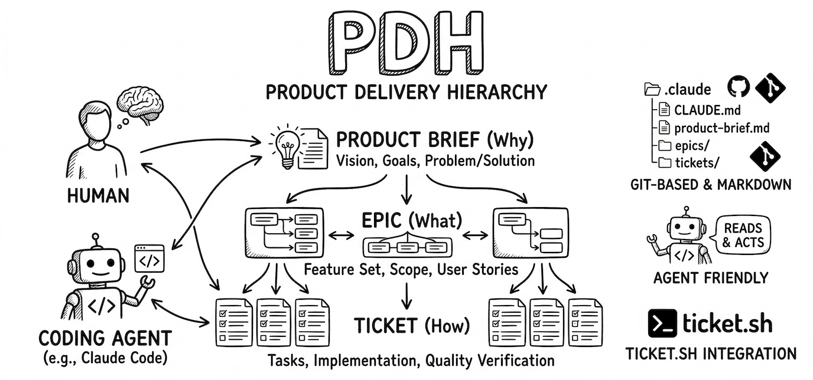

# PDH — Product Delivery Hierarchy

Product Brief / Ticket の 2 層で、**なぜ作るか**・**いま何をやるか**を構造化し、Codex と人間が同じ完了条件を共有するための仕組み。

## 特徴

- **2 層構造**: Product Brief（why）→ Ticket（what + how、1 ticket = 1 work unit）
- **実装前後の gate**: 実装前に ticket contract / AC を人間と合意し、実装後に review / verify / human-review を通す
- **Codex ネイティブ**: `AGENTS.md`、`.agents/skills/`、`.codex/agents/`をそのまま使う
- **Git ベース**: 判断・作業記録・証跡を Markdown と Git に残す
- **ticket.sh 連携**: [ticket.sh](https://github.com/masuidrive/ticket.sh) がチケットのライフサイクルを管理する

## 前提条件

| 必須/任意 | ツール | バージョン目安 | 用途 |
|---|---|---|---|
| 必須 | `git` | 2.x+ | バージョン管理、リポジトリ clone |
| 必須 | `curl` | any | ticket.sh ダウンロード |
| 必須 | `bash` | 4.x+ | スクリプト実行 |
| 必須 | [`codex`](https://github.com/openai/codex) | 0.153.4+ | coding agent 本体。`AGENTS.md`、`.agents/skills/`、`.codex/agents/`を使う |

## セットアップ・アップデート

導入と更新は [INSTALL.md](INSTALL.md) に集約している。

- [新規導入](INSTALL.md#新規導入): Codex に任せる方法と手動手順
- [既存プロジェクトのアップデート](INSTALL.md#既存プロジェクトのアップデート): project 固有ファイルを保持しながら PDH 配布物を更新する手順
- [Claude 併用版からの移行](INSTALL.md#claude-併用版からの移行): 旧 `.claude/` 配置と `CLAUDE.md` を退役させる手順

プロジェクトのルートで Codex に次のように指示すれば導入できる。

```text
https://github.com/masuidrive/pdh の INSTALL.md を読んで、このプロジェクトに PDH を導入して。
```

## ワークフロー

```text
Product Brief を書く
    ↓
Ticket を作成する
    ↓
PDH-open: ticket / note / brief を読む
    ↓
PDH-ticket-review: ticket contract を整える
    ↓
PDH-ticket-human-review: 概要・修正点・AC を提示し、承認を得る
    ↓
PDH-implement: 実装する
    ↓
PDH-review: 独立 review と修正を繰り返す
    ↓
PDH-verify: AC 裏取り、surface 確認、テストを行う
    ↓
PDH-human-review: 達成内容をユーザーが確認する
    ↓
PDH-close: 承認後に close する
```

詳細は `docs/product-delivery-hierarchy.md` と `.agents/skills/pdh-dev/SKILL.md` にある。

## Codex のモデル方針

通常の PDH worker は `.codex/agents/pdh-*.toml` に定義された `gpt-5.6-sol` を使う。機械的な確認は `medium`、複雑な実装・review・AC 判定は `high` を既定にする。軽量モデルへの自動 downgrade はしない。

通常モデルで同じ問題に繰り返し失敗した場合や、不可逆な設計判断など最高水準の推論が必要な場合だけ Astra を使う。[Codex の custom agent 設定](https://developers.openai.com/codex/subagents/#custom-agents)では agent ファイルの `model` が spawn 指定より優先されるため、Astra への escalation は Sol 固定の `pdh-*` 定義ではなく、モデルを直接指定できる別 worker として起動する。

## 導入後のファイル構成

```text
project-root/
  AGENTS.md                       ← project 固有の Codex ルール
  AGENTS.local.md                 ← gitignore 済みの環境固有 context（任意）
  AGENTS.local.md.example         ← 環境固有 context のサンプル
  PDH-AGENTS.md                   ← PDH 共通ルール
  product-brief.md                ← プロダクトの why と Architectural Invariants
  technical-reference.md          ← 現在の実装の How
  ticket.sh
  .ticket-config.yaml
  .agents/
    skills/                       ← PDH skill の実体
      pdh-dev/
      pdh-coding/
      pdh-reviewing/
      pdh-verifying/
      pdh-check-writing/
      pdh-update/
      pdh-decision-board/
  .codex/
    agents/                       ← PDH worker の Codex custom agent 定義
  docs/
    product-delivery-hierarchy.md
  tickets/
    YYMMDD-hhmmss-slug/
    done/
  current-ticket/                 ← ticket.sh が作る作業中 ticket への symlink
  scripts/
    test-all.sh
    fast-checks.sh
    checks/
    dev-server.sh
    seed-pdh-verify.sh
    test-ticket-local.sh
```

## このリポジトリの構成

```text
pdh/
  AGENTS.md                        ← PDH repo 固有ルール
  README.md
  INSTALL.md
  product-brief.md
  docs/
    PDH-AGENTS.md                  ← 配布先の PDH-AGENTS.md
    product-delivery-hierarchy.md
  skills/                          ← `.agents/skills/` へコピーする実体
  templates/
    AGENTS.md                      ← project 固有 AGENTS.md の雛形
    AGENTS.local.md.example        ← 環境固有 context のサンプル
    agents/codex/                  ← `.codex/agents/` へコピーする定義
    checks/
    .ticket-config.yaml
    product-brief.md
    technical-reference.md
    test-all.sh
    fast-checks.sh
    dev-server.sh
    seed-pdh-verify.sh
    test-ticket-local.sh
  scripts/
    test-all.sh                    ← この repo 自身の検査入口
    fast-checks.sh
    check-distribution.sh
    check-links.py
    checks/
```

## 関連ツール

- [ticket.sh](https://github.com/masuidrive/ticket.sh) — Git ベースのチケット管理
- [Codex CLI](https://github.com/openai/codex) — PDH を実行する coding agent

## License

Apache License 2.0
