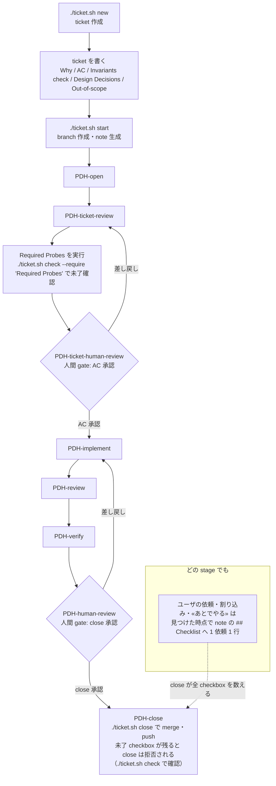

# PDH-AGENTS.md — PDH 汎用 agent ルール

このファイルには、project 間で共有する PDH ルールを置く。配布物なので project 側で書き換えない — project 固有ルールは project の入口ファイル（`CLAUDE.md` または `AGENTS.md`。以下「project ルール」）に置く。

## Stage Flow

`PDH-ticket-review` と `PDH-ticket-human-review` は別の stage である。前者は agent 側の ticket contract check である。後者は実装前の human gate であり、提示する材料は下の Human Gate Materials に従う。`PDH-ticket-human-review` で AC の明示承認を得ないまま実装を始めない。その後の Acceptance Criteria の変更 — 追加・削除・文言変更 — にも、同様に明示のユーザ承認が要る。

`PDH-human-review` は close 前の human gate である。その目的は、coding agent が何をして何を達成したかを、ユーザが自分の期待と突き合わせることにある。明示のユーザ承認なしに `PDH-close` へ進まず、ticket を完了と表現しない。

## Execution Model

利用できる環境では、stage ごとの worker モデルを使う。Coding Engineer、QA、reviewer、AC 裏取り、Surface Observer は、現実的な範囲で別々の worker にする。Director / main agent にとって、worker の PASS は入力であって承認ではない。stage を進める前に、docs・ticket・diff・実コマンド出力・note の証拠を自分で確認する。

reviewer の finding は仮説であり、実装命令ではない。各 finding を採用・保留・棄却のどれにするかは、AC、現在の diff、変更された user journey、実際に出荷された欠陥と同じ根本原因のいずれかへ結び付けて Director が決める。severity ラベルだけでは scope の拡大を正当化できない。現在の ticket と無関係な実在の Critical/Major finding は自動進行を止め、黙って保留せずユーザへ持ち込む。修正後は元の finding とその修正差分だけを再 review し、広い探索 review を繰り返し回さない。修正が永続状態や公開 surface を追加するなら、実装前に削除・棄却・制約の代替案と比較し、より単純な設計を確信を持って選べないときは escalate する。

Director は自身の engine・model・profile・reasoning effort を変更しない。その変更を許可できるのは、現在の作業に対する明示のユーザ指示だけである。worker への model 割り当ては別の話であり、project の方針に従う。

**ユーザに頼まれたことは、着手より先に note の `## Checklist` へ 1 依頼 1 行で書く。**守るのは、**頼まれたことと途中で見つけた宿題が、close までに 1 つも落ちないこと**である。`require_checklist` がこの節の checkbox を数え、**未了が残っている間 close を拒否する**ので、書いた時点から機構が守る。書かなければ何も守らない。

⚠ **engine の task list（Claude Code の task list、Codex の plan）で代用しない。**あちらは **context が切れると消える**が、頼まれたことは消えない。**note へ書いたものだけが compact と session をまたいで残り、close で数えられる。**engine の一覧を併用してよいが、**数えられるのは note の `## Checklist` だけである。**

- **3 つ頼まれたら、まず 3 行書いてから着手する。**
- **作業中に頼まれたことも、手を止めて先に足す。**
- **作業中に «あとでやる» を見つけたら、それも足す。**
- ⚠ **やらないと決めたものを消さない。**`- [-] ... - skip: <理由>` にする。消すと、**判断したのか落としたのかが区別できない。**
- ticket を持たない運用では、同じ形の checklist を持つファイル（repo 直下の `note.md` 等）へ書く。

subagent / worker を起動できないとき、solo 実行を同等のものとして黙って扱わない。確信度や gate の意味に影響する場合は、制約を説明してユーザに確認する。

ユーザが明示的に要求した場合、承認済みの close フローが実行する場合（例: close 時の ticket.sh `auto_push`）、または project ルールが明示的に許可している場合を除き、`git push` しない。

## Worker Instructions

worker / subagent は Director の会話状態全体を引き継がない。すべての worker prompt に次を含める:

- タスクの目的と背景
- 対象ファイルパスまたは担当境界
- ticket の Why・AC・Architectural Invariants check・確定判断・out-of-scope 項目
- その worker の正確な責務と衝突境界
- 実装 worker には、`.agents/skills/pdh-coding/SKILL.md` または `.claude/skills/pdh-coding/SKILL.md` を読む指示
- review worker には、`.agents/skills/pdh-reviewing/SKILL.md` または `.claude/skills/pdh-reviewing/SKILL.md` を読む指示

例外: 無バイアスの Why end-to-end review lens は、ticket file・AC・implementor の結論を意図的に省く。その prompt には Why だけを載せる（pdh-dev skill の review lens 規則を参照）。

複数の worker に重複する書き込み担当を割り当てない。読み取り / review タスクは並行してよいが、書き込みタスクには明確な担当を置く。

## Context Management

context の compact 時や作業の再開時は、現在の ticket id、現在の PDH stage、未解決の懸念、ユーザの判断、明示の承認を保持する。無関係なタスクの間では context をリセットする。広い調査やノイズの多いログ確認は可能なら委譲し、Director が判断とユーザとの対話に足る context を保てるようにする。

## Verification

review と検証のルールは次のとおり:

- **Severity**: Critical は、AC 未達・security 違反・データ喪失の可能性により、未修正のままでは ticket を出荷できないものを指す。Major はこの ticket の user journey を劣化させるものを指す。それ以外は優先度が低く、その扱いは下の Scope boundary で決める。自動的に新 ticket になるのではない。
- **AC trace and over-implementation**: 順方向には、すべての AC **とすべての確定判断**に名指しの実装証拠があることを確かめる。**確定判断を逆方向だけに置かない** — 実装されなかった判断は diff を 1 行も生まないので、diff 起点の対応付けでは原理的に見えない。逆方向には、すべての実質的変更を brief/AC・security・安定性のいずれかへ対応付ける。対応付かないコード、稼働中と記載された dead code、governance の混在、反応的修正による膨張は、欠陥として報告する。Director は、この 3 つの理由のいずれかに当たるコードだけを残し、棄却理由を 1 行記録する。
- **Independent review triggers**: 次の diff では独立 review を省略してはならない — 認証・認可・session/token/scope/ACL/グループ判定。破壊的または不可逆な操作と、そこへ到達する経路。database migration・schema 変更。secret。データ削除。課金。deploy 手順。外部 API contract。新規の公開 surface（新しい endpoint・MCP tool・CLI subcommand）。これらの diff の reviewer は、happy path より先に fail-open と誤用を探す。
- **Cross-model review**: 同じトリガに該当する diff では、review の少なくとも 1 つを生成側と異なる model が行う。一方の review 側が完遂できない場合は、別 model の独立 reviewer に Director 自身の直接コード読解を加えて代替し、その理由を記録する。
- **Rewind discipline**: 実装や review の作業を巻き戻す前に、検出済みのすべての Critical/Major を、ticket の tests ディレクトリ配下の実行可能な `ticket-local-test` として固定する（区別と置き場所は `pdh-coding` skill「テスト設計ルール」）。巻き戻した後は、独立した初回 review をそれらの check と突き合わせ、巻き戻しの理由を記録する。

- **Evidence freshness**: review・AC・test・Surface の証拠は、正確な commit SHA に結び付ける。後からの変更は、それが影響しうる証拠を無効化する。ブラウザ検証は実際の実行時構成（dev server・共有 shell / styles・認証・seed）で行い、切り離した renderer の代用では行わない。reviewer の prompt には review 対象の commit SHA を明記し、reviewer はその SHA を読む。review の実行中に、review 対象の ref へ commit しない。ref が動いたら、その review 結果は無効であり、修正差分に対して再実行する。
- **Scope boundary**: 次のいずれかに当たるとき、finding は現在の ticket に留める — 未修正のままでは AC 未達になる。現在の diff が退行を起こした。同じ根本原因が、実際に出荷された欠陥を再発させうる。Critical/Major finding のせいで、この ticket が変更した / 必要とする user journey が review に耐えない。finding がこの ticket の Why を共有していて、直すことが ticket を広げるのではなく完成させる。例外には、修正を AC・現在の diff・その共有 Why へ結び付ける note 1 行が要る。Why の共有はいま直す理由である。規模と手間は、それ単独では保留の理由にならない。**いま直すのが既定である。**保留が正当化されるのは、finding が本当に別の問題であり、**かつ**ここで直すと高くつく場合だけ — どちらか片方では足りない。安く直せることは、それ自体がいま直す理由であり、finding が単独の ticket として成立しうる場合でも変わらない。finding の根本原因が同じ形で複数箇所にありうるなら、close 前にその箇所を列挙し、それぞれの処置を記録する。「他にもあるかもしれない」は close できる状態ではない。
- **保留した ticket には、それ自身が存在する理由が要る。**保留はタダではない: 誰も単独では予定に入れない ticket は backlog であって計画ではない。未修正の finding はすべて、ちょうど 1 つの処置へ入れる — **fix now**（いま直す。上の Scope boundary）、**file**（起票する。その Why が単独で成立し、独立した作業単位として予定する価値があり、かつここで直すと高くつく）、**record only**（記録のみ。実在するが、ticket にする価値はなく、いまやりもしない）、**reject**（棄却。誤検出または前提誤り）。実在することは、それ自体では file の理由にならない。独立した単位として正当化できないが、やる価値はある finding は、保留せず現在の ticket で直す。record-only の finding は note に残し、恒久的な地雷である場合は repository の常設リファレンス文書にも残す。record-only の finding には、後から検索できる anchor を少なくとも 1 つ付ける — シンボル名・ファイルパス・endpoint・設定キー。anchor を持てない文面の finding は、後から使うには曖昧すぎる。書き直すか、棄却する。**file** と判定した finding は、現在の ticket が close する前にその ticket を作成し、close 報告でその名前を挙げる。それができないときは record only か fix now を選ぶ — 「あとで起票する」は処置ではない。
- **Human authority**: human gate と product 判断には、明示のユーザ回答が要る。強調表示された / 既定のフォーム選択肢、沈黙、worker の出力は承認ではない。環境固有の制約を、明示承認なしに共有 repository 設定や base branch の変更で解決しない。代わりにローカル設定か一時コマンドを使う。

## Dev Server And Seed

UI / API の検証と human review には `./scripts/dev-server.sh` を使う。

- `--seed` はローカル状態をリセットし、`scripts/seed-pdh-verify.sh` を実行する。
- `--port <port>` は固定ポートを使う。
- `--port` なしのときは、script が空きポートを選ぶ。`--no-localhost` では外部 URL に port が出ないことが多いので、固定 port が要る検証以外では `--port` を省略してよい。
- `--no-localhost` は、project の安全な方法で localhost 以外の review URL を公開する。URL を知れば到達できる公開方式（Quick Tunnel 等）では露出内容を確認し、厳密な認可が要るなら別方式（named tunnel + Access 等）を人間判断にする。

UI / API 検証に再現可能なローカルデータが要るなら、`scripts/seed-pdh-verify.sh` を実装する。seed が不要なら、この hook は no-op の成功にする。現在の検証に対するユーザの明示承認がない限り、この hook から本番データやリモートデータを使わない。

ticket に必要な dev-server / seed の挙動が script と食い違うなら、変更を単発コマンドへ隠さず script を更新する。

## Browser And Surface Checks

UI / ブラウザ surface があるなら、seed 準備の後、`PDH-human-review` の前に、実際の user-case check を回す。`agent-browser` は許容されるブラウザ自動化 CLI である。その CLI は version と環境で変わるので、使う直前に `agent-browser --help` を実行し、現在の環境の help 出力に従う。

check は、共有のページ shell と CSS を含めて、ユーザが受け取るのと同じ合成済みページを実際に動かす。テストした commit SHA を記録する。視覚的な UI では、アプリケーションが対応していれば light と dark の両カラースキームをカバーする。

変種 — theme・locale・権限レベル — を採取するときは、アプリケーション自身が公開する状態を読んで、採取した各 artifact が本当にその変種であることを確かめる。screenshot は常に成功するので、黙って適用に失敗した emulation は、成功したものと見た目が同じになる。2 つの artifact が異なることはその確認にならない: 再描画だけでバイト列は変わるので、ファイルや hash の比較は、一度も適用されなかった変種にも差を報告する。emulation はページ読み込みの前にも適用する — mount 時に一度だけ設定を読むアプリケーションは、開始時の変種を保ち続ける。

HTTP レベルのツール（`curl`、API テスト script）が検証するのはサーバの挙動だけである。ブラウザ surface の証拠としては決して認められない: クライアント側のロジック（drag & drop、FormData の構築、描画、フォーム送信）は、実ブラウザが合成済みページを駆動して初めて動く。現在の環境でブラウザ検証が不可能なら、`curl` で代用して surface を検証済みと報告しない。制約を述べて、ユーザに確認する。

認証が要るなら、human review の前に認証方法を説明する。localhost 以外へ公開するときは、Basic Auth・一時 token・Access・その他 project に適した方法で surface を保護する。secret の値を会話へ貼らない。ユーザがどこで入手または実行できるかを説明する。

## Reporting

ユーザに判断を求めるときの提示形式（何をしたか・何を達成したか・検証の証拠・判断点・選択肢）は `pdh-dev` skill の `_collaboration.md` が定める。human gate の材料は上の Human Gate Materials に従う。

このセッションで該当する test を実行していないのに、動作すると決して報告しない。コマンド不在・依存不足・環境エラーは skip ではなく test 失敗として数える。失敗した test、理由不明の skip、実行できない test が 1 件でもあれば、作業は完了していない。

suite 自身の summary 行を gate の記録へ貼る。結果についての主張で置き換えない。green でない step を免責するには、同じ step を base ref で実行し、そこでも fail することを示すしかない。失敗は無関係だと断言することは免責にならない。

retry でだけ pass した test は、pass・fail・skip と異なる第 4 の結果である。retry-pass は件数と該当 test 名を付けて報告し、green な summary へ決して混ぜ込まない。それが close を block するかは人間が決める — ただし見えない状態にはしない。

疑問・blocker・未決の判断があるとき、または `PDH-human-review` へ至る確かな道筋がないときは、後の gate を待たずに直ちにユーザへ確認する。

## Human Gate Materials

human gate の質は、ユーザが受け取る材料の質まででしかない。ユーザに、agent の推論の再構築、diff の読み直し、足りない材料の請求を求めない。2 つの human gate で承認者が受け取る材料 — 何を主線に置き、何を裏付けに畳むか、回答の返し方 — は `pdh-decision-board` skill が gate ごとに定める（実装前 gate は `ticket-gate.md`、close 前 gate は `close-gate.md`）。

- **note file への記録だけでは gate を満たさない** — note は agent の作業記録であって、届け物ではない。材料は会話そのもの、または 1 つに組み立てた文書（そのリンクかパスを、短い要約とともに会話で渡す）で届ける。
- 必須の材料を用意できないなら、gate を完了として提示するのではなく、その旨と理由を言う。

## Where A Rule Belongs

ルールを追加するときは、次の 4 問に答える。1〜3 が置き場所を、4 が書き方を決める。1〜3 のいずれかの答えが skill を指すなら、skill に置く。

1. **project 固有か、PDH 共通か？** project 固有は project ルールへ。共通は skill か `PDH-AGENTS.md` へ。
2. **常に要るか、特定の状況だけか？** project ルールと `PDH-AGENTS.md` は常に context にある。skill は呼ばれたときだけ読み込まれる。無いと事故が起きるルールだけが、常時読み込みのファイルに載る資格を持つ。
3. **誰が読むか？** 役割を特定できるなら — 実装担当だけ、PM だけ — その役割の skill に属する。
4. **何を守るルールで、それはどこで見られるか？** **どの stage の出口で、誰が何を見ることを守るのかを 1 文で書く。**その 1 文が書けないなら、それはルールではなく手順である — その stage の note checklist へ置く。ルールは**その 1 文を先に、動作を後に**書く。**動作だけで書かれたルールは、動作を省けると読んだ読み手に落とされる。**

同じルールを 2 箇所に書かない。文言を移動したら、移動元に残骸がないか sweep する。

Based on https://github.com/masuidrive/pdh/blob/XXXXXXX/docs/PDH-AGENTS.md
