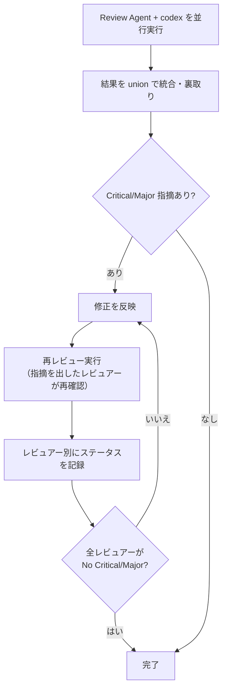

# Epic Creator — Epic 作成 + Ticket 切り出しワークフロー

product-brief.md を基に Epic をドラフト作成し、レビューループで品質を確定させた後、Ticket を切り出す。

## 前提

- **最初に `product-brief.md` を読む**（全判断の基準）
- `docs/product-delivery-hierarchy.md` の Epic テンプレートに従う
- CLAUDE.md の運用ルールに従う
- Epic ファイルは `epics/` に配置する

## ステップ遷移の宣言

ステップを移動するたびに、次の形式でユーザに宣言すること:

```
[PD-A-1] -> [PD-A-2]
```

レビューラウンドは `(N回目)` で表現する:

```
[PD-A-2] -> [PD-A-2(1回目)]     — レビュー実行
[PD-A-2(1回目)] -> [PD-A-2(2回目)] — Critical 修正後の再レビュー
[PD-A-2(2回目)] -> [完了]        — 全レビュアー PASS、Epic 確定
```

省略や暗黙の遷移は禁止。

## フェーズ完了ルール

各フェーズ完了時にコミットする。コミットメッセージは `[フェーズ名] 概要` の形式。

---

## PD-A-1. Epic ドラフト作成

`docs/product-delivery-hierarchy.md` の Epic テンプレートに従い、`epics/` にファイルを作成する。

必須セクション:
- **Outcome**: この Epic が完了すると何ができる状態になるか
- **Problem**: この Epic が直接解く問題
- **Scope**: Outcome を実現するために具体的に作るもの（成果物が分かる粒度で）
- **Non-goals**: この Epic では意図的にやらないこと。AI が「ついでにやりそう」なものを明記
- **Exit Criteria**: この条件を満たしたら閉じる。全 Ticket が閉じても自動では閉じない

任意セクション（必要に応じて追加）:
- **Dependencies** — 他 Epic・外部要因との依存関係
- **Tickets** — Ticket 切り出し後に記載
- **Related Links** — 参考リンク

Epic 固有の事情がある場合は独自セクションを追加してよい（例: Key Design Decisions, Working Rules）。

**ユーザへのインタビュー**: ユーザの依頼が抽象的・大まかな場合は、いきなりドラフトを書かず AskUserQuestion でインタビューする。技術的な実装方針、エッジケース、トレードオフなど、ユーザが考慮していない可能性がある論点を掘り下げる。自明な質問は避け、判断が分かれるポイントに集中する。十分な情報が集まってからドラフトを書く。

**ブランチ戦略の確認**: ドラフト作成前に、AskUserQuestion で Epic ブランチを使うか確認する。基本は `branch: epic/<epic-name>` で Epic ブランチを作成。小規模な改善・hotfix は `branch: main` でもよい。選択結果を frontmatter の `branch` フィールドに記載する。

ドラフト作成後、コミットする（例: `[PD-A-1] Create <epic-name>`）。

---

## PD-A-2. Epic レビューループ

以下を並行実行してレビュー:
- **Devil's Advocate(Sonnet)×2**: Outcome の明確さ、スコープの過不足、Exit Criteria の曖昧さ、product-brief.md との矛盾
- **Engineer(Opus)×1**: 技術的実現可能性、依存関係、規模感
- **codex×1**: 致命的な点のみ指摘

Critical/Major があれば修正し、**全レビュアーが「No Critical/Major」を返すまでループする**（レビューパターン参照）。なければ Epic 確定。

Epic 確定後、コミットする（例: `[PD-A-2] Review <epic-name>`）。

---

## レビューパターン



### レビュアーへの指示ルール

レビュアーを spawn する際、以下を指示に含めること:
- **Epic の目的**: 何を解決するための Epic かを明記する
- 対象ファイル・スコープ
- レビュー観点（ロールごとの責務）
- Critical/Major のみ指摘し、瑣末な点は無視する旨

### レビューループの必須ルール

1. **修正したら必ず再レビューする** — 修正内容を反映した後、Review Agent を再実行して確認する。リードの自己判断だけで「修正したから OK」としない。**ただし、Round N で既に PASS したレビュアーは Round N+1 での再実行は不要**（FAIL したレビュアーのみ再レビュー）
2. **完了条件: 全レビュアーの最新回答が「No Critical/Major」であること** — 一人でも Critical/Major を出していたらループ継続。レビュアーごとのステータスをテーブルで記録する:
   ```
   | レビュアー | 最新回答 | ステータス |
   |---|---|---|
   | DA1 | No Critical/Major | PASS |
   | DA2 | CRITICAL: xxx | FAIL -> 修正後に再レビュー |
   | Engineer1 | No Critical/Major | PASS |
   | codex | No Critical/Major | PASS |
   ```
3. **指摘のクローズ権限はレビュアーにある** — レビュアーが出した指摘は、次の再レビューで **そのレビュアー自身が「解消済み」と回答する** ことでのみクローズできる
4. **レビューループが収束しない場合はユーザに相談する**

### リードの裏取りルール

- **許可される操作（重複排除と事実確認）**:
  - 複数レビュアーの同一指摘を統合する（重複排除）
  - コード上の事実誤認を除外する（例: 存在しないファイルへの指摘）
- **禁止される操作**:
  - 「計画に既記載だから問題ない」という理由での却下
  - リードの判断で指摘の重要度を下げる（Critical -> Minor 等）
  - 「対応済み」とリードが判断してクローズする

### レビュー品質ルール

- LLM レビューは実行ごとに指摘の 6-7 割が入れ替わる。複数回実行して union（和集合）を取る
- Review Agent と codex は並行実行（依存関係なし）
- 検出頻度は「信頼度のヒント」であり「重要度の指標」ではない

### codex レビューコマンド

CLAUDE.md「codex の起動方法」を参照。Bash ツールで `run_in_background` で直接実行する。Agent で wrap しない。

---

## PD-B. Ticket 切り出し

Epic 確定後、Ticket を切り出す。

### PD-B-0. Epic 紐付け確認

Ticket を切る前に、必ずどの Epic に属するかを確認する:

1. ユーザの依頼内容と既存 Epic（`epics/`）のスコープを照合する
2. **合致する Epic がある場合**: その Epic の Ticket として切り出す
3. **合致する Epic がない場合**: AskUserQuestion で以下の選択肢を提示する:
   - 新しい Epic を作成してからチケットを切る（PD-A-1 に戻る）
   - 既存 Epic のスコープに含める
   - 単独チケットとして切る（作業中に発見したバグ修正・小規模改善に限る。Why に経緯を書く）

### PD-B-1. Ticket 作成

Epic の Scope から Ticket を切り出す:
- 各 Ticket は 1 レビュー・1 実装単位の粒度
- `docs/product-delivery-hierarchy.md` の Ticket テンプレートに従う
- Why に Epic へのリンクと、Epic のどの部分を担うかを含める
- Acceptance Criteria はプロダクトの観察可能な振る舞いだけを書く

切り出した Ticket 一覧を AskUserQuestion でユーザに提示し、確認を得てから `./ticket.sh new <slug>` で作成する。

**並行実行のための依存関係明記**: チケット間に依存がある場合は Dependencies に記載する。依存のないチケットは git worktree で別ディレクトリに分離し並行実行できる。

**Epic ファイルの更新**: チケット作成後、Epic ファイルの `Tickets` セクションに作成したチケットを追記する。形式:
```markdown
### Tickets
- [ ] `<ticket-slug>` — <一行説明>
```

Ticket 作成・Epic 更新後、コミットする（例: `[PD-B-1] Cut tickets from <epic-name>`）。

### PD-B-2. Epic + Tickets レビューループ

Ticket 切り出し後、Epic 全体（Outcome・Scope・Exit Criteria）と切り出した Tickets の整合性をレビューする。

以下を並行実行:
- **Devil's Advocate(Sonnet)×2**: Tickets が Epic の Scope を過不足なくカバーしているか、Ticket 間の依存関係に矛盾がないか、各 Ticket の AC が明確か
- **Engineer(Opus)×1**: 各 Ticket の技術的実現可能性、粒度の妥当性（1 レビュー・1 実装単位か）、並行実行可能性
- **codex×1**: 致命的な点のみ指摘

Critical/Major があれば修正し、**全レビュアーが「No Critical/Major」を返すまでループする**（レビューパターン参照）。

レビュー完了後、コミットする（例: `[PD-B-2] Review tickets for <epic-name>`）。

完了後、ユーザに「`/pdh-dev` でチケット開発を開始してください」と促す。

---

## 中止フロー

Epic を中止する場合:
- frontmatter に `cancelled_at` を追加し、本文に中止理由を記録してから `epics/done/` に移動する
- `done/` 内のファイルは消さない。判断の履歴として残す

---
Based on https://github.com/masuidrive/pdh/blob/XXXXXXX/skills/epic-creator/SKILL.md
