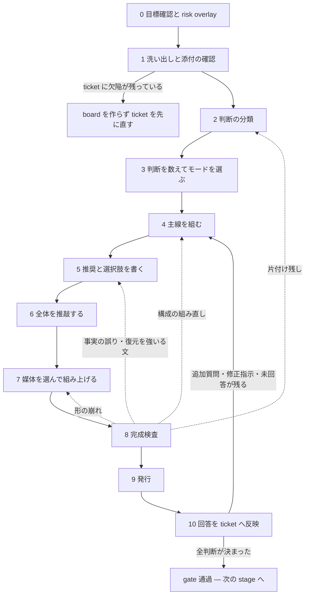

# pdh-decision-board-base

このファイルは、**gate と媒体に依存しない判断ボードの共通規則**である。 gate ごとの差分は次の skill が持ち、どちらもこのファイルを前提とする。

- 実装前 gate（`PDH-ticket-human-review`）— [pdh-ticket-decision-board](../pdh-ticket-decision-board/SKILL.md)
- close 前 gate（`PDH-human-review`）— [pdh-close-decision-board](../pdh-close-decision-board/SKILL.md)

判断ボードを作るときは必ずこのファイルと該当 gate の skill を読み、媒体を選んだ後だけ該当する renderer を読む。**board の文章は [common-writing](../common-writing/SKILL.md) に従う。**

## 判断ボードとは何か

**判断ボードとは、承認者に留保された判断について coding agent が作成する Completed Staff Work （CSW）である。**実装の途中で AC を変える承認は、どちらの gate の対象でもない。

完成条件は 2 つで、対になっている。**片方だけでは完成ではない。**

> **① 承認者が、書き手自身でできたはずの追加調査をせずに、求められた判断を下せる。**
> **② 承認者が、その判断に使わないものを読まされない。**

⚠ **② を落とすと、① だけを満たそうとする力が板を太らせる。**足りない材料は名指しできるので足しやすく、要らない材料は「これは要らない」の判断が要るので落ちにくい。⚠ **① の欠落は独立 reviewer が見つけられるが、② の過剰は見つけられない** — reviewer は読む量のコストを負わないので、長い板を長いと感じない。だから ② は板の側で守る — **gate skill が主線に置くものを閉じたリストで定め、そこに無いものを主線へ置かせない。**

CSW の中核は、書き手が問題を調べ、解決案を完成させ、承認者には承認または指示だけを残すことにある。この board では、不承認の後に何をするかも書き手が用意する。

**この skill の規則は、次の 2 つのどちらかを守るためにある。**どちらも守らない規則は置かない。

1. **判断がゴールへ向かう** — board の判断と推奨が、ticket のゴール（Why と AC）を達成するためのものになる（第 1 部）。
2. **承認者が決められる** — 承認者が追加調査なしで、渡された材料だけで決められる（第 2 部）。

第 3 部は、その 2 つを媒体に載せて検査する形の規則である。

## 手順 — 進行を task list に載せる

board は次の番号の順で作る。ファイル内の節の並びは参照用であって、作る順はこの番号が定める。各節の見出し末尾にある〔手順 n〕が、この番号との対応を示す。



手順 8 から戻れるのは «決められなくする» 指摘と形の崩れだけで、**戻り先は欠陥を持ち込んだ手順である**（点線の辺）。戻ったら、その手順から 8 までを再走し、checklist の該当手順を未完了へ戻す。ticket 自体の欠陥は、どの手順で見つけても board を出ずに ticket を先に直す（gate skill「board と ticket の関係」）。

手順 10 で回答を ticket へ反映したら、終わり方は 2 つ。**追加質問・修正指示・未回答が残るなら**、直した ticket に合わせて board を直し（戻り先は点線と同じ規則で決める）、 8〜9 を再走して**同じ発行先へ再発行する** — 新しい URL・新しいファイルを作らない。**全判断が決まったら gate 通過**で、この skill の仕事は終わり、ticket は次の stage （実装前 gate なら実装、close 前 gate なら close）へ進む。

| 手順 | 定める節 |
|---|---|
| 0 | 「board を作る前に — 目標へ戻る」「risk overlay を当てるか」 |
| 1 | gate skill の洗い出し節、「合意済みの画像」 |
| 2 | 「判断の分類 — ゴールに効くか、誰が決めるか」 |
| 3 | 「判断の数でモードを選ぶ」 |
| 4 | gate skill の主線固定部、「主線の構成 — 共通則」「決定サマリー」「Acceptance Criteria の書き方」 |
| 5 | 「判断カードの型 — approve or direct」、gate skill「選択肢と ticket を一対一にする」 |
| 6 | 「読み手の仕事を増やさない」「数と断定の扱い」「読み手を決める」、[common-writing](../common-writing/SKILL.md) |
| 7 | 「媒体を選ぶ」と、選んだ媒体の renderer 分冊 |
| 8 | [final-check.md](final-check.md)（形・文・判断） |
| 9 | 「発行」 |
| 10 | [answer-form.md](answer-form.md) |
| 全手順 | 「唯一の検査 — これは誰が決めることか」「規則は、守る対象から適用範囲を決める」 |

**作り始めるときに、手順 0〜10 を engine の task 管理機構へ 1 手順 1 項目で登録し、手順を終えるたびに完了へ更新する**（Claude Code は task list、codex は plan。機構の無い engine では note に markdown の checklist `- [ ] 手順 0 …` を書いて消し込む）。この記録の目的は 2 つ — **飛ばした手順がその場で見える**ことと、**検査や発行の後に前の手順へ戻ったとき、どの手順からやり直すかが残る**こと。構成を組み直したら 4〜8 を未完了へ戻す（final-check「構成を組み直したら、それまでの指摘は無効になる」）。

## 唯一の検査 — これは誰が決めることか

board のすべての段落に、次の 1 問を当てる。

> **これは承認者が決めることか、書き手が決められることか。** **書き手が決められることが書いてあれば、書き手が決めてから書き直す。**

CSW 違反は内容の種類ではなく、board と承認者の関係に現れる。禁止事項の列挙で代用しない。次の形は、いずれもこの検査に落ちる。

- 書き手が実行できる測定を、選択肢として承認者に指示させる。
- 書き手が欠陥と診断した箇所を直さず、直してよいかを承認者に聞く。
- 書き手の作業経過を、承認者の判断材料の主線に置く。
- 承認者が持っていない変更前の資料を前提に、差分だけを問う。
- 書き手の作業時間を、承認者が負担するコストとして示す。

**「この board で決められるか」と「書き手の片付け残しがないか」は別の検査である。**「先に測定するよう指示してください」という board は決められてしまうため、両方を別々に検査する。

## 規則は、守る対象から適用範囲を決める

規則を適用する前に、**その規則が何を守るかを 1 文で言う。**言えない規則を機械的に当てない。たとえば、本文幅は目が次の行を取り違えないため、表の構造は数を復元するため、組版指定は散文を読みやすくするためにある。対象が違えば、同じ規則を当てない。

念のために足した要素・語・表示・検査は、実在する必要を確認する。確認していない保険は、存在しない状況をあたかも存在するように見せる。

### 規則を撤去する条件

規則は事故のたびに増える。**減る条件を持たない規則集は、必ず読めなくなる。**次のどれかに当たる規則は削除する。⚠ **規則を足す前に、この 3 つに当たる既存の規則がないかを先に見る。**

- **別の仕組みが同じことを保証するようになった。**kit の CSS や機械の検査で起きなくしたなら、手順の側は消す（実例: `line-break: strict` で禁則の検査を、kit の CSS の修正で横 overflow の検査を落とした — ）。
- **その規則が守る対象を 1 文で言えない**（上記）。
- **同じ主題の節が他にある。**足すのではなく統合する（[final-check.md](final-check.md)「修正後の一貫性」）。

削除したら、その規則を根拠にしていた手順・検査・reviewer の問いも一緒に消す。**片方だけ残すと、根拠の無い手順になる。**

## 第 1 部 — 判断をゴールへ向ける

board に載る判断・推奨・承認文が、ticket のゴール（Why と AC）を達成するためのものになるための規則。手順 0〜5 が主に使う。

## board を作る前に — 目標へ戻る〔手順 0〕

**以降の規則は、上の完成条件を満たすための手段である。**規則を全部当てることが目的ではない。 board を組み始める前に、次を確認する。

- **この gate で、承認者が実際に決めることは何か。**先にそれを 1 行で書く。
- **その判断は、ticket のゴール（Why と AC）にどう効くか。**どちらに決めても Why と AC の達成が変わらない判断は、承認者の判断ではない（「判断の分類」の最初の篩）。
- **当てようとしている規則は、その判断に効くか。**効かない規則は当てない（「規則は、守る対象から適用範囲を決める」）。
- ⚠ **board そのものより、board の作り方を整える作業が長くなっていないか。**なっていたら、**規則を足す側ではなく、board を出す側へ戻る。**

## 判断の分類 — ゴールに効くか、誰が決めるか〔手順 2〕

洗い出した未確定の項目（洗い出しの手順は gate skill が定める）に、まず 1 問を当てる。

> **その項目をどちらに決めても、ticket が約束するもの — Why の達成・AC・利用者が見る結果 — は同じか。**

同じなら判断にしない。書き手が決め、決めた理由を note に残す。board は ticket のゴールへ向かうための意思決定の文書であり、ゴールに効かない判断が載ると、承認者は「何のためにこれを選ぶのか」を自分で補うことになる。この篩を通った項目だけを、次の 3 つに分ける。

- **書き手が測れる** — board を書く前に測る。
- **実装しないと分からない** — 未測定と明記し、反証条件と停止条件を付ける。
- **承認者にしか決められない** — board の判断にする。**不可逆な決定、プロダクトとしての価値判断（利用者から見た挙動・体裁・語）、費用の負担、既知のリスクを残す決定、信頼境界を動かす変更**が該当する。**実装方式の差でも、出力・監視・運用手順が変わるなら承認者の判断にする。** **どれにも当たらない実装方式・命名・内部構造は、書き手が決める。**

既定は「書き手が測れる」とする。**書き手がアクセス手段を持たず測定できない場合は、対象・範囲・取得項目・取得しない項目・保存先・削除時期を示して、必要な権限だけを依頼する。**依頼は判断ではないので `N` に数えず、**断られた場合に書き手が採る次善策**を併記する。

## 判断の数でモードを選ぶ〔手順 3〕

**`N` は «承認者が独立に返答できる指示の単位» の数である。**選択肢の数でも、成果物の数でも、未確定の項目の数でもない。**判断数そのものも疑い、書き手が決められる項目と、ゴールに効かない項目（「判断の分類」の最初の篩）を数に含めない。**

⚠ **複数の未確定が «同じ 1 つの文・設定・値» を決めるなら、まとめて 1 件と数える。**別々に選ばせると、組み合わせの数だけ結果ができてしまい、**承認者が «自分が何を承認したか» を復元できない。**まとめた場合は、**推奨の組み合わせで完成した文面の全文**と、**別案を選んだときに完成する文面**を board に置く。⚠ **承認者に文章を合成させない。**

⚠ **モードを選ぶ前に、`N` を減らせないかを見る。**板を良くする手段のうち、いちばん効くのは書き方ではなく **`N` を減らすこと**である。次の順に試す。

1. **書き手が決める側へ戻す**（上の 3 分類）。
2. **ticket を分ける。**別々の Why に属する判断が 1 枚に載っているなら、大きいのは板ではなく ticket である。
3. **それでも残った数**でモードを選ぶ。

⚠ **段階承認を «`N` を減らす手段» に使わない。**1 枚を小さくするだけで、承認者が最後まで読む総量は変わらない。

そのうえで、次の 3 モードから選ぶ。

### `N = 0` — 承認だけ

架空の選択肢を作らない。「決めてほしいこと」「別案」「失うもの」を空欄で残さない。**何の承認を求めるか（承認文の内容）と、そのときの主線は gate skill が定める。**

**承認も 1 枚のカードで出す。**型は「判断カードの型」（後述）と同じ骨格で、**選択肢が「承認する / 修正して / 差し戻す」に固定されているだけ**である。選択肢が固定でも、判断の材料（像・得失・覆す条件）が要ることは変わらない。

```
### 承認 — <何の承認かを 1 行で>
承認文: <「この AC で実装に入ることを承認してほしい」の形の 1 文>
出来上がりの像: <承認どおりに進んだ後に承認者が見るものを、具体物で 1 つ以上。
  変更前と変更後を «同じ入力・同じ画角・同じ幅» で並べる（判断カードの像と同じ規則。
  条件の違う 2 枚は変更の証拠にならない）。前の board に貼った像も、この board へ再掲する
  — 承認者が前の資料を持っている前提にしない>
ゴールへの効き: <承認どおりに進むと、Why と AC がどう達成されるか。1 行、ticket の言葉で>
得るもの / 失うもの: <承認して得るものと、代償・リスク。失うものを必ず書く>
承認が間違いになる条件: <観測できる反証条件 / 優先条件>
実装を止める条件: <承認後に作業を止めて承認者へ戻す境界>

回答: 承認する / 修正して / 差し戻す （⚠ 選ばせる媒体では «押せる» ようにする）
メモ: <修正指示・差し戻し理由は、ここが本体になる>
```

⚠ **«架空の選択肢を作らない» と «承認を選ばせる» は別のことである。**前者が禁じているのは、書き手が決められる事柄を判断として並べることであって、**承認者が実際に返す 2 つの答えを選択肢にすることではない。**承認は、この board が求めている唯一の答えである。

判断が 0 件なので、**判断ごとの集計と複数回答の同期は置かない。**承認の回答 1 件だけを扱う。

### `N = 1〜少数` — 個別判断

判断ごとに推奨、代償、**推奨が間違いになる条件**（下記「判断カードの型」）、具体的な別案を置く。材料を読んだ直後に回答できるようにする。複数の判断がある場合は、回答を失わず、未回答を明示し、選択結果をそのまま返せるようにする。

### `N` が多数 — グループ化して段階承認

**目安は 5 件以上**である。判断を意味のまとまりに分け、依存する判断を先に並べ、グループごとに段階的に承認する。後の判断内容が前の判断で変わる場合は、後の判断本文にも依存を明記する。

決定サマリーへ多数の判断を列挙しない。サマリーにはグループ名、今回承認する段階、未承認で残る段階を書く。1 回の board で認知負荷を下げられない場合は、ticket の契約を分割せず、同じ ticket に対する複数回の承認状態として扱う。

## 判断カードの型 — approve or direct〔手順 5〕

返答は **approve or direct** にする。不承認だけを求めず、承認しない場合に進む具体的な道を用意する（「差し戻す」だけにせず、差し戻した後に書き手が何をするかまで書く）。各判断は次の型に流し込む。**欄が埋まらない判断は、まだ比較が終わっていない。**

```
### 判断 n — <決めることを 1 行・疑問形で>
背景: <この判断がどの Open Question・どの要望から来たか。Why / AC のどこに効くか>
推奨: <案の記号と名前 + 選ぶ理由 1 行。理由は Why / AC の言葉で>
推奨を覆す条件: <事実の判断なら観測できる反証条件 / 価値の判断なら優先条件>

選択肢 A（推奨）— <案の名前>
  内容: <何をするか。契約・仕様の全文はこの欄に 1 回だけ置く>
  ゴールへの効き: <この案で Why / AC のどこが、どう達成されるか。1 行、ticket の言葉で>
  出来上がりの像: <選んだ後に利用者が見るものを、同じ入力 1 件で示す具体物>
  得るもの / 失うもの: <推奨案にも失うものを必ず書く>
  選んだときに起こること: <動く対象と、選択後に成立する文面。次に承認者の判断が要る時点>
  選ばなかったときに起こること: <この案は捨てられるのか、後から選び直せるのか>

選択肢 B — <別案。同じ 5 欄を同じ精度で。薄く書けば誘導になる>

回答: <承認者がそのまま返せる形>
```

推奨の行の良い例と悪い例（実例から）。

- ❌ 「推奨: A。caller は結果 object（wrapper）全体を渡し、renderer が output を表示対象にする。…depth 0〜4 の複数キー object に brace・comma・1rem 字下げを戻す。」— 契約の全文 200 字。承認者が 1 行目から解読を強いられ、同じ文が選択肢の欄にも逐語で重複する。final-check はこれを «復元作業を強いる文» として止める。
- ✅ 「推奨: A — 表示に brace と字下げを戻す。読み手が JSON の構造を目で追えるようになる。」— 何を選ぶかと理由だけ。契約の全文は選択肢 A の「内容」にある。

型の欄ごとの規則。

- **推奨は 1 つ**に絞り、最初に置く。選択肢を同格に並べない — 別案は、推奨を採らない場合の指示先として置く。
- **ゴールへの効きは、ticket の Why と AC の言葉で書く。**「速い」「きれい」「小さい」のような、board の中で発明した基準で選ばない。全案で効きが同じなら、その判断は承認者の判断ではない（「判断の分類」の最初の篩へ戻る）。得るもの / 失うものはこの行の下に置く — 効きが先、代償が後。
- **覆す条件は判断の種類で書き分ける。**事実で決まる判断（速いか / 壊れるか / 足りるか）は「この測定でこの値が出たら誤り」と観測できる形で書く。価値で決まる判断（体裁・語・優先順位）は「〇〇より△△を重く見るなら別案のほうがよい」と、承認者が持っている基準で書く。⚠ **価値の判断に客観的な反証条件を求めない** — ticket に無い基準を書き手が発明することになる。
- **コストを作業時間で書かない。**coding agent の工数見積りは人間の作業時間を学習した積算で、実際には agent が並行で走るため前提から外れ、外れる向きも一定しない。承認者はその数字で優先順位を決めるので、判断そのものが狂う。代わりに「選んだときに起こること」の**動く対象**と**次に判断が要る時点**で書く（どちらも並列度に依らない）。reviewer に「A と B の工数差を出せ」と求められても採らず、採らなかったことと理由を成果物に残す。「戻せる」とだけ書かない —不可逆な変更は risk overlay を足す。
- **出来上がりの像は、文章ではなく具体物で置く。**承認者は文章から画面や出力を想像できない。 UI の変更なら、実装前でも HTML で画面を試作して screenshot を撮り、選択肢の隣に埋める（実画面の CSS を使えるならそれで、使えないなら構造が分かる素の試作でよい）。API・CLI・データ・ログなら、各案が返す実例の文面を置く。**全案で同じ入力 1 件を使う** — 入力が違うと承認者は案を比較できない。**案ごとに結果が違うなら、案の数だけ像を作る。**そのときは同じ入力・同じ画角・同じ幅でそろえ、**差が現れる部位を含めて**撮る（同条件でも、変化の薄い部位を写すと「前後同じ」に見える — 差が小さいならその事実も caption に書く）。⚠ **幅は «承認者がその画面を実際に見る幅» で撮る。**書き手が検査に使った幅で撮らない — board を読む環境（PC か、スマホか）を確かめ、その幅で撮る。**狭い幅で撮った像を広い画面の読み手へ出すと、図の箱の中に小さな画像が浮き、細部も読めない**。読む環境が分からなければ承認者に聞く。**どの像がどの案かを像の隣に明記し**、変更前（現在）の像も基準として 1 枚置く — 並べて見たときに差がそのまま判断材料になる形にする。試作は実装ではないので、試作であることを像の隣に書く。**承認された像は「合意済みの画像」になり**、実装後の確認で実物と突き合わせる。 `N = 0` では、承認対象の変更後の像をゴールの面に置く。
- **「安い」「面倒」だけで退けない。**書き手が測れることを「先に測る案」として置かない。
- `N = 0` では別案を捏造しない。⚠ **ただし «承認する / 承認しない» の 2 つは選ばせる**（上記）。「承認しない」を選んだときの修正指示・差し戻し理由は、コメント欄が本体になる。

## Acceptance Criteria の書き方〔手順 4〕

承認者が理解できる言葉へ AC を書き換え、その直下で ticket の原文を項目ごとに確認できるようにする。

- 書き換えで約束を増減させない。言葉、順序、語彙だけを変える。
- AC の群記号、番号、並び順を組み替えない。
- 原文を末尾へまとめず、対応する書き換えの隣に置く。
- 緩い達成条件は、緩いことも判断材料として明記する。
- ticket review 中に AC を直した場合は、ticket を先に更新し、その最新原文を示す。

## 合意済みの画像〔手順 1〕

要望、報告、回答案に**添付がある場合は board を書く前に開く。**完成形の mockup、試作、変更前後の比較、仕様書、実データの標本は、合意した文章と同じ重さで扱う。⚠ **画像に限らない** — PDF、表計算、設計図、ログの抜粋も同じである。

- board に画像そのものを載せるか、安全な参照を置く。
- 画像が決める文言・色・導線・並び順を、画像の隣で文字にもする。
- 画像と異なる提案は、差異と理由を判断として明示する。黙って上書きしない。
- 合意済みかを保存場所だけで推測しない。書き手が確認できなければ承認者の判断にする。

機微な情報を含む画像は inline にせず、risk overlay の秘匿版を使う。

既定では画像を成果物へ埋め込み、board だけで確認できるようにする。媒体が画像を保持できない場合、または画像の機微性・容量が発行先の制約を超える場合だけ、安全な参照へ切り替えて理由を書く。

## 第 2 部 — 承認者が決められるようにする

承認者が、渡された材料だけで、追加調査なしに決められるための規則。主線の並び、数の精度、読み手の前提、危険の大きさに合わせた上書きを定める。手順 4〜6 と 0 が使う。

## 主線の構成 — 共通則〔手順 4〕

主線は、書き手が調べた順ではなく、承認者が決める順に並べる。

**主線の面数 = gate skill が定める固定部 + 判断の数 `N`**

媒体に「面」がない場合も、この情報単位を見出しまたは段落として保つ。

- **各判断**は、材料、推奨、代償、反証条件、別案、回答を同じ情報単位に置く。
- 主線の最後には**「返す」** — 選択内容または承認文をそのまま返せる文章 — を置く。**その文をどこへ返すのかを、board 自身に書く。**board を出した側には自明でも、**board だけを開いた承認者（スマホ等）には、書いていなければ返し先が分からない。**何と書くかは board を作る側が、その board の実際の返し先（board を出した会話、依頼が来た場所など）を指す言葉で決める。特定のツール名をこの規則は決めない。
- 実測の全表、測定ログ、退けた案の詳細、scope 外、リスク、作業経緯は、主線から 1 手で開ける裏付けまたは付録へ置く。**事実と、書き手がその事実へ至った経緯を同じ段落に混ぜない。**

## 決定サマリー〔手順 4〕

冒頭に 1 画面相当で置く。承認者が最初に要る答えを、次の順で書く。**行数は決めない** — 1 行で済む答えもあれば、ゼロイチの ticket では何行も要る答えもある。分量は答えが決める。

1. **この作業は何のためか** — この board が扱う作業が、**誰の何を変えるために始まったか**を 1 行で書く。⚠ **省かない。**下の「Why から新しく書く」を参照。
2. 今回決めること — 対象を症状か契約の名前で書く。「判断1で選ぶ」のような、判断の番号だけの行にしない。
3. 推奨 — Why / AC の言葉で、選ぶ理由を添えて。
4. 確かめた事実。
5. まだ確かめられないこと。
6. 承認後に実装を止める条件。

`N = 0` では 2 の答えを承認文にする（1 の目的は `N = 0` でも書く）。多数モードでは個別判断ではなくグループと承認段階を示す。

## 読み手の仕事を増やさない〔手順 6〕

### 差分で語らない — Why から、毎回新しく書く

承認者が変更前の資料を持つと仮定しない。「何を変えたか」だけでなく、**承認する約束そのもの**を現在形で書く。ticket review 中に AC を変えた事実は隠さず、判断の枠ではなく検証用の注記として、変更内容と理由を示す。

AC 番号を単独で置かない。番号を出す場所で、意味または原文を同時に確認できるようにする。

**board は毎回、Why から書き起こす。**前の版・前の gate・前の会話の続きとして書かない。⚠ **「前回からこう変わりました」を主線に置かない** — 前回を見ていない読み手には、**変化の量だけが残って、何のための作業かが消える。**前の版との違い・今回直したところ・再発行の理由は、**畳んで置く**（読み手が「前を見た」ときだけ要るものである）。

⚠ **ただし «前回の回答» からの差分は、畳んで必ず置く。**承認者が一度回答を返し、その指示を受けて作り直して再発行した board では、**承認者は「自分が出した指示が通ったか」を確かめる。**それが board に無ければ、承認者は**板を最初から読み直して差分を自分で復元する**ことになる。畳みの題は「前回の回答『<返ってきた指示>』に対して変えたこと」のように、**何に対する差分かが分かる形**にする。基準は**前の版ではなく前の回答**である — 版は書き手の都合で何度も上がるが、承認者が確かめたいのは**自分の指示に対する応答**だけである。回答がまだ無い board には、この畳みは要らない。

⚠ **これは «目的を書く» と «差分を畳む» の両方でひと組である。**目的を足しても差分が主線に残れば、読み手は依然として前回を復元しようとする。逆に差分を畳んでも目的が無ければ、**結果だけがあって理由の無い板**になる。

書き手は経緯を知っているので、経緯の続きとして書いてしまう。

### 大きさの分からないリスクを受容させない

対象を数え、分類し、書き手が片付けられなかった残りだけを判断に出す。「ほかにもあるかもしれない」のまま広い受容を求めない。数える権限がなければ、必要なアクセスの安全範囲を具体化して依頼する。

### 開示できる不確実性を限定する

調べれば分かる由来・判定方法・件数・過去の実測値は調べる。**実装しないと分からない達成値や導入可否だけ**を未確定として開示し、反証条件と停止条件を付ける。「推論」は調査省略の札にしない。

### 作業経緯は畳む

判断を変える結論と未測定の事実は主線に置く。実行条件・生ログ・一覧・commit・調査経緯は、検証できる形で付録へ置く。見出しは「何を測ったか」ではなく、測定から分かった結論にする。

## 数と断定の扱い〔手順 6〕

### まず、その数は判断を変えるか

⚠ **board に載る数は 2 種類ある。混ぜると、精度を詰める先を間違える。**

| 種類 | 例 | 求める精度 |
|---|---|---|
| **判断が変わる数** | 消える機能・落とす列・影響を受ける行数・直さなかった指摘・確かめていないこと・上限や閾値 | **正確に。**下の検算の規則は、この種類にだけ当てる |
| **規模の目安** | 差分の行数・変更ファイル数・テストの件数・レビューの件数・測った点の数 | **目安でよい。**多少ずれても、下す判断は変わらない |

⚠ **目安の側を «正確に» しようとすると、board が実装を追いかけ始める。**実装が 1 回変わるたびに数え直し、数え直すために作業記録を書き、その記録でまた数が変わる。**この往復は判断を 1 ミリも良くしない。**

⚠ **数が判断の材料になっている板では、冒頭で線を宣言する。**「この board の数は目安である。正確に書いたのは «判断が変わる事実» のほうである」と書き、何を正確に書いたかを並べる。**宣言があれば、検査の reviewer も数の不一致を指摘しない。**⚠ **争っている数が無い板には書かない** — 判断に使われない前置きが主線の先頭に載る。

⚠ **書かないもの。**

- **commit の SHA。**読み手はソースを読まない。**操作に使う名前**（ブランチ名・release 名・tag）で足りる。書き手が証拠を紐づけるための SHA は note に置く
- **board を書く行為で変わる数**（作業記録の行数、この board 自身を含む件数）。**自己参照するので、直すたびに古くなる**

### 実際の実行条件で測る

測定前に、設定、実行入口、資源配分、並列・直列の関係を確認する。board には測定値だけでなく、**実際の実行条件**を書く。条件が異なる数値をそのまま比較しない。

### 読み手が検算できる形にする

- 数を出したら、対象集合を数え直せる形にする。
- 推奨の裏付けを 1 例だけにしない。合計を出すか、合計未測定と書く。
- 断定には board 内の証拠を付ける。証拠を載せられなければ確度を下げる。
- 確度を **実測 / 推論 / 測定できていない** に分ける。
- ticket の主張を証拠として循環利用しない。元の実体を確認する。
- 実証できない不存在は、実証できないと書く。
- ⚠ **「同型は n 箇所だけ」「該当なし」と書くときは、数え直しに使った検索条件も書く**（検索した語・対象範囲・除外したもの）。書けない列挙は、読み手が検算できない。
- 合計と内訳の関係が並列か直列かを書く。
- 数値目標は、どの処置がどれだけ寄与する見込みかを積み上げる。
- 比較値は同条件で測る。条件差があれば影響を示すか測り直す。

### 巨大な集合には列挙上限を置く

通常の本文で個別に列挙する上限は **20 件**とする。20 件を超える集合は、分類ごとの件数、代表例、例外、最大影響を本文に置き、完全な manifest は付録または別の生成物へ置く。本文の分類別件数を足すと総数を復元でき、manifest の生成条件と安定した識別子を辿れる形にする。プロジェクト規約がより小さい上限を定めていれば、それに従う。

## 読み手を決める〔手順 6〕

読み手が repo の持ち主とは限らない。board の冒頭か承認表で、**誰が何を承認するか**を決める。

- 読み手が知っているのは、一般的な技術語と、対象 repo に実在する語の存在までとする。
- この ticket の内容、経緯、調査内容、過去の指示文は思い出していない前提にする。
- repo 固有の語は、対象 repo に実在するかを検索して判定する。勝手な略語を作らない。
- repo 外の読み手には、内部識別子だけで意味を伝えず、一般的な技術語は不必要に言い換えない。
- skill 内部の比喩や呼称を成果物へ持ち出さない。「この資料」「判断ボード」のように定義済みの語を使う。
- 規約を根拠にするときはファイル名だけを指さず、判断に必要な規則本文をその場で引用または要約する。

### 短さを合否基準にしない

短くした結果、承認者が指示対象や根拠を復元するなら CSW に反する。斜め読みは文を削ることではなく、見出しと強調だけを拾って判断の筋が通るようにすることで実現する。

## risk overlay を当てるか〔手順 0〕

基本規則だけでは不足または過剰になる ticket がある。⚠ **次のどれかに当たるなら、[risk-overlay.md](risk-overlay.md) を読んで基本規則を上書きしてから board を作る。**⚠ **当たるかどうかの判定は書き手がここで行う。**判定を飛ばすと、分冊ごと落ちる。

- **不可逆な変更** — 元に戻せない、または戻すのに同規模の作業が要る。⚠ «migration があるか» では決めない。列や index を足すだけで既存の値を書き換えず、戻す操作が用意できるなら当たらない
- **機微な情報** — セキュリティ修正、脆弱性、secret、個人情報
- **承認者が複数、または repo 外**
- **hotfix** — 被害が続いており、遅延そのものが害になる
- **差分または生成集合が巨大** — 本文の列挙上限（20 件）を超える
- **公開された契約が変わらない** — docs・コメント・内部説明だけの変更

⚠ **1 つも当たらないなら、このファイルは読まない。**

## 第 3 部 — 形: 媒体・発行・検査

上の 2 つを媒体に載せ、発行し、検査する。手順 7〜9 が使う。

## 媒体を選ぶ〔手順 7〕

主成果物は 1 つにする。補助資料を添えてよいが、同格の本文を 2 つ作らない。

形式は下の表から選び、**発行先は「発行」の節で別に決める。**⚠ **形式が Markdown でも、外部の共有先へ置けば外部発行である。**形式で発行先を推定しない。

| 媒体 | 選ぶ基準 | 読む追加ファイル |
|---|---|---|
| **Markdown** | `N = 0`〜少数、表と引用が中心、repo 上で差分管理したい。多数モードの段階表にも使える | なし |
| **端末に出す文章** | `N = 0` または 1、画像なし、回答を同じ会話ですぐ返せる | なし |
| **PR コメント** | diff と結び付く `N = 0`〜少数、承認履歴を PR に残す。機微情報は載せない | なし |
| **HTML 文書** | 表、長い AC、画像、付録を 1 ページで突き合わせる。狭い画面と広い画面の両方で読む | [render-html-common.md](render-html-common.md) と [create-doc.md](create-doc.md) |
| **HTML 2 軸デッキ** | 承認者が明示的に求めたときだけ。スマホで主線を横に読み、必要な根拠だけ縦に開く | [render-html-common.md](render-html-common.md) と [create-slides.md](create-slides.md) |

画像が判断の中心で、端末または PR コメントでは読めない場合は HTML または画像を表示できる Markdown を選ぶ。多数モードでは、1 画面ずつ送るデッキより Markdown または HTML 文書の段階表を優先する。

### デッキは、承認者が求めたときだけ作る

HTML を選んだときの既定は**文書**である。**2 軸デッキは、承認者が明示的に求めたときだけ作る。**文章の精度を文書で先に上げている段階であり、2 媒体の同時作成は組版の検査を倍にして調整を遅くするためである。

デッキも作る場合、判断・選択肢・AC・数値は**同じ 1 つ**で、読む形だけが違う。回答は同じ `data-q` で同期し、内容を直したら**両方を作り直して両方を再発行する** —片方だけ直すと、同じ判断が媒体によって違う内容になる。
- **会話には両方の場所を並べて置く**（末尾に、文書 → デッキの順）。**どちらで答えてもよい**と 1 行添える。

⚠ **共通部分をコピーで増やさない。**判断・選択肢・数値は 1 か所に持ち、**両方の生成がそこから読む**形にする。コピーすると、**片方だけ古くなったことに誰も気づけない。**

**複数の行に当てはまる場合は、上から順に決める。**

1. **機微な情報を含むなら**、外部へ発行しない媒体（Markdown / 端末 / ファイル）を選ぶ。
2. **表・長い AC・付録を突き合わせる必要があるなら**、1 ページで見比べられる文書を選ぶ。
3. **承認者が主に狭い画面で読むなら**、デッキを選ぶ。
4. **どれも決め手にならないなら**、いちばん軽い媒体を選ぶ（Markdown → 端末 → PR コメント → HTML）。

### HTML 以外の回答支援

選択 UI を作れない媒体でも、判断番号、推奨の選択文、自由記述欄、未回答表示を含む**貼り戻し用テンプレート**を末尾に置く。⚠ **`N = 0` でも «承認する / 承認しない» の 2 択とコメント欄をテンプレートに入れる** — 選ばせる仕組みが無い媒体でも、承認者が消して返せる形にする。

## 発行〔手順 9〕

**発行先はプロジェクト設定が定める。**設定がない場合は、ticket の一時領域または安全な作業領域のファイルへ書き、会話に絶対 path を示す。公開 URL や共有ツールへ新しく発行すると取り消せない場合は、試作やサンプルを発行する前に承認を得る。機微な情報には risk overlay を優先する。

## 完成検査〔手順 8〕

⚠ **board を書き終えたら [final-check.md](final-check.md) を読み、形・文・判断の 3 層を実施する。**主成果物と、承認者へ渡す補助資料のすべてに行う。

⚠ **判断の層は «別 engine の独立 reviewer に board だけを渡す» ため、往復が要る。**発行の直前ではなく、書き終えた時点で始める。
