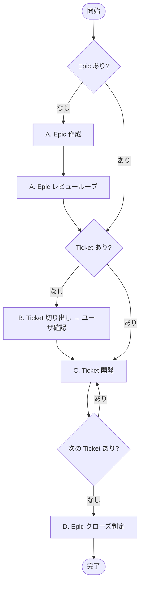
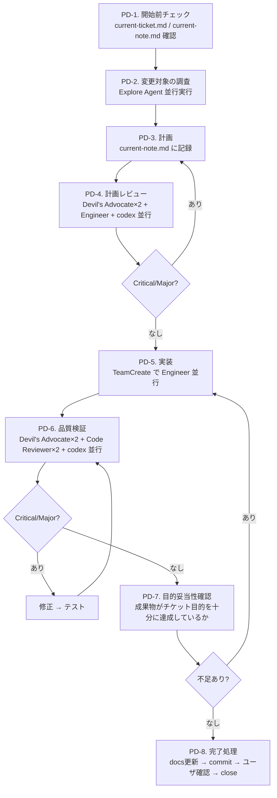
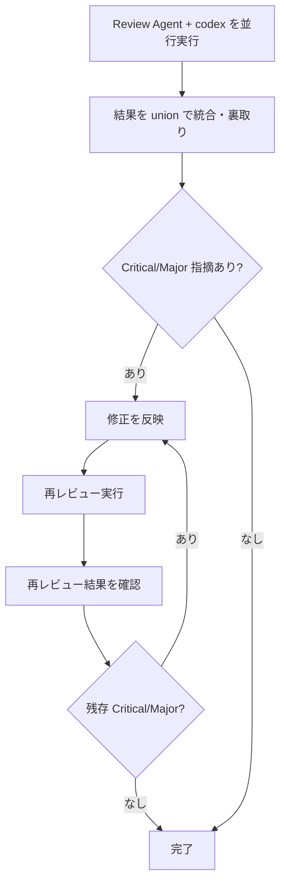

# PDH Dev — Product Delivery Hierarchy 開発ワークフロー

Epic → Ticket → 実装 → クローズの全フローを管理する。

## 最重要原則

PDH は **ヒエラルキー** である。

- **Product Brief** = 人間の意思。解きたい問題と目指す状態
- **Epic** = その意思を「届けられる価値の単位」に切った仮説
- **Ticket** = Epic の成果物を構成する実装単位

Epic は Product Brief のゴールへ導くために書き、Ticket は Epic の Outcome を実現するために書く。常に **「誰の」「どんな問題を解くか」** を意識し、そこに貢献するために Epic / Ticket を書くこと。

## 前提

- **最初に `./ticket.sh` を引数なしで実行して、チケット操作の使い方を学ぶこと**
- `product-brief.md` を最初に読む（全判断の基準）
- `docs/product-delivery-hierarchy.md` の運用ルール・テンプレートに従う
- CLAUDE.md のチーム運用ルール・コードマップに従う
- チケットの作成・開始・クローズは必ず `./ticket.sh` を使う（手動でファイル移動しない）
- `ticket.sh` が Ticket ごとに `feature/<ticket-name>` ブランチを自動作成し、close 時にデフォルトでは main にマージする
- Epic が大きく、Ticket 単位のマージで main が中間的に壊れる場合は Epic ブランチを切ってよい（Epic の frontmatter に `branch` を記載し、`ticket.sh close` 時にマージ先として指定する）

## 概要フロー



### C. Ticket 開発 詳細フロー



---

## ticket と note の役割分担

| ファイル | 役割 | 残す情報 |
|---|---|---|
| **current-ticket.md** | 後世への記録。`ticket.sh close` 時にコミットメッセージになる | Why / What / プロダクトAC / Implementation Notes（設計判断）/ Related Links |
| **current-note.md** | 今の作業のノート。セッションをまたぐ引き継ぎ資料 | 調査結果 / 計画 / レビュー結果 / プロセス通過証跡 / Debug Log |

- **プロダクトAC**（振る舞い）→ ticket に書く。「何が正しく動けばOKか」は後世に残す
- **プロセス要件**（PD-4レビュー済み、テストパス等）→ note の「プロセスチェックリスト」セクションに書く。PD-8 完了処理時にチェックする

---

## ユーザ相談ルール

以下の場合に AskUserQuestion でユーザに相談する:

1. **疑問点**: Epic のスコープ・Ticket の Acceptance Criteria など、判断に迷う点
2. **意思決定エスカレーション**: 取り消しコストが高い判断（仕様変更・スコープ変更等）。選択肢・トレードオフ・推奨案を添える
3. **定期報告**: 同一フェーズ内の修正→再レビューが 3 ラウンドごと（3, 6, 9…回目）に達したとき（初回レビュー = 1）
4. **デッドロック**: 同じ指摘が 2 回修正しても解消しないとき

## 中止フロー

Epic / Ticket を中止する場合:
- **Ticket**: `./ticket.sh cancel` を実行する（frontmatter に `cancelled_at` を追加し `done/` に移動する）
- **Epic**: frontmatter に `cancelled_at` を追加し、本文に中止理由を記録してから `epics/done/` に移動する
- `done/` 内のファイルは消さない。判断の履歴として残す

上位レイヤ（Product Brief / Epic）の前提が崩れた場合は、下位の作業を止めて上位を先に更新する。

## レビューパターン（共通）

Epic レビュー・計画レビュー・品質検証はすべて同じ構造で動く。



### レビューループの必須ルール

1. **修正したら必ず再レビューする** — 修正内容を反映した後、Review Agent を再実行して「残存する Critical/Major がない」ことを確認する。リードの自己判断だけで「修正したから OK」としない
2. **再レビューで「No remaining issues」または同等の回答を得るまでループを抜けない** — レビュアーが「問題なし」と明言するまで修正→再レビューを繰り返す
3. **3 ラウンドごとにユーザに相談する** — 同じ指摘が解消しない場合はデッドロックの可能性がある

### レビュー品質ルール

- LLM レビューは実行ごとに指摘の 6-7 割が入れ替わる。複数回実行して union（和集合）を取る
- Review Agent と codex は並行実行（依存関係なし）
- 全結果をリードが統合し、コードで裏取りしてから重要度を判定する
- 検出頻度は「信頼度のヒント」であり「重要度の指標」ではない

### codex レビューコマンド

```
codex exec --dangerously-bypass-approvals-and-sandbox \
  "<レビュー指示>。瑣末な点は無視し Critical/Major のみ指摘 (ref: CLAUDE.md)"
```
注意:
- `2>&1` を付けないこと（stdout が空になる）
- Bash ツールの `timeout` は `600000`（10分）に設定すること（codex はコードを大量に読むためデフォルトの2分では不足する）

---

## A. Epic 作成・レビュー

### A1. Epic ドラフト作成

`docs/product-delivery-hierarchy.md` の Epic テンプレートに従い、`epics/` にファイルを作成する。

必須セクション:
- **Outcome**: この Epic が完了すると何ができる状態になるか
- **Problem**: この Epic が直接解く問題。done/ 移動後の振り返りで「当時何が困っていたか」を残す
- **Scope**: Outcome を実現するために具体的に作るもの（成果物が分かる粒度で）
- **Non-goals**: この Epic では意図的にやらないこと。AI が「ついでにやりそう」なものを明記
- **Exit Criteria**: この条件を満たしたら閉じる。全 Ticket が閉じても自動では閉じない

任意セクション（必要に応じて追加）:
- **Dependencies** — 他 Epic・外部要因との依存関係
- **Tickets** — Ticket 切り出し後に記載
- **Related Links** — 参考リンク

Epic 固有の事情がある場合は独自セクションを追加してよい（例: Key Design Decisions, Working Rules）。

不明点は AskUserQuestion でユーザに確認しながら埋める。

### A2. Epic レビューループ

以下を並行実行してレビュー:
- **Devil's Advocate(Sonnet)×2**: Outcome の明確さ、スコープの過不足、Exit Criteria の曖昧さ、product-brief.md との矛盾
- **Engineer(Sonnet)×1**: 技術的実現可能性、依存関係、規模感
- **codex×1**: 致命的な点のみ指摘

Critical/Major があれば修正し、**再レビューを実行してレビュアーから「問題なし」を得るまでループする**（レビューパターン参照）。なければ Epic 確定。

---

## B. Ticket 切り出し

### B0. Epic 紐付け確認

Ticket を切る前に、必ずどの Epic に属するかを確認する:

1. ユーザの依頼内容と既存 Epic（`epics/`）のスコープを照合する
2. **合致する Epic がある場合**: その Epic の Ticket として切り出す
3. **合致する Epic がない、または依頼内容と Epic のスコープが合わない場合**: AskUserQuestion で以下の選択肢を提示する:
   - 新しい Epic を作成してからチケットを切る
   - 依頼内容を既存 Epic のスコープに合わせてチケットを調整する
   - 特例として Epic に紐づかない単独チケットを切る（`[no-ticket]` 相当）

### B1. Ticket 作成

Epic の Scope から Ticket を切り出す:
- 各 Ticket は 1 レビュー・1 実装単位の粒度
- `docs/product-delivery-hierarchy.md` の Ticket テンプレートに従う
- Why に Epic へのリンクと、Epic のどの部分を担うかを含める
- Acceptance Criteria はプロダクトの観察可能な振る舞いだけを書く

切り出した Ticket 一覧を AskUserQuestion でユーザに提示し、確認を得てから `./ticket.sh new <slug>` で作成する。

---

## C. Ticket 開発

### PD-1. 開始前チェック

1. `current-ticket.md` が存在するか確認する
   - **存在しない場合**: `./ticket.sh list` で TODO チケットを表示し、AskUserQuestion でどのチケットを開始するか確認する。選択後 `./ticket.sh start <ticket-name>` を実行
   - **存在する場合**: 内容を読んで作業を続行
2. `current-note.md` を確認する（`./ticket.sh start` で自動リンクされる）
   - 作業中の調査結果、計画、レビュー結果はすべて `current-note.md` に記録する
   - セッションをまたいで作業を再開する際の引き継ぎ資料になる
3. Acceptance Criteria が明確か確認する。曖昧な場合は AskUserQuestion で具体化する
4. Dependencies に未完了のブロッカーがあれば、着手せずユーザに報告する

### ノートの記録ルール

`current-note.md` は以下のセクション構成で記録する（`./ticket.sh start` が初期テンプレートを生成する）:

| セクション | 記録タイミング | 内容 |
|---|---|---|
| **PD-2. 調査結果** | PD-2 完了時 | Explore Agent の調査結果を統合 |
| **PD-3. 計画** | PD-3 完了時 | 実装計画（タスクリスト・ファイル所有権・テスト計画） |
| **PD-4. 計画レビュー結果** | PD-4 完了時 | レビュー指摘と対応結果。**「残存 Critical/Major なし」の記録がプロセス通過の証跡になる** |
| **PD-6. 品質検証結果** | PD-6 完了時 | レビュー指摘と対応結果。**「残存 Critical/Major なし」の記録がプロセス通過の証跡になる** |
| **PD-7. 目的妥当性確認** | PD-7 完了時 | AC の実質的達成・成果物の十分性・抜け漏れの棚卸し結果 |
| **プロセスチェックリスト** | PD-8 完了処理時 | プロセス要件のチェック（PD-4/PD-6 解消、テストパス、E2E 確認等） |
| **Debug Log** | 随時 | 調査中のメモ、デバッグ情報 |

**必須ルール:**
- **空セクションを残さない** — 該当フェーズを実施したら必ず結果を記録する。スキップした場合は理由を 1 行書く（例: `変更がコード外のため PD-6 スキップ`）
- **プロセスを繰り返すときはセクション名に回数を付ける** — 問題修正などで同じフェーズを再実行した場合、「PD-4(2回目)」「PD-6(3回目)」のようにセクションを追加する（上書きしない）。プロセスチェックリストも同様に項目を追記する。全ラウンドの証跡を残す。例:
  ```
  ## PD-4. 計画レビュー結果
  （1回目の結果）

  ## PD-4. 計画レビュー結果(2回目)
  （2回目の結果）
  ```
- セッションをまたぐ引き継ぎ資料として機能させるため、判断の根拠や却下した代替案も記録する

### PD-2. 変更対象の調査（Agent 並行実行）

リードの context を節約するため、以下の調査は **Explore Agent を並行 spawn** して行う:
- 各 Agent に変更対象ファイルの `git log --oneline` で最近の ticket 名を調べさせる
- 関連 ticket があれば `tickets/done/` で背景・設計判断を読ませる
- 変更対象ファイルの現在の実装を読ませ、影響範囲を報告させる

調査対象ファイルが多い場合は複数 Agent に分担させて並行実行する。
調査結果は `current-note.md` の「PD-2. 調査結果」セクションに記録する。

### PD-3. 計画

Agent の調査結果をもとに、リードが以下を含む実装計画を立てる（`current-note.md` に記録）:
- 実装するファイルと変更内容、ファイル所有権の分担
- 仕様から網羅的なテスト（エンドポイント、エラーケース、境界値）
- 実行可能な成果物がある場合は E2E スモークテスト手順
- 設計判断が必要な場合は ticket の Implementation Notes に理由を記録する

### PD-4. 計画レビュー

以下を並行実行する:
- **Devil's Advocate(Sonnet)×2**: 設計上の矛盾、見落としたリスク
- **Engineer(Sonnet)×1**: 技術的実現可能性、依存関係、実装量の妥当性
- **codex×1**: 致命的な点のみ指摘

Critical/Major があれば計画を修正し、**再レビューを実行してレビュアーから「問題なし」を得るまでループする**（レビューパターン参照）。完了条件: **Critical/Major が全て解消済み、もしくは未解消について AskUserQuestion でユーザ同意済み**。

### PD-5. 実装

> **前提条件**: PD-3（計画）と PD-4（計画レビュー）が完了していること。
> 計画なしにコードを書き始めないこと。「簡単な変更」でも省略不可。
> リードは Engineer に委譲する構造のため、計画がないと指示が曖昧になり手戻りが増える。

**リードは直接コードを書かない。** TeamCreate で実装チーム（PM + Engineer(s)）を作り、計画に従って実装させる。完了後:
- 自動テスト（全件パス必須）
- **E2E 実環境テスト（必須）**: サーバー起動 → UI 変更は Playwright でスクリーンショット確認、API 変更は curl でレスポンス検証。ビルド成功・テストパスだけで完了としない
- 実装チームを解散

### PD-6. 品質検証

以下を並行実行する:
- **Devil's Advocate(Sonnet)×2**: セキュリティ脆弱性、設計上の論理バグ
- **Code Reviewer(Sonnet)×1 + Code Reviewer(Opus)×1**: コード品質、レースコンディション、認証チェック漏れ
- **codex×1**: 致命的な点のみ指摘

結果を union で統合・裏取りし、以下の観点で確認する:
- `product-brief.md` との整合性
- Acceptance Criteria の達成状況
- セキュリティ（OWASP Top 10）
- エラーハンドリングの網羅性

Critical/Major があれば修正 → 自動テスト（全件パス必須）→ **再レビューを実行してレビュアーから「問題なし」を得るまでループする**（レビューパターン参照）。完了条件: **Critical/Major が全て解消済み、もしくは未解消について AskUserQuestion でユーザ同意済み**。

### PD-7. 目的妥当性確認

PD-6（コード品質）完了後、クローズ前に **成果物がチケットの目的を十分に達成しているか** を最終確認する。
PD-6 は「書いたコードにバグ・脆弱性・設計問題がないか」を見る。
PD-7 は「書くべきだったのに書いていないコード・テストがないか」を見る。
例: PD-6 は「この API に SQL インジェクションがある」を検出し、PD-7 は「エラーケースのテストが一つもない」を検出する。

確認観点:
1. **Acceptance Criteria の実質的達成**: 形式的に Acceptance Criteria を満たしているだけでなく、Acceptance Criteria の意図（Why）を満たしているか
2. **成果物の十分性**: テストなら「主要フローが網羅されているか」、機能なら「ユーザが実際に使える状態か」
3. **抜け漏れの棚卸し**: 実装した機能/テスト一覧を列挙し、明らかに不足しているものがないか確認

不足がある場合:
- **このチケット内で対応すべきもの**: 追加実装 → テスト → PD-7 再確認
- **別チケットに切り出すべきもの**: `docs/future-list.md` またはチケットとして記録

### PD-8. Ticket 完了処理

1. `current-ticket.md` の **プロダクト Acceptance Criteria**（振る舞い）を一つずつ確認し、各項目に `[x]` チェックをつける
2. **プロセスチェックリストの確認**: `current-note.md` の「プロセスチェックリスト」セクションを一つずつ確認し、各項目に `[x]` チェックをつける
3. **Acceptance Criteria チェックの裏取り**: Review Agent（Sonnet×2）を並行 spawn し、各 Acceptance Criteria 項目が実際に達成されているかコード・テスト結果・ノートを読んで検証させる。リードの自己判断だけで「達成済み」としない。NOT VERIFIED が返った項目は証拠を補完してから進む
4. `/update-docs` スキルを実行（設定している場合）
5. Acceptance Criteria チェック済みの ticket ファイルを含めて `/commit` スキルでコミット
6. `./ticket.sh list` で Epic の残り TODO Ticket を確認する
7. **クローズ前にテキストで以下を報告する**（AskUserQuestion に詰め込まず、先に読める形で出す）:
   - **確認手順**: ユーザが自分で動作確認する方法（URL・curl コマンド・操作手順・期待結果）
   - **懸念事項・残課題**: 既知の制限、スコープ外にした項目、future-list に追記した項目
   - **作業サマリ**: 主な変更を 3-5 行で
8. テキスト報告後、AskUserQuestion で「クローズしてよいか？」を確認（Epic 残チケット状況も含める）
9. 承認後 `./ticket.sh close` でチケットをクローズ
10. ユーザの Epic 完了判断に応じて:
    - **Epic 未完了**: `/clear` → `/pdh-dev` で次の作業を開始するよう促す
    - **Epic 完了**: ゼロベースレビュー用のチケットを切り（`./ticket.sh new`）、D セクションに進む

---

## D. Epic クローズ判定

> PD-8 でユーザが「Epic 完了」と判断した場合に、ゼロベースレビュー用チケットの中でこのフローを実行する。

### D1. Exit Criteria 確認

1. Epic の Exit Criteria を全て確認する
2. 満たしていない条件があれば、追加 Ticket が必要か AskUserQuestion でユーザに確認する
3. 全条件を満たしていれば D2 に進む

### D2. ゼロベースレビュー

**「ゼロから自由に再設計できるとしたら、どうするか」** という観点で Epic 全体を振り返る。
目的は、Ticket 単位のレビューでは見落としがちな **設計レベルの改善機会** を発見すること。

以下を並行実行する:
- **Devil's Advocate(Sonnet)×2**: 「今の実装を白紙にして再設計するなら何を変えるか」— アーキテクチャ・データモデル・API設計の改善点
- **Code Reviewer(Sonnet)×1 + Code Reviewer(Opus)×1**: 「コードベース全体を見て、技術的負債や構造上の問題はないか」— 重複コード・責務の混在・拡張性の課題
- **codex×1**: 致命的な設計問題のみ指摘

結果を union で統合・裏取りし、以下に分類する:
- **今すぐ修正すべき問題**（Critical/Major）→ 追加 Ticket を切って対応
- **将来の改善候補** → `docs/future-list.md` に記録
- **問題なし** → そのまま D3 へ

レビュー結果は Epic ファイルの **Close Summary** セクションに記録する。

### D3. Epic クローズ

1. Epic ファイルの YAML frontmatter に `zero_base_reviewed: true` を追加する
2. Close Summary にゼロベースレビュー結果の要約を記録する
3. `closed_at` を追加し `epics/done/` に移動する

---

## ロール定義

**実装チーム（TeamCreate）:**

| ロール名 | 必須/任意 | 責務 |
|---|---|---|
| **PM** | 必須 | 進行管理、意思決定のエスカレーション |
| **Engineer** | 必須(x N) | 実装担当。ファイル所有権を分担 |
| **Document Owner** | 任意 | ドキュメントと実装の整合性維持 |

**レビュー（Review Agent）:**

| ロール名 | 用途 | 責務 |
|---|---|---|
| **Devil's Advocate (Sonnet)** | Epic・計画・品質レビュー | 設計・仕様への建設的批判 |
| **Code Reviewer (Sonnet/Opus)** | 品質レビュー | コード品質・セキュリティ検証 |
| **Engineer (Sonnet)** | Epic・計画レビュー | 技術的実現可能性チェック |
| **codex** | 全レビュー | 外部ゲートキーパー |

---
Based on https://github.com/masuidrive/pdh/blob/XXXXXXX/skills/pdh-dev/SKILL.md