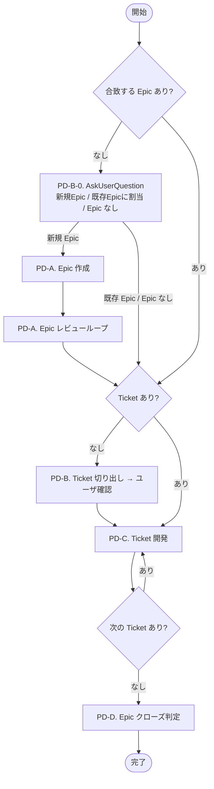
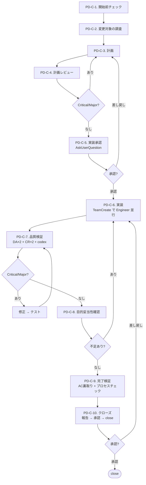
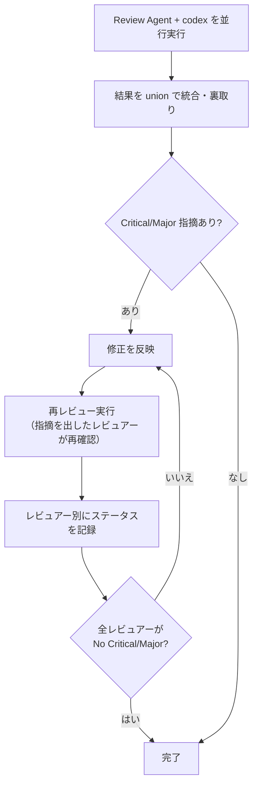

# PDH Dev — Product Delivery Hierarchy 開発ワークフロー

Epic → Ticket → 実装 → クローズの全フローを管理する。

## 最重要原則

PDH は **ヒエラルキー** である。

- **Product Brief** = 人間の意思。解きたい問題と目指す状態
- **Epic** = その意思を「届けられる価値の単位」に切った仮説
- **Ticket** = Epic の成果物を構成する実装単位

Epic は Product Brief のゴールへ導くために書き、Ticket は Epic の Outcome を実現するために書く。常に **「誰の」「どんな問題を解くか」** を意識し、そこに貢献するために Epic / Ticket を書くこと。

## ステップ遷移の宣言

ステップを移動するたびに、次の形式でユーザに宣言すること:

```
[PD-A-1] -> [PD-A-2]
```

レビューを含むステップでは、ラウンドを `(N回目)` で表現する:

```
[PD-C-3] -> [PD-C-4]            — 計画完了、レビュー開始
[PD-C-4] -> [PD-C-4(1回目)]     — レビュー実行
[PD-C-4(1回目)] -> [PD-C-4(2回目)] — Critical 修正後の再レビュー
[PD-C-4(2回目)] -> [PD-C-5]     — 全レビュアー PASS、実装承認へ
```

省略や暗黙の遷移は禁止。

## 前提

- **チケットの規模に関わらず、PDH フローのステップを省略しない。** 小規模チケットでもPD-C-1〜PD-C-10 の全ステップ（ユーザが PD-C-1 で明示的に省略承認したものを除く）を実行する。「小さいから簡略化してよい」という判断は禁止
- **最初に `./ticket.sh` を引数なしで実行して、チケット操作の使い方を学ぶこと**
- `product-brief.md` を最初に読む（全判断の基準）
- `docs/product-delivery-hierarchy.md` の運用ルール・テンプレートに従う
- CLAUDE.md のチーム運用ルール・コードマップに従う
- チケットの作成・開始・クローズは必ず `./ticket.sh` を使う（手動でファイル移動しない）
- `ticket.sh` が Ticket ごとに `features/<ticket-name>` ブランチを自動作成し、close 時にデフォルトでは main にマージする
- Epic が大きく、Ticket 単位のマージで main が中間的に壊れる場合は Epic ブランチを切ってよい（Epic の frontmatter に `branch` を記載し、`ticket.sh close` 時にマージ先として指定する）

## フェーズ完了ルール

各フェーズ完了時にコミットする。コミットメッセージは `[フェーズ名] 概要` の形式（例: `[PD-C-3] Planning`）。
セッション中断時の作業損失を防ぎ、フェーズごとの進捗を git 履歴で追跡する。

## 全体フロー



### PD-C. Ticket 開発 内部フロー



---

## ticket と note の役割分担

| ファイル | 役割 | 残す情報 |
|---|---|---|
| **current-ticket.md** | 後世への記録。`ticket.sh close` 時にコミットメッセージになる | Why / What / プロダクトAC / Implementation Notes（設計判断）/ Related Links |
| **current-note.md** | 今の作業のノート。セッションをまたぐ引き継ぎ資料 | 調査結果 / 計画 / レビュー結果 / プロセス通過証跡 / Debug Log |

- **プロダクトAC**（振る舞い）→ ticket に書く。「何が正しく動けばOKか」は後世に残す
- **プロセス要件**（レビュー済み、テストパス等）→ note の「プロセスチェックリスト」セクションに書く。PD-C-9 完了検証時にチェックする

**AC に書いてよいもの / 書いてはいけないものの例:**
- OK: 「`/api/services` が 200 を返し、レスポンスに description フィールドが含まれる」
- OK: 「画面幅 375px 以下でメニューがハンバーガーに切り替わる」
- NG: 「計画レビューで Critical/Major が解消済み」 → note のプロセスチェックリスト
- NG: 「テストが全件パスする」 → note のプロセスチェックリスト
- NG: 「リードが直接コードを書いていない」 → note のプロセスチェックリスト

---

## ユーザ相談ルール

以下の場合に AskUserQuestion でユーザに相談する:

1. **判断に迷う・取り消しコストが高い場合**: スコープ変更、仕様変更、AC の変更など。選択肢・推奨案を添える
2. **レビューループが収束しない場合**: 同じ指摘が修正後も解消しないとき

## 中止フロー

Epic / Ticket を中止する場合:
- **Ticket**: `./ticket.sh cancel` を実行する（frontmatter に `cancelled_at` を追加し `done/` に移動する）
- **Epic**: frontmatter に `cancelled_at` を追加し、本文に中止理由を記録してから `epics/done/` に移動する
- `done/` 内のファイルは消さない。判断の履歴として残す

上位レイヤ（Product Brief / Epic）の前提が崩れた場合は、下位の作業を止めて上位を先に更新する。

---

## レビューパターン（共通）

PD-A-2・PD-C-4・PD-C-7・PD-D-2 はすべて同じレビュー構造で動く。
ラウンドは `(N回目)` で表現する（「ステップ遷移の宣言」参照）。



### レビュアーへの指示ルール

レビュアーを spawn する際、以下を指示に含めること:
- **計画・変更の目的**: 何を解決するための計画/変更かを明記する。レビュアーが「現状の問題」を指摘するのではなく、**計画・変更がその問題を正しく解決できるか** を評価できるようにする
- 対象ファイル・スコープ
- レビュー観点（ロールごとの責務）
- Critical/Major のみ指摘し、瑣末な点は無視する旨

### レビューループの必須ルール

1. **修正したら必ず再レビューする** — 修正内容を反映した後、Review Agent を再実行して確認する。リードの自己判断だけで「修正したから OK」としない
2. **完了条件: 全レビュアーの最新回答が「No Critical/Major」であること** — 一人でも Critical/Major を出していたらループ継続。レビュアーごとのステータスをテーブルで記録する:
   ```
   | レビュアー | 最新回答 | ステータス |
   |---|---|---|
   | DA1 | No Critical/Major | PASS |
   | DA2 | CRITICAL: xxx | FAIL → 修正後に再レビュー |
   | Engineer1 | No Critical/Major | PASS |
   | codex | No Critical/Major | PASS |
   ```
3. **指摘のクローズ権限はレビュアーにある** — レビュアーが出した指摘は、次の再レビューで **そのレビュアー自身が「解消済み」と回答する** ことでのみクローズできる。リードが「対応したので問題なし」と判断してクローズすることはできない
4. **レビューループが収束しない場合はユーザに相談する** — 同じ指摘が修正後も解消しないときはデッドロックの可能性がある

### リードの裏取りルール

リードがレビュー結果を統合する際に行う「裏取り」の範囲を厳密に定義する:

- **許可される操作（重複排除と事実確認）**:
  - 複数レビュアーの同一指摘を統合する（重複排除）
  - コード上の事実誤認を除外する（例: 存在しないファイルへの指摘、誤ったコード引用）
- **禁止される操作**:
  - 「計画に既記載だから問題ない」という理由での却下 — これは裏取りではなく却下であり、禁止。レビュアーが計画を読んだ上で指摘している可能性がある
  - リードの判断で指摘の重要度を下げる（Critical → Minor 等）
  - 「対応済み」とリードが判断してクローズする（クローズ権限はレビュアーにある）

### スコープ外の既存問題の扱い

レビューで発見した問題が今回のチケットの変更によるものでない（既存の問題）場合、**リードが自分で対応方針を決定してはならない**。以下の手順で対応する:

1. **既存問題を `current-note.md` に記録する**（問題の内容・発見箇所・影響範囲）
2. **AskUserQuestion でユーザに対応方針を確認する**。選択肢の例:
   - このチケット内で修正する（小さい修正の場合）
   - 同じ Epic に別チケットを切る
   - `docs/future-list.md` に記録して将来対応
   - 対応不要（実用上問題なし）
3. **セキュリティ上の重大な問題**: 即座にユーザに相談する

**禁止**: リードが「対応検討」「別チケットで対応」「スコープ外」と自分で判断して note に記載し、ユーザの確認なくクローズに進むこと。

このルールは PD-C-4（計画レビュー）、PD-C-7（品質検証）、PD-C-8（目的妥当性確認）すべてに適用する。

### レビュー品質ルール

- LLM レビューは実行ごとに指摘の 6-7 割が入れ替わる。複数回実行して union（和集合）を取る
- Review Agent と codex は並行実行（依存関係なし）
- 検出頻度は「信頼度のヒント」であり「重要度の指標」ではない

### codex レビューコマンド

```
codex exec --dangerously-bypass-approvals-and-sandbox \
  "<レビュー指示>。瑣末な点は無視し Critical/Major のみ指摘 (ref: CLAUDE.md)"
```
注意:
- `2>&1` を付けないこと（stdout が空になる）
- Bash ツールの `timeout` は `600000`（10分）に設定すること（codex はコードを大量に読むためデフォルトの2分では不足する）

---

## PD-A. Epic 作成・レビュー

### PD-A-1. Epic ドラフト作成

`docs/product-delivery-hierarchy.md` の Epic テンプレートに従い、`epics/` にファイルを作成する。

必須セクション:
- **Outcome**: この Epic が完了すると何ができる状態になるか
- **Problem**: この Epic が直接解く問題
- **Scope**: Outcome を実現するために具体的に作るもの（成果物が分かる粒度で）
- **Non-goals**: この Epic では意図的にやらないこと。AI が「ついでにやりそう」なものを明記
- **Exit Criteria**: この条件を満たしたら閉じる。全 Ticket が閉じても自動では閉じない

任意セクション（必要に応じて追加）:
- **Dependencies** — 他 Epic・外部要因との依存関係
- **Tickets** — Ticket 切り出し後に記載
- **Related Links** — 参考リンク

Epic 固有の事情がある場合は独自セクションを追加してよい（例: Key Design Decisions, Working Rules）。

**ユーザへのインタビュー**: ユーザの依頼が抽象的・大まかな場合は、いきなりドラフトを書かず AskUserQuestion でインタビューする。技術的な実装方針、エッジケース、トレードオフなど、ユーザが考慮していない可能性がある論点を掘り下げる。自明な質問は避け、判断が分かれるポイントに集中する。十分な情報が集まってからドラフトを書く。

ドラフト作成後、コミットする（例: `[PD-A-1] Create <epic-name>`）。

### PD-A-2. Epic レビューループ

以下を並行実行してレビュー:
- **Devil's Advocate(Sonnet)×2**: Outcome の明確さ、スコープの過不足、Exit Criteria の曖昧さ、product-brief.md との矛盾
- **Engineer(Opus)×1**: 技術的実現可能性、依存関係、規模感
- **codex×1**: 致命的な点のみ指摘

Critical/Major があれば修正し、**全レビュアーが「No Critical/Major」を返すまでループする**（レビューパターン参照）。なければ Epic 確定。

Epic 確定後、コミットする（例: `[PD-A-2] Review <epic-name>`）。

---

## PD-B. Ticket 切り出し

### PD-B-0. Epic 紐付け確認

Ticket を切る前に、必ずどの Epic に属するかを確認する:

1. ユーザの依頼内容と既存 Epic（`epics/`）のスコープを照合する
2. **合致する Epic がある場合**: その Epic の Ticket として切り出す
3. **合致する Epic がない場合**: AskUserQuestion で以下の選択肢を提示する:
   - 新しい Epic を作成してからチケットを切る
   - 既存 Epic のスコープに含める
   - 単独チケットとして切る（作業中に発見したバグ修正・小規模改善に限る。Why に経緯を書く）

### PD-B-1. Ticket 作成

Epic の Scope から Ticket を切り出す:
- 各 Ticket は 1 レビュー・1 実装単位の粒度
- `docs/product-delivery-hierarchy.md` の Ticket テンプレートに従う
- Why に Epic へのリンクと、Epic のどの部分を担うかを含める
- Acceptance Criteria はプロダクトの観察可能な振る舞いだけを書く（「ticket と note の役割分担」の OK/NG 例を参照）

切り出した Ticket 一覧を AskUserQuestion でユーザに提示し、確認を得てから `./ticket.sh new <slug>` で作成する。

**Epic ファイルの更新**: チケット作成後、Epic ファイルの `Tickets` セクションに作成したチケットを追記する。形式:
```markdown
### Tickets
- [ ] `<ticket-slug>` — <一行説明>
```

Ticket 作成・Epic 更新後、コミットする（例: `[PD-B-1] Cut tickets from <epic-name>`）。

---

## PD-C. Ticket 開発

### PD-C-1. 開始前チェック

1. `current-ticket.md` が存在するか確認する
   - **存在しない場合**: `./ticket.sh list` で TODO チケットを表示し、AskUserQuestion でどのチケットを開始するか確認する。選択後 `./ticket.sh start <ticket-name>` を実行
   - **存在する場合**: 内容を読んで作業を続行
2. `current-note.md` を確認する（`./ticket.sh start` で自動リンクされる）
   - 作業中の調査結果、計画、レビュー結果はすべて `current-note.md` に記録する
   - セッションをまたいで作業を再開する際の引き継ぎ資料になる
3. Acceptance Criteria が明確か確認する。曖昧な場合は AskUserQuestion で具体化する
4. Dependencies に未完了のブロッカーがあれば、着手せずユーザに報告する
5. **ステップ省略**: 全ステップ実行を推奨する。ユーザが明示的に省略を指示した場合のみ省略可。省略した場合は `current-note.md` 冒頭に記録する。省略不可: PD-C-6（実装）、PD-C-7（品質検証）、PD-C-9（完了検証）、PD-C-10（クローズ）
6. **ユーザ指示優先**: ユーザが特定フェーズの再実施を指示した場合、note に「PD-X 通過済み」と記録されていても **ユーザの指示を優先して再実施する**。note の記録はスキップの根拠にならない

### ノートの記録ルール

`current-note.md` は以下のセクション構成で記録する（`./ticket.sh start` が初期テンプレートを生成する）:

| セクション | 記録タイミング | 内容 |
|---|---|---|
| **PD-C-2. 調査結果** | PD-C-2 完了時 | Explore Agent の調査結果を統合。技術的な懸念事項も記録する |
| **PD-C-3. 計画** | PD-C-3 完了時 | 実装計画（タスクリスト・ファイル所有権・テスト計画） |
| **PD-C-4. 計画レビュー結果** | PD-C-4 完了時 | レビュアー別ステータステーブル + 指摘と対応結果 |
| **PD-C-7. 品質検証結果** | PD-C-7 完了時 | レビュアー別ステータステーブル + 指摘と対応結果 |
| **PD-C-8. 目的妥当性確認** | PD-C-8 完了時 | AC の実質的達成・成果物の十分性・抜け漏れの棚卸し結果 |
| **PD-C-9. プロセスチェックリスト** | PD-C-9 完了検証時 | プロセス要件のチェック（PD-C-4/PD-C-7 解消、テストパス、E2E 確認等） |
| **Debug Log** | 随時 | 調査中のメモ、デバッグ情報 |

**必須ルール:**
- **空セクションを残さない** — 該当フェーズを実施したら必ず結果を記録する。スキップした場合は理由を 1 行書く（例: `変更がコード外のため PD-C-7 スキップ`）
- **プロセスを繰り返すときはセクション名に回数を付ける** — 問題修正などで同じフェーズを再実行した場合、「PD-C-4(2回目)」「PD-C-7(3回目)」のようにセクションを追加する（上書きしない）。プロセスチェックリストも同様に項目を追記する。全ラウンドの証跡を残す。例:
  ```
  ## PD-C-4. 計画レビュー結果
  （1回目の結果）

  ## PD-C-4. 計画レビュー結果(2回目)
  （2回目の結果）
  ```
- セッションをまたぐ引き継ぎ資料として機能させるため、判断の根拠や却下した代替案も記録する
- **セッション終了時**: 作業が途中の場合、現在の状態・次にやるべきことを `current-note.md` に記録してから終了する

### PD-C-2. 変更対象の調査

変更対象ファイルの現在の実装・設計経緯・影響範囲を調査する。

**調査内容:**
- 変更対象ファイルの `git log --oneline` で最近の ticket 名を調べる
- 関連 ticket があれば `tickets/done/` で背景・設計判断を読む
- 変更対象ファイルの現在の実装を読み、影響範囲を把握する
- **実行パス追跡**: 変更箇所がどこから呼ばれ、データがどう流れるかをトレースする。変更の影響が及ぶ範囲を特定する（大規模な変更の場合）
- **懸念事項の記録**: 技術的な注意点（未検証の API、複雑なロジック、パフォーマンス影響）、外部依存の制約（バージョン互換性、API 制限）を記録する

**調査方法はコードベースの規模で選ぶ:**
- **対象ファイルが少ない（〜10 ファイル）**: リードが直接 Read を並列実行する。Explore Agent は不要
- **対象ファイルが多い、または何がどこにあるか不明**: Explore Agent を並行 spawn して分担する

調査結果は `current-note.md` の「PD-C-2. 調査結果」セクションに記録し、コミットする（例: `[PD-C-2] Investigation`）。

### PD-C-3. 計画

Agent の調査結果をもとに、リードが以下を含む実装計画を立てる（`current-note.md` に記録）:
- **パターン分析**: 類似機能が既存コードでどう実装されているかを調べ、同じ規約・パターンに従う。新しいパターンを導入する場合は理由を明記する
- 実装するファイルと変更内容、ファイル所有権の分担
- **ファイル別コンテキスト**: 変更対象ファイルごとに、PD-C-2 の調査結果から直近の設計判断・注意点を 2-3 行でまとめる。Engineer spawn 時にこの情報を渡し、過去の設計判断に反する変更を防ぐ
- 仕様から網羅的なテスト（エンドポイント、エラーケース、境界値）
- 実行可能な成果物がある場合は E2E スモークテスト手順
- 設計判断は**一つ選んで決め、選択理由を記録する**。複数案を並べてユーザに丸投げしない。判断に自信がない場合のみ AskUserQuestion で相談する
- 設計判断は ticket の Implementation Notes に理由を記録する
- **懸念事項への対処**: PD-C-2 で記録した懸念事項への対処方針を計画に反映する。不確実性が高い場合は AskUserQuestion でユーザに相談する

計画を `current-note.md` に記録し、コミットする（例: `[PD-C-3] Planning`）。

### PD-C-4. 計画レビュー

以下を並行実行する。各レビュアーには **計画の目的（何を解決するか）** を伝え、「現状の問題点」ではなく「計画の修正方針の妥当性」を評価させる（レビューパターン「レビュアーへの指示ルール」参照）:
- **Devil's Advocate(Sonnet)×2**: 計画の修正方針に矛盾・見落としがないか
- **Engineer(Opus)×1**: 技術的実現可能性、依存関係、実装量の妥当性
- **codex×1**: 致命的な点のみ指摘

結果をレビューパターンに従って統合・裏取りする。完了条件: **全レビュアーの最新回答が「No Critical/Major」**、もしくは未解消について AskUserQuestion でユーザ同意済み。

レビュー結果を `current-note.md` に記録し、コミットする（例: `[PD-C-4] Plan review`）。

### PD-C-5. 実装承認

計画レビュー完了後、実装に進む前に AskUserQuestion で承認を得る。**承認はユーザの明示的な意思表示（「OK」「y」「yes」「進めて」等）のみ有効。曖昧な返答の場合は再確認する。**

報告内容:
- **計画内容**: 設計判断、ファイル変更計画、チーム分担
- **E2E テスト手順**
- **懸念事項**: レビューで出た Minor 指摘や残存する懸念

**差し戻しの場合**: ユーザが計画の修正を求めたら PD-C-3 に戻る。

### PD-C-6. 実装

> **前提条件**: PD-C-3（計画）と PD-C-4（計画レビュー）が完了し、PD-C-5 で承認を得ていること。
> 計画なしにコードを書き始めないこと。「簡単な変更」でも省略不可。
> リードは Engineer に委譲する構造のため、計画がないと指示が曖昧になり手戻りが増える。

**リードは直接コードを書かない。** TeamCreate で実装チーム（PM + Engineer(s)）を作り、計画に従って実装させる。各 Engineer の spawn プロンプトには、担当ファイルの「ファイル別コンテキスト」（PD-C-3 で作成）を含めること。完了後:
- 自動テスト（全件パス必須）
- **E2E 実環境テスト（必須）**: サーバー起動 → UI 変更は Playwright でスクリーンショット確認、API 変更は curl でレスポンス検証。ビルド成功・テストパスだけで完了としない。**重要: E2E テストは test DB で実行すること（CLAUDE.md「DB 使い分け」参照）。development DB はユーザの手動確認専用であり、自動テスト・E2E で使ってはならない**
- **`scripts/test-all.sh` を実行し全スイートパスを確認**
- 実装チームを解散
- コミットする（例: `[PD-C-6] Implementation`）

### PD-C-7. 品質検証

以下を並行実行する。各レビュアーには **チケットの目的と変更内容の概要** を伝え、変更が目的に対して正しく機能するかを評価させる（レビューパターン「レビュアーへの指示ルール」参照）:
- **Devil's Advocate(Sonnet)×2**: セキュリティ脆弱性、設計上の論理バグ
- **Code Reviewer(Sonnet)×1 + Code Reviewer(Opus)×1**: コード品質、レースコンディション、認証チェック漏れ
- **codex×1**: 致命的な点のみ指摘

結果をレビューパターンに従って統合・裏取りし、以下の観点で確認する:
- `product-brief.md` との整合性
- Acceptance Criteria の達成状況
- セキュリティ（OWASP Top 10）
- エラーハンドリングの網羅性

Critical/Major があれば修正 → 自動テスト（全件パス必須）→ **再レビューを実行して全レビュアーが「No Critical/Major」を返すまでループする**（レビューパターン参照）。完了条件: **全レビュアーの最新回答が「No Critical/Major」**、もしくは未解消について AskUserQuestion でユーザ同意済み。

品質検証結果を `current-note.md` に記録し、コミットする（例: `[PD-C-7] Quality verification`）。

### PD-C-8. 目的妥当性確認

PD-C-7（コード品質）完了後、クローズ前に **成果物がチケットの目的を十分に達成しているか** を最終確認する。
PD-C-7 は「書いたコードにバグ・脆弱性・設計問題がないか」を見る。
PD-C-8 は「書くべきだったのに書いていないコード・テストがないか」を見る。
例: PD-C-7 は「この API に SQL インジェクションがある」を検出し、PD-C-8 は「エラーケースのテストが一つもない」を検出する。

確認観点:
1. **Acceptance Criteria の実質的達成**: 形式的に Acceptance Criteria を満たしているだけでなく、Acceptance Criteria の意図（Why）を満たしているか
2. **成果物の十分性**: テストなら「主要フローが網羅されているか」、機能なら「ユーザが実際に使える状態か」
3. **抜け漏れの棚卸し**: 実装した機能/テスト一覧を列挙し、明らかに不足しているものがないか確認
4. **懸念事項の確認**: PD-C-2 で記録した懸念事項が問題化していないか確認する。問題化した場合は影響範囲を評価し対応する

不足がある場合:
- **このチケット内で対応すべきもの**: 追加実装 → テスト → PD-C-8 再確認
- **別チケットに切り出すべきもの**: `docs/future-list.md` またはチケットとして記録

目的妥当性確認結果を `current-note.md` に記録し、コミットする（例: `[PD-C-8] Purpose validation`）。

確認完了後、以下をテキストで報告する:
- **テスト結果**: 自動テスト・E2E テストの結果
- **AC 達成状況**: 各 Acceptance Criteria の達成/未達
- **実環境動作確認結果**
- **懸念事項・残課題**: 既知の制限、スコープ外にした項目

### PD-C-9. 完了検証

1. `current-ticket.md` の **プロダクト Acceptance Criteria**（振る舞い）を一つずつ確認し、各項目に `[x]` チェックをつける
2. **プロセスチェックリストの確認**: `current-note.md` の「PD-C-9. プロセスチェックリスト」セクションを一つずつ確認し、各項目に `[x]` チェックをつける
3. **Acceptance Criteria チェックの裏取り**: Review Agent（Sonnet×1, Opus×1）を並行 spawn し、各 Acceptance Criteria 項目が実際に達成されているかコード・テスト結果・ノートを読んで検証させる。リードの自己判断だけで「達成済み」としない。NOT VERIFIED が返った項目は証拠を補完してから進む
4. **`scripts/test-all.sh` を実行し全スイートパスを最終確認**
5. `/update-docs` スキルを実行（設定している場合）
6. Acceptance Criteria チェック済みの ticket ファイルを含めて `/commit` スキルでコミット

### PD-C-10. クローズ

1. `./ticket.sh list` で Epic の残り TODO Ticket を確認する
2. AskUserQuestion で以下を報告し、クローズ承認を得る。**承認はユーザの明示的な意思表示（「OK」「y」「yes」「閉じて」等）のみ有効。曖昧な返答の場合は再確認する**:
   - **確認手順**: ユーザが自分で動作確認する方法（URL・curl コマンド・操作手順・期待結果）
   - **作業サマリ**: 主な変更を 3-5 行で
   - **懸念事項・残課題**: 既知の制限、スコープ外にした項目、future-list に追記した項目
   - **チケット化候補**: 懸念事項・残課題の中でチケット化すべきものがあればリスト
   - **Epic 残チケット状況**
3. **差し戻しの場合**: ユーザが修正を求めたら PD-C-6 に戻る。修正後は PD-C-7 から再走する。差し戻し理由を note の Debug Log に記録する
4. 承認後 `./ticket.sh close` でチケットをクローズ
4. **Epic ファイルの更新**: Epic ファイルの `Tickets` セクションで、クローズしたチケットにチェックを付ける（`- [ ]` → `- [x]`）
5. ユーザの Epic 完了判断に応じて:
   - **Epic 未完了**: `/clear` → `/pdh-dev` で次の作業を開始するよう促す
   - **Epic 完了**: ゼロベースレビュー用のチケットを切り（`./ticket.sh new`）、D セクションに進む

---

## PD-D. Epic クローズ判定

> PD-C-10 でユーザが「Epic 完了」と判断した場合に、ゼロベースレビュー用チケットの中でこのフローを実行する。

### PD-D-1. Exit Criteria 確認

1. Epic の Exit Criteria を全て確認する
2. 満たしていない条件があれば、追加 Ticket が必要か AskUserQuestion でユーザに確認する
3. 全条件を満たしていれば PD-D-2 に進む

### PD-D-2. ゼロベースレビュー

**「ゼロから自由に再設計できるとしたら、どうするか」** という観点で Epic 全体を振り返る。
目的は、Ticket 単位のレビューでは見落としがちな **設計レベルの改善機会** を発見すること。

以下を並行実行する:
- **Devil's Advocate(Sonnet)×2**: 「今の実装を白紙にして再設計するなら何を変えるか」— アーキテクチャ・データモデル・API設計の改善点。加えて「過剰な複雑さはないか、より少ないコード・シンプルな設計で同じ目的を達成できなかったか」も検証する
- **Code Reviewer(Sonnet)×1 + Code Reviewer(Opus)×1**: 「コードベース全体を見て、技術的負債や構造上の問題はないか」— 重複コード・責務の混在・拡張性の課題
- **codex×1**: 致命的な設計問題のみ指摘

コード重複の検出には `similarity-ts` / `similarity-py`（`cargo install` で導入）を活用し、構造的な重複を定量的に把握する。

コードレビューに加えて、**実環境でのスモークテストも必ず実施する**:
- API 変更がある場合: curl で実際にエンドポイントを叩いて動作確認
- UI 変更がある場合: Playwright でブラウザ操作・スクリーンショット確認
- 外部サービス連携がある場合: stub ではなく実モデル/実プロバイダで1回は実行確認
- テストが stub/mock のみの場合: 実環境との乖離がないかを特に注意して検証する

結果をレビューパターンに従って統合・裏取りし、以下に分類する:
- **今すぐ修正すべき問題**（Critical/Major）→ 追加 Ticket を切って対応
- **将来の改善候補** → `docs/future-list.md` に記録
- **問題なし** → そのまま PD-D-3 へ

レビュー結果は Epic ファイルの **Close Summary** セクションに記録する。

### PD-D-3. Epic クローズ

1. Epic ファイルの YAML frontmatter に `zero_base_reviewed: true` を追加する
2. Close Summary にゼロベースレビュー結果の要約を記録する
3. `closed_at` を追加し `epics/done/` に移動する

---
Based on https://github.com/masuidrive/pdh/blob/8014894/skills/pdh-dev/SKILL.md
