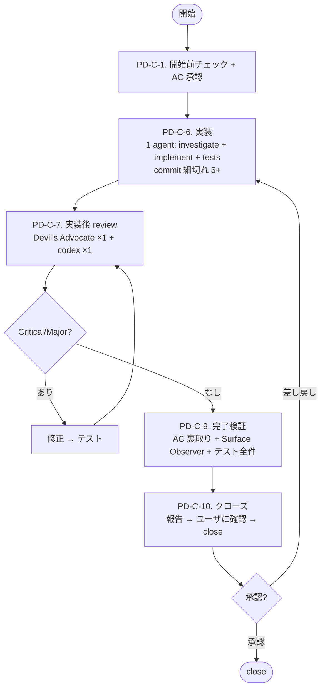
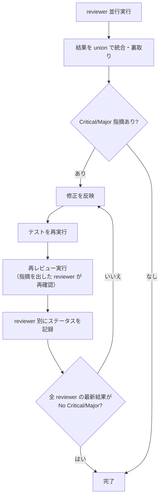

# PDH Dev — Ticket-centric 開発ワークフロー

`Product Brief → Ticket → 実装 → クローズ` の workflow を回す。1 user + AI 体制に最適化した single flow。

## 最重要原則

**価値を届けるために workflow を選ぶ。workflow を当てはめるために workflow を回すのではない。**

階層:
- **Product Brief** = 人間の意思。解きたい問題と目指す状態。常に最上位
- **Ticket** = 実装単位。常に存在する

**Epic 概念は持たない。** 1 user + AI scale では Epic の同期 / coordination 価値より overhead cost の方が高い。Epic に書くべき情報 (Outcome / Scope / Design Decisions / Non-goals) は ticket に直接書く。

## 核となる設計選択

| 選択 | 理由 |
|---|---|
| **1 ticket per work** | cross-cutting changes を複数 ticket に切ると layer 間整合性が完成時にしか取れず、複数の plan-vs-real-code 不整合が並列発生し review loop が収束しなくなる。1 ticket なら 1 agent context で全 layer を見ながら整合性を取れる |
| **1 agent が investigate + implement** | 「PM が実コードを読み計画を書く」「Engineer が再度実コードを読み実装する」の 2 段階分離は、PM の盲点を計画と実装の両方に伝播させる anti-pattern。同一 agent が実コードを読みながら実装すれば計画と実コードは自動的に整合 |
| **実装後 review のみ** | 実装前 (plan review) は「計画書 vs 計画書」の内部整合性しか検証できない。実装後 (code review) は「動くコード vs AC / Invariants / spec」の実質整合性を検証できる |
| **commit cadence 5+ 必須** | 実装後 review で bisect / partial rollback / 段階追跡を可能にする。「全変更を 1 commit に押し込む」は事後分析不能 |
| **Ticket immutable** | implementor が AC / out-of-scope / Architectural Invariants を勝手に書き換えると、ticket が "PM の意思" を持たなくなり ticket 自体の価値が消失する。変更が必要なら implementation を止めて PM に escalate |

---

# Part 1: リファレンス

## 用語

- **step** = `PD-C-*` の単位 (PD-A / PD-B / PD-D は持たない)
- **review loop** = PD-C-7 で修正 → テスト → 再レビューを繰り返すこと
- **gate** = 次の step に進むための完了条件
- **AC** = Acceptance Criteria。観察可能な振る舞い
- **Architectural Invariants** = `product-brief.md` に明記された不変則

## 役割

- **PM (Director)** = 進行管理、判断、統合、ユーザ報告。**判断と dispatch に専念し、機械的タスクは全て委譲する**
- **Coding Engineer** = 実装。`pdh-coding` skill に従う。1 agent が investigate + implement + tests を 1 session で完遂する
- **QA Engineer** = テスト実行、E2E 確認、ドキュメント再生成 (OpenAPI / SDK モデル) など機械的検証
- **Devil's Advocate** = 実装後 review。ユーザの立場から厳しい指摘
- **Code Reviewer** = 実装後 review。コード品質・回帰・認可漏れ・整合性
- **AC 裏取り Agent** = PD-C-9 で各 AC が実際に達成されているかコード・テスト・ノートを読んで検証
- **Surface Observer** = consumer 視点で実機 (browser / curl / SDK 直叩き) で外部 surface を観察。自動テストが拾えない視覚崩れ・レスポンスボディ違和感・エラー文言の分かりにくさを目視。Sonnet で実行。外部 surface 変更がない純 backend ticket では skip 可

### PM の責務と禁止事項

PM がやる:
- レビュー結果の triage、採否決定、修正方針
- Agent の spawn / dispatch
- note / ticket 更新、コミット、ユーザ報告
- PM Self-check (ticket 提出前 / spawn prompt 提出前)

**PM がやらない (必ず委譲):**
- ソースコード直接編集 → Coding Engineer
- テスト実行 (pytest / vitest / playwright 等) → QA Engineer
- ドキュメント再生成 (OpenAPI / SDK モデル) → QA Engineer
- 修正後のコード修正 → Coding Engineer (PM が直接 Edit しない)

### 責務境界

| レイヤー | PM が決める / 書く | Coding Engineer 領域 |
|---|---|---|
| Product Brief | ユーザの意思 (ユーザ承認のもと PM が編集) | — |
| Ticket | Why / AC (観察可能な振る舞い) / Architectural Invariants check / 確定判断 / out-of-scope / Implementation Notes (任意) | 実コード詳細 |
| Subagent spawn prompt | 目的 / 背景 / AC / 担当範囲 / PM が決めた判断 | how-to / 実装手順 / コマンド指定 |

書かない側に踏み込むと下流の自由度を奪い、review loop 肥大化 / 実装手戻り / drift の原因。

### PM Self-check

PM は ticket / spawn prompt 提出前に確認:

- `product-brief.md` の Architectural Invariants と矛盾していないか
- 実装詳細 (signature / 行番号 / 内部実装フロー / 現状 snapshot / コード snippet) が混入していないか
- AC は「観察可能な振る舞い」のみか (テスト方法 / 実装状態を書いていないか)
- spawn prompt は「judgement」のみで「how-to」を書いていないか

1 つでも混入していれば抽象化する。

## ステップ遷移の宣言

step を移動するたびにユーザに宣言する:

```text
[PD-C-1] -> [PD-C-6] — AC 承認、実装開始
[PD-C-7] -> [PD-C-7(2回目)] — Critical 修正後の再レビュー
[PD-C-7(2回目)] -> [PD-C-9] — 全 reviewer PASS
```

差し戻しも明示的に宣言する。省略や暗黙の遷移は禁止。

## 進捗報告フォーマット

```text
Current Step:
Step Status: 未着手 / 進行中 / 完了
Gate Remaining:
Evidence:
Next Step:
```

`Gate Remaining` が空でない限り、その step は完了ではない。

## step 完了ルール

各 step 完了時にコミット。コミットメッセージは `[step 名] 概要` の形式 (例: `[PD-C-6] Implementation`)。セッション中断時の作業損失を防ぎ、step ごとの進捗を git 履歴で追跡する。

## ticket と note の役割分担

| ファイル | 役割 | 残す情報 |
|---|---|---|
| **current-ticket.md** | 後世への記録。`ticket.sh close` 時のコミットメッセージの元 | Why / AC / Architectural Invariants check / 確定判断 / out-of-scope / Implementation Notes (任意) |
| **current-note.md** | 今の作業のノート。セッションをまたぐ引き継ぎ資料 | Status / 実装ログ / レビュー結果 / プロセスチェック / Discoveries |

### ticket 標準構造

```markdown
# Why
ユーザ価値・解きたい問題 (1〜3 行)

# What / Acceptance Criteria
- AC 1: 観察可能な振る舞い
- AC 2: ...

# Architectural Invariants check
product-brief.md の Invariants と矛盾しないことを 1 行宣言

# 確定判断 (Design Decisions)
- 既知の判断は明示
- 理由を 1 行添える

# Out-of-scope
- やらないこと (scope creep 防止)

# Implementation Notes (任意、PM 自主 NG)
- ユーザの明示指示や会話で言及された事項のみ
- 関数名 / module 名レベルまで
```

1 ページ以内 (〜20 行) で書ける。

### AC に書いてよいもの / 書いてはいけないもの

- OK: 「`/api/services` が 200 を返し、レスポンスに description フィールドが含まれる」
- OK: 「画面幅 375px 以下でメニューがハンバーガーに切り替わる」
- NG: 「レビューで Critical/Major が解消済み」 → note のプロセスチェックリスト
- NG: 「テストが全件パスする」 → note のプロセスチェックリスト

### Implementation Notes は PM が自主的に書かない

ユーザの明示指示、またはユーザが会話で言及した事項を残す場合 (認識齟齬の予防) のみ書く (関数名 / module 名レベルまで)。設計判断は `確定判断 (Design Decisions)` に書く。Coding Engineer は Implementation Notes が空でも実装できる責務を持つ。

### note のセクション構成

| セクション | 記録タイミング | 内容 |
|---|---|---|
| **Status** (冒頭) | 常時 | 現在 step + タイムスタンプ (例: `## Status: PD-C-6 — 2026-05-27T03:45:00Z`) |
| **PD-C-6. 実装ログ** | PD-C-6 中・完了時 | commit hash 一覧、implementor が implementation 中に発見した設計判断 / scope 拡張 / 縮小の判断 |
| **PD-C-7. 品質検証結果** | PD-C-7 完了時 | reviewer 別ステータステーブル + 指摘と対応結果 |
| **PD-C-9. プロセスチェックリスト** | PD-C-9 完了時 | プロセス要件のチェック (レビュー通過、テスト全件パス、実動確認等) |
| **Discoveries** | 随時 | 実装中に発見した想定外の事実 |

必須ルール:
- Status 行を冒頭に維持
- タイムスタンプ必須
- 空セクションを残さない (スキップ理由を 1 行書く)
- gate 未達のまま次 step 名へ Status を更新してはならない
- セッション終了時、作業途中の場合は現在の状態と次にやるべきことを `current-note.md` に記録

---

# Part 2: フロー

## 前提

- **実行モードの選択 (Claude / Codex)**: 現在のモードが明確でない場合は `which codex` で codex CLI の存在を確認し、ユーザに「Claude モードで進めますか、Codex モードで進めますか」と選択を求める。ユーザ既指定の場合は確認不要
- **最初に `./ticket.sh help` を実行して、チケット操作の使い方を確認する**
- `product-brief.md` を最初に読む
- CLAUDE.md のチーム運用ルール・コードマップ・repo ルールに従う
- チケットの作成・開始・中止・クローズは必ず `./ticket.sh` を使う
- `ticket.sh` が ticket ごとに `features/<ticket-name>` ブランチを自動作成する。close 時のマージ先は ticket frontmatter の `branch` フィールド (default `main`)
- 仕様変更が入った場合、コードやレビューを続ける前に `current-ticket.md` の AC / 確定判断を最新化する
- ローカル文脈で判断できる論点は先に洗い出し、真にローカルから解けない blocker だけ短く相談する

## 全体フロー



## PD-C-1. 開始前チェック + AC 承認

1. **`current-ticket.md` の確認**
   - **存在しない場合**: `./ticket.sh list` で TODO ticket を表示。新規作成なら `./ticket.sh new <slug>` で作成し、PM が ticket 標準構造 (Why / AC / Architectural Invariants check / 確定判断 / out-of-scope) を埋める。`./ticket.sh start <ticket-name>` で開始
   - **存在する場合**: 内容を読んで作業を続行する
2. **`current-note.md` の確認**
   - ノートの構造は `./ticket.sh start` が生成した初期テンプレートに従う
3. **AC の明確化**
   - AC が曖昧な場合はユーザに確認して具体化する
   - AC にプロセス要件 (`レビュー済み` `テストパス` 等) が混入していたら、note のプロセスチェックリストに移し、AC にはプロダクトの観察可能な振る舞いのみを残す
   - runtime で UX/Security invariant を強制する ticket では、AC に **runtime enforce の保証メカニズム** を 1 行明記する。例: 「editor で警告される」だけでなく「runtime で 422 reject される」「render context から物理的に除外される」など、動作レベルの要求を書く
   - **AC が触る consumer surface の列挙**: AC が外部から観察される interface (= consumer surface) に影響する場合、影響範囲を以下のカテゴリで列挙し、note の `Consumer surface` セクションに記録する。列挙された surface は PD-C-9 の Surface Observer が網羅観察する対象になる:
     - **UI**: 画面・コンポーネント・フォーム・モーダル・ダッシュボード・ナビゲーション
     - **HTTP API**: endpoint path・request / response body schema・status code・error message
     - **SDK**: class / method / type 定義・例外・docstring・README example (複数言語ある場合は全言語)
     - **CLI**: command 名・option / flag・help text・exit code・出力フォーマット
     - **Config**: 設定ファイルキー・環境変数・default 値・validation message
     - **生成物**: OpenAPI / 自動生成 SDK モデル・wiki / docs ページ・migration script
     - **観測 surface**: log フォーマット・metrics 名・events payload・trace span 属性

     列挙が薄い ticket は close 後に「機能としては動くが consumer 体験が破綻している」周辺欠落の発見数が増える傾向がある。**Surface Observer はここに列挙された範囲を最低ラインとして観察し、それ以外で気づいた違和感も追加で報告する** (列挙は最小保証であり、上限ではない)。surface に該当しないチケット (純内部 refactor 等) では「該当なし」と 1 行記録する
4. **Architectural Invariants check**
   - `product-brief.md` の Invariants と矛盾しないことを ticket 内で 1 行宣言する
5. **Dependencies**
   - 未完了のブロッカーがあれば、着手せずユーザに報告する
6. **AC 承認 (gate)**
   - ticket の AC をユーザに提示し、明示承認を得る (これが唯一の実装前 gate)
   - 承認なしに PD-C-6 に進まない

step 完了時にコミット (例: `[PD-C-1] Start <ticket-name>`)。

## PD-C-6. 実装

> **前提条件**: PD-C-1 で AC 承認を得ていること。

PM は CLAUDE.md「チーム構成・モデル設定」に従い、Coding Engineer (1 agent) を spawn する。Coding Engineer は `pdh-coding` skill に従って実装する。

**1 agent で investigate + implement + tests を 1 session で通す**。計画を別 artifact に書かない (agent の頭の中に持つ、設計判断は note の「実装ログ」と commit message に append)。

### spawn prompt の必須内容

- ticket の Why / AC / Architectural Invariants check / 確定判断 / out-of-scope
- **commit cadence 契約**: 「実装は incremental に 5+ commits に分けて切ること。1 commit = 1 論理単位」
- **Ticket 不可侵契約**: 「ticket の AC / out-of-scope / Architectural Invariants は変更禁止。変更が必要と判断したら implementation を止めて PM に escalate」
- **E2E gate**: 外部 provider / 外部 API を経由する path がある場合は実 API で 1 経路以上 200 確認、credential 不在なら明示的に deferred として escalate
- **テスト全件 PASS gate**: backend + frontend + e2e + SDK 全部を完成時に通すこと
- **Open Questions protocol**: `pdh-coding` SKILL 「Open Questions protocol (batch escalate)」セクションに従わせる (迷い点は default + `ASSUMPTION:` commit + note 記録で進め、即中断 trigger は限定 5 条件のみ)
- **Engineer agent への指示**: `.claude/skills/pdh-coding/SKILL.md を読んでから作業開始すること` を必ず含める

### PM の整合性 gate (実装後、QA に渡す前)

PM は以下を確認してから QA Engineer に完了チェックを委譲する:

- 修正対象 identifier / フィールド名 / API パス / enum 値が全レイヤー (実装 / テスト / 公開層 / 自動生成 layer / ドキュメント / spec / サンプル) で追従完了している
- 対称ペア (sync ⇔ async / 入力 ⇔ 出力 / 初回 ⇔ キャッシュ など) の片方だけ修正が残っていない
- 派生型 / 実装型 / wrapper / facade で「内部実装は正しいが公開層で値が捨てられている」状態がない

機械的 sweep は Coding Engineer (まだ active) または専用 sweep sub-agent に委譲する。

### 完了チェック (QA Engineer に委譲)

PM は QA Engineer を spawn し、以下を実行させる:
- 自動テスト全件パス (CLAUDE.md のテストセクションに従い全スイートを実行)
- 影響レイヤーをカバーするテスト
- 実環境確認 (E2E テスト、curl による API 確認)
- 全スイートパス確認 (project が提供する一括テストスクリプトがあればそれを使用)

全パスなら実装チームを解散し、コミット (例: `[PD-C-6] Implementation`)。失敗があれば Coding Engineer に差し戻す。

テストが 1 件でも失敗、未実行、環境不備なら完了扱いにしない。

## PD-C-7. 品質検証 (実装後 review)

**開始前条件 (必須)**: ticket の base branch を作業ブランチに取り込み済みであること。

- base branch は ticket frontmatter の `branch` フィールドが正 (`./ticket.sh` がこの値を ticket 開始時の派生元・close 時の merge 先として使う)。`branch` が空 / 未指定の場合は repo の default branch にフォールバックする
- 確認手順: ticket frontmatter から base 名を取得 → `git fetch origin <base>` → `git merge-base --is-ancestor origin/<base> HEAD` を確認。false なら `git merge origin/<base> --no-edit` で取り込んでから PD-C-7 に進む
- **なぜ必須か**: 並行 ticket が base branch に merge された状態で本 ticket が PD-C-7 に入ると、`git diff <base>..HEAD` 上で他 ticket の変更が **revert として混入** し、reviewer の集中を奪う + 誤検知 Critical を生む原因になる (複数 ticket で実発生)。Conflict が出た場合は PM が解消してから review を開始する

並行実行:

- **Devil's Advocate ×1**: セキュリティ脆弱性、設計上の論理バグ、AC 達成の実質判定
- **codex ×1**: 致命的な点のみ指摘 + Ticket 不可侵 check (implementor が AC / out-of-scope / Architectural Invariants を勝手に書き換えていないか)

各 reviewer には **チケットの目的と変更内容の概要** を伝える。

### 実装後 review 特有 gate

以下を必ず check する:

- **Ticket 不可侵**: implementor が AC / out-of-scope / Architectural Invariants を変更していないか
- **commit cadence**: 5+ incremental commits に分かれているか (全変更を 1 commit に押し込んでいないか)
- **E2E gate**: 外部 provider 経由 path は実 API 200 確認済みか、deferred なら明示記録されているか
- **テスト全件 PASS**: backend + frontend + e2e + SDK 全部 PASS している事実が確認できるか

### review 観点

結果を「レビューパターン」(後述) に従って統合・裏取りし、以下を確認する:

- `product-brief.md` との整合性
- Acceptance Criteria の達成状況
- セキュリティ
- エラーハンドリングの網羅性
- 影響レイヤーの漏れ
- テスト手法と実動確認手法が変更内容に見合っているか

### 修正ループ

Critical / Major があれば:
1. **修正** → Coding Engineer に委譲 (PM が直接コードを編集しない)
2. **テスト再実行** → QA Engineer に委譲。中間 round では変更の影響範囲に限定 (変更ファイルと import chain 上で依存する test のみ)。フルスイート / E2E / 長時間スイートは PD-C-9 の最終確認で 1 回だけ実行
3. **再レビュー** → 同じ reviewer role で再実行、全 reviewer の最新結果が `No Critical/Major` になるまでループ

完了条件: 全 reviewer の最新回答が `No Critical/Major`、または未解消点についてユーザ同意済み。

品質検証結果を `current-note.md` に記録し、コミット (例: `[PD-C-7] Quality verification`)。

## PD-C-9. 完了検証

1. `current-ticket.md` の **AC** を一つずつ確認し、各項目に `[x]` を付ける
2. `current-note.md` の **プロセスチェックリスト** を一つずつ確認し、各項目に `[x]` を付ける
3. **AC 裏取り**: AC 裏取り Agent ×1 を spawn (モデルは CLAUDE.md「チーム構成・モデル設定」参照)。各 AC 項目が実際に達成されているかコード・テスト結果・ノートを読んで検証させる。**実装が AC を実質達成しているか** を厳しく見る (形式的に満たすだけでなく、Why を満たしているか)。NOT VERIFIED が返った項目は証拠を補完してから進む
4. **ドキュメント sweep**: 変更内容に名前・パス・URL の rename / delete が含まれる場合、全ドキュメントを走査し、旧名称・旧パスの残骸がないか確認する
5. CLAUDE.md のテストセクションに従い全スイートを最終確認として実行する
6. 必要なら `update-docs` skill を実行する
7. **Surface Observer の起動 (PD-C-10 直前、必須)**: 外部 surface (UI / HTTP API / SDK / CLI 等) に変更があった場合 Surface Observer を spawn し、consumer 視点の違和感を観察させる
   - 観察 focus: UI 視覚崩れ・反応速度・情報ヒエラルキー、HTTP API レスポンスボディ / エラー文言 / ステータスコードの自然さ、SDK / CLI import 経路 / 型ヒント / 例外メッセージ / ヘルプテキストの consumer 体験
   - 観察手段はプロジェクト固有のツールに従う (実機ブラウザ / browser automation CLI / `curl` / `httpie` / 実 SDK 呼び出し / CLI 実行)
   - 純 backend ロジックのみで外部 surface 変更がない場合は skip 可。skip する場合は note に判断を 1 行記録
   - blocker 指摘があれば PD-C-6 / PD-C-7 に戻る
8. AC チェック済みの ticket ファイルを含めてコミット

## PD-C-10. クローズ

1. ユーザに以下を報告し、クローズ承認を得る。**承認はユーザの明示的な意思表示 (`OK` / `yes` / `閉じて` 等) のみ有効**:
   - **確認手順**: ユーザが自分で動作確認する方法
   - **作業サマリ**: 主な変更を 3〜5 行で
   - **実施したテスト手法と結果の概要**
   - **懸念事項・残課題**
   - **チケット化候補**: 今回のスコープ外で発見した改善案 / 別 ticket 推奨事項
2. **差し戻しの場合**: PD-C-6 に戻る。修正後は PD-C-7 から再走する。差し戻し理由を note の Discoveries に記録する
3. 承認後 `./ticket.sh close` でチケットをクローズ

---

# Part 3: 横断ルール

## チーム運用・サブエージェント運用

### 原則

- 「読むだけ」のタスク (レビュー / 調査) は Review Agent を並行実行し、「書く」タスク (実装) は Coding Engineer (1 agent) を使う
- **PM (Director) がソースコードを直接編集しないこと**

### spawn のルール

- チームメイトは PM の会話履歴を引き継がない。spawn プロンプトに以下を必ず含める:
  - タスクの目的と背景
  - 対象ファイルパス
  - 該当 Ticket の AC + Architectural Invariants check + 確定判断 + out-of-scope
  - 担当範囲 (他のチームメイトとの衝突を避けるため、ただし Coding Engineer は基本 1 agent)
  - **`pdh-coding` skill を読んでから作業開始すること** (Coding Engineer 用)
- Haiku モデルは使わない。各役割のモデルは CLAUDE.md「チーム構成・モデル設定」に従う

### サブエージェント委譲ルール

- **メインコンテキスト汚染を避けるため**、調査・レビュー・長時間テスト・実動確認は積極的にサブエージェントへ委譲する
- レビュー系は読み取り専用にする
- ユーザが指定した reviewer 構成は、省略・短縮・統合で代替してはならない
- ユーザが複数 reviewer を求めた場合、各 reviewer は **同じ差分全体** を見る。担当分けレビューは補助であり代替ではない
- 特に以下はサブエージェント優先:
  - blast radius 用の大規模検索
  - `git log` / `git blame` / ticket 履歴調査
  - PD-C-7 品質レビューの観点別レビュー
  - **テスト全件実行** → QA Engineer (PM が直接 pytest / vitest / playwright を実行しない)
  - **ドキュメント再生成** (OpenAPI validate/export, SDK モデル生成) → QA Engineer
  - API や frontend の実動確認をまとめて行う検証タスク
- サブエージェントから戻す内容は、要約・結論・失敗点・次アクションだけに絞る
- 並行 reviewer には worktree の `result.txt` を編集させない。レビュー結果は agent の最終テキスト出力 (response message) として返させ、PM が統合して記録する。複数 reviewer が同じ result file を書くと race condition で結果欠落・上書きが起きるため

## レビューパターン

PD-C-7 は以下の構造で動く。ラウンドは `(N回目)` で表現する。



### レビュアーへの指示ルール

レビュアーを spawn する際、以下を指示に含める:

- **変更の目的**: 何を解決するための変更か
- 対象ファイル・スコープ
- レビュー観点 (役割ごとの責務)
- Critical / Major を優先し、瑣末な点は後回しにしてよいこと
- `reviewer の網羅探索チェックリスト` (後述) を必ず参照させる

### reviewer の網羅探索チェックリスト

各 reviewer は指摘を 1 箇所に絞らず、以下の観点で系統的に網羅探索する。1 つの問題を見つけたとき、同種パターンが他にもないか確認する責務がある。**観点はあくまで参考枠**。変更内容に該当しない観点はスキップしてよい。

- **同名 symbol sweep**: 修正対象の identifier / フィールド名 / endpoint path / 設定キー名を codebase 全体から探し、未修正・未追従の箇所がないか確認
- **対称関係**: 入力 ⇔ 出力 / sync ⇔ async / 初回 ⇔ キャッシュ / read ⇔ write / publish ⇔ subscribe / migration ⇔ rollback など、変更がペアの片方しか触れていないケースがないか
- **継承・派生関係** (該当する場合): 親型 / interface / abstract / 基底スキーマを修正・追加した時、subclass / 実装 / 派生スキーマにも同様の追従が必要でないか
- **境界層の伝搬** (該当する場合): 内部実装 → 公開 facade → wrapper → adapter → 自動生成 layer → 公開ドキュメント のうち、変更が伝搬すべきレイヤーで停止していないか
- **テスト追従**: 修正対象に対応するテスト・mock・fixture・stub・hardcoded 期待値が旧仕様のまま放置されていないか
- **ドキュメント sweep**: 旧 identifier / 旧パス / 旧 enum 値が、ドキュメント・spec・README・コード内コメント・サンプルコード・チェンジログ等に残骸として残っていないか
- **ドメイン固有対称性**: 状態遷移 / concurrency / locking / retry / idempotency / error path / cleanup / observability / 認可境界 などのドメイン固有観点

指摘を出す時は、観点ラベル (例: `[同名 symbol sweep]`) を冒頭に付けると、PM の統合作業と再レビュー時の追跡が容易になる。

### レビューループの必須ルール

1. **修正したら必ず再レビューする** — 修正内容を反映した後、同じ reviewer で再レビューして確認する
2. **完了条件**: 全 reviewer の最新回答が `No Critical/Major` であること
3. **指摘のクローズ権限はレビュアーにある** — 指摘を出した reviewer が再レビューで `解消済み` と判断して初めて閉じられる
4. **Round N で PASS した reviewer は、Round N+1 で差分が影響しない限り再実行不要**

### レビューループ収束性診断

**2 round 同種 Critical 再発で root cause 診断 → escalation**。Direct flow は実装後 review のみで計画 review がないため、段階分けされた flow より厳しい threshold で介入する。

考えられる root cause:
- PM の書きすぎ (ticket に実装詳細混入) → 抽象化
- scope 肥大 → 切り直し
- reviewer プロンプト偏り → 観点を見直す
- 「Coding Engineer 判断」punt 癖 (PM が確定値を下流に投げる pattern) → PM が決めるべき判断を確定値として書き込む、または scope を縮小

**3+ round の patch loop には絶対に入らない**。3+ round の同種再発は「scope か work の根本ミスマッチ」を示す signal。追加 patch ではなく以下のいずれかで対処:

- **scope 切り直し**: ticket cancel (`./ticket.sh cancel`)、scope を縮小して新 ticket
- **エスカレーション**: ユーザに状況を報告し判断を仰ぐ (3 案以上の選択肢を実コード fact と共に提示)
- **戦略転換 + 出口検査 (sentinel) 追加**: **「入口除外 → 通過遮断 → 出口検査」の 3 重 defense は、動的言語で security invariant を強制する一般的な設計パターンである。**

  動的言語・template・plugin など、入口側の静的検出だけで security invariant を強制している場合、同種 Major の 3 round 再発は blocklist 戦略の限界を示す。入口除外 (validation / AST blocklist) で漏れ、通過遮断 (runtime allowlist / context exclusion) へ転換しても適用範囲漏れが出る場合は、最終生成物の直前で invariant violation を検査する出口 sentinel を追加する。

  典型的な 3 段階再発パターン: Round 1 で「filter 経由 bypass」 → Round 2 で「dynamic key / method access bypass」 → Round 3 で「隠れた context 経由 bypass (例: 前段ステップが publish した internal data 経由)」。この pattern に対しては context exclusion + 該当 context の sanitize + 最終生成物 sentinel の組み合わせで provider / consumer 呼び出し前に違反を捕捉できる。

### PM の裏取りルール

PM がレビュー結果を統合する際の「裏取り」範囲:

#### 許可される操作

- 複数 reviewer の同一指摘を統合する
- コード上の事実誤認を除外する

#### 禁止される操作

- 「ticket に書いてあるから問題ない」という理由での却下
- PM の判断で指摘の重要度を下げる
- PM が `対応済み` とみなしてクローズする
- 既存の問題とみなして、現在の問題を無視する
- ユーザが指定した role / gate / 承認条件を、近い意味の別手順で満たしたと扱う

### スコープ外の既存問題の扱い

レビューやテスト実行で発見した既存問題 (今回の ticket の変更によるものでない問題) は、**原則として同じ ticket 内で片付ける方針** を既定とする。別チケット化・先送りは「今やると本筋の目的を損なう場合」の例外扱い。

判断フロー:

1. **既存問題を `current-note.md` に記録する** (問題の内容・発見箇所・影響範囲・原因が本 ticket か pre-existing か)
2. **自動分類**: 以下のいずれかに当てはまれば **PM 判断で同一チケット内修正を進めてよい** (ユーザ確認不要):
   - テストの期待値が実装実挙動と乖離している (実装を変えずテスト側を追従させる修正)
   - 環境セットアップ不足 (依存関係インストール・editable install・ツール初期化など) による CI / フルスイート失敗
   - 明らかな typo・設定ミス・パス解決起因のエラー
   - リネーム / 削除の残骸 (grep 1 発で検出できる範囲)
   - ticket 変更で暴露されただけの軽微なバグで、修正量が数十行以内
3. **ユーザ確認が必要なケース**: 以下は自動分類せず選択肢を添えてユーザに聞く:
   - **スコープが広がる変更** (新機能追加・API 契約変更)
   - **実装ロジックの挙動変更** (テストではなく実装側を直す必要がある場合)
   - **AC 追加相当の修正** (ユーザに見せる振る舞いが変わる)
   - **セキュリティ上の重大な問題** (常に即相談)
4. 同一チケット内で修正する場合は `current-note.md` の Discoveries / PD-C-7 結果欄に「pre-existing として検出 → 本 ticket 内で修正 → 修正 commit hash」の証跡を残す。ticket の AC は追加しない (pre-existing 修正は AC ではなく副次対応として扱う)

**背景**: 別チケット化は切り出しコスト・文脈ロストが高く、1 user + AI 開発体制では「今ここで直せば 10 分」の問題を翌週まで放置する動機にしかならない。同一チケットで拾う方が全体速度が上がる。

### レビュー品質ルール

- LLM レビューは実行ごとに指摘の 6-7 割が入れ替わる。複数回実行して union (和集合) を取る
- reviewer と codex は並行実行する (依存関係なし)
- 検出頻度は「信頼度のヒント」であり「重要度の指標」ではない

### codex レビュー

Bash ツールで `codex exec` を `run_in_background` で直接実行する。Agent で wrap しないこと (stdin フリーズの原因)。CLAUDE.md「codex の起動方法」を参照。

## ユーザ相談ルール

以下の場合にユーザに確認する:

1. **判断に迷う・取り消しコストが高い場合**: スコープ変更、仕様変更、AC の変更など。選択肢と推奨案を添える
2. **レビューループが収束しない場合** (2 round 同種再発時点で早期相談)
3. **既存問題でスコープが大きく広がる場合**: 軽微な既存問題は §スコープ外の既存問題の扱い の自動分類で PM 判断で同一チケット内修正してよい。新機能相当・実装挙動変更・AC 追加相当に該当する場合のみユーザに聞く
4. **重大なセキュリティ問題が見つかった場合**

承認が必要な場面では、`OK` / `yes` / `進めて` / `閉じて` などの明示応答だけを承認とみなす。

## 中止フロー

ticket を中止する場合:

- `./ticket.sh cancel` を実行する
- 中止理由を ticket / note に記録してから cancel する (学習 record として残す)
- cancel された ticket は `tickets/done/` に保存される。判断の履歴として消さない

上位レイヤ (Product Brief) の前提が崩れた場合は、下位の作業を止めて上位を先に更新する。
