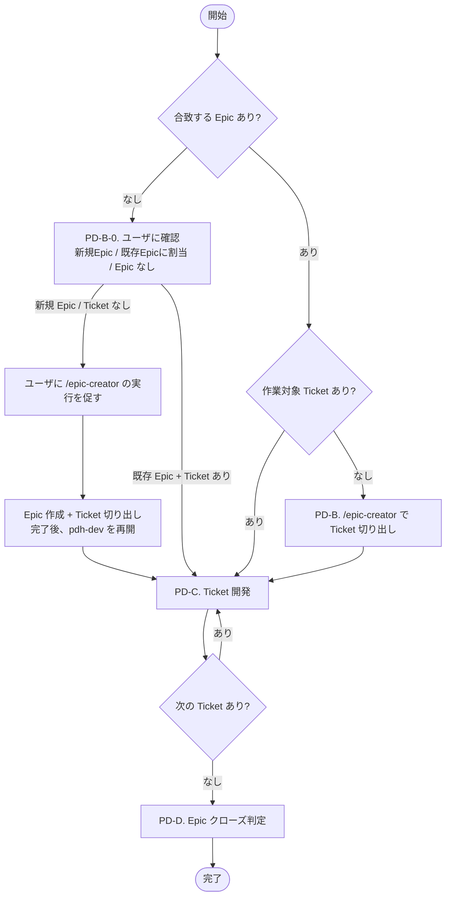
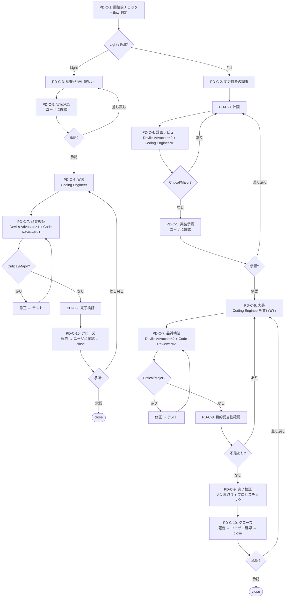
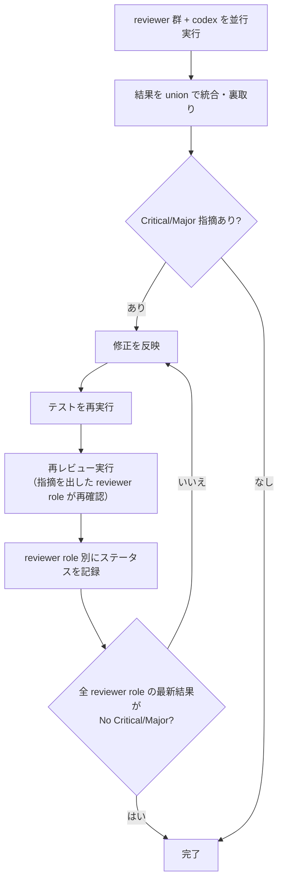

# PDH Dev — Product Delivery Hierarchy 開発ワークフロー

Epic → Ticket → 実装 → クローズの全フローを管理する。

## 最重要原則

@docs/product-delivery-hierarchy.md の定義に従い、プロダクトの価値を届けるために必要な作業を、必要なだけ、必要な品質で行うこと。

PDH は **ヒエラルキー** である。

- **Product Brief** = 人間の意思。解きたい問題と目指す状態
- **Epic** = その意思を「届けられる価値の単位」に切った仮説
- **Ticket** = Epic の成果物を構成する実装単位

Epic は Product Brief のゴールへ導くために書き、Ticket は Epic の Outcome を実現するために書く。常に **「誰の」「どんな問題を解くか」** を意識し、そこに貢献するために Epic / Ticket / コード / テストを書くこと。

---

# Part 1: リファレンス

辞書的に引くセクション。フロー実行中に必要に応じて参照する。

## 用語

- **flow** = Light / Full の進め方
- **step** = `PD-A`、`PD-B-0`、`PD-B`、`PD-C-*`、`PD-D-*` の単位
- **review loop** = 同じ step 内で、修正 → テスト → 再レビューを繰り返すこと
- **gate** = 次の step に進むための完了条件

この skill では、flow と step と review loop を分けて扱う。  
**事実の進捗** と **step の完了** を混同してはならない。

## 役割

- **PM（リード）** = 進行管理、判断、統合、ユーザ報告を担う。**判断とディスパッチに専念し、機械的タスクは全て委譲する**
- **Coding Engineer** = 実装・コード修正を担う
- **QA Engineer** = テスト実行、E2E 確認、ドキュメント再生成など機械的な検証タスクを担う
- **Devil's Advocate** = 計画レビュー、品質レビューで、ユーザの立場に立って厳しい指摘をする役割
- **Code Reviewer** = 品質レビューで、コードの観点から指摘をする役割。実装内容に精通している必要がある

### PM の責務と禁止事項

PM がやること:
- レビュー結果のトリアージ（severity 判定、採否決定、修正方針）
- Agent の spawn・dispatch
- note/ticket 更新、コミット、ユーザ報告

**PM がやらないこと（必ず委譲する）:**
- ソースコードの直接編集 → Coding Engineer
- テスト実行（pytest, vitest, playwright, test-all.sh） → QA Engineer
- ドキュメント再生成（OpenAPI, SDK モデル） → QA Engineer
- PD-C-7 修正後のコード修正 → Coding Engineer（PM が直接 Edit しない）

## Light / Full フロー

PD-C-1 で flow を判定する。  
**Light の適用条件をすべて満たす場合のみ、ユーザに Light / Full を確認する。1 つでも満たさなければ確認なしで Full にする。**  
判定結果は `current-note.md` の Status と `current-ticket.md` に記録する。

### Light の適用条件（すべて満たす場合に選択可能）

- Acceptance Criteria が **3 項目以下**
- 変更対象ファイルが **5 ファイル以下**（テスト含まず）
- **DB スキーマ変更（migration）なし**
- **API の破壊的変更なし**
- **新しい外部依存の追加なし**

1 つでも満たさない場合は Full。判断に迷う場合も Full。

### ステップ比較

| step | Full | Light | Light での変更点 |
|---|---|---|---|
| PD-C-1. 開始前チェック | ✓ | ✓ | flow 判定を含む |
| PD-C-2. 調査 | ✓ | — | PD-C-3 に統合 |
| PD-C-3. 計画 | ✓ | ✓ | 調査を含む簡易版 |
| PD-C-4. 計画レビュー | ✓ | — | スキップ |
| PD-C-5. 実装承認 | ✓ | ✓ | 同じ（ユーザ gate） |
| PD-C-6. 実装 | ✓ | ✓ | Coding Engineerは 1 つでよい |
| PD-C-7. 品質検証 | ✓ | ✓ | Devil's Advocate×1 + codex×1 のみ |
| PD-C-8. 目的妥当性確認 | ✓ | — | スキップ |
| PD-C-9. 完了検証 | ✓ | ✓ | AC チェックの裏取りを簡略化 |
| PD-C-10. クローズ | ✓ | ✓ | 同じ（ユーザ gate） |

### Light のノート運用

- スキップした step のセクションは削除してよい。残す場合は `Light スキップ` と 1 行書く
- プロセスチェックリストの Full のみ対象項目は `- [N/A] ... (Full only)` の書式で統一する

### flow 昇格ルール

Light で開始しても、実装中に以下が判明した場合は **Full に昇格する**:

- 影響範囲が想定を超えた
- 設計判断が必要になった
- セキュリティ上の懸念が出た

昇格時は PD-C-3 に戻り、`current-note.md` の Status 行を `Full（Light から昇格）` に更新する。

## ステップ遷移の宣言

step を移動するたびに、次の形式でユーザに宣言すること:

```text
[PD-A-1] -> [PD-A-2]
```

レビューを含む step では、ラウンドを `(N回目)` で表現する:

```text
[PD-C-3] -> [PD-C-4]               — 計画完了、レビュー開始
[PD-C-4] -> [PD-C-4(1回目)]        — レビュー実行
[PD-C-4(1回目)] -> [PD-C-4(2回目)] — Critical 修正後の再レビュー
[PD-C-4(2回目)] -> [PD-C-5]        — 全 reviewer PASS、実装承認へ
```

差し戻しも明示的に宣言する。省略や暗黙の遷移は禁止。

## step の運用ルール

- 選択された flow 内の step は省略しない
- `実装済み`、`テスト通過`、`反映済み` は事実の記述であり、step 完了を意味しない
- `完了` は、その step の gate を満たした場合にのみ使う
- `進めた`、`入った`、`終わった` は step 遷移を伴う言葉として扱い、gate 未達では使わない
- ある step の完了条件を満たすまで、後続 step を `進めた`、`入った`、`完了した`、`反映した` と表現してはならない
- 後続 step に触れる必要がある場合は、`未着手` または `次に行う予定` としてのみ述べる
- 現在地・次 step・差し戻し先を常に明示する

## 進捗報告フォーマット

進捗を報告する時は、必ず以下の順で書く。

```text
Current Step:
Step Status: 未着手 / 進行中 / 完了
Gate Remaining:
Evidence:
Next Step:
```

`Gate Remaining` が空でない限り、その step は完了ではない。

## step 完了ルール

各 step 完了時にコミットする。コミットメッセージは `[step 名] 概要` の形式（例: `[PD-C-3] Planning`）。  
セッション中断時の作業損失を防ぎ、step ごとの進捗を git 履歴で追跡する。

## ticket と note の役割分担

| ファイル | 役割 | 残す情報 |
|---|---|---|
| **current-ticket.md** | 後世への記録。`ticket.sh close` 時のコミットメッセージの元にもなる | Why / What / プロダクト AC / Implementation Notes（設計判断）/ Related Links |
| **current-note.md** | 今の作業のノート。セッションをまたぐ引き継ぎ資料 | Status / 調査結果 / 計画 / レビュー結果 / プロセス通過証跡 / Discoveries |

- **プロダクト AC**（振る舞い）→ ticket に書く
- **プロセス要件**（レビュー済み、テストパス等）→ note のプロセスチェックリストに書く

**AC に書いてよいもの / 書いてはいけないものの例:**

- OK: 「`/api/services` が 200 を返し、レスポンスに description フィールドが含まれる」
- OK: 「画面幅 375px 以下でメニューがハンバーガーに切り替わる」
- NG: 「計画レビューで Critical/Major が解消済み」 → note のプロセスチェックリスト
- NG: 「テストが全件パスする」 → note のプロセスチェックリスト
- NG: 「PM が直接コードを書いていない」 → note のプロセスチェックリスト

---

# Part 2: フロー

上から順に読む。各 step の詳細定義。

## 前提

- **Codex モード自動検出**: セッションで初めて pdh-dev を起動する際、ユーザが明示的にモードを指定していなければ `which codex` を実行する。codex CLI が存在する場合は「Codex モードで起動しますか？」とユーザに確認する。ユーザが既に「codex モード」または「通常モード」と指示済みの場合は確認不要
- **flow は Light / Full の 2 段階。** PD-C-1 で判定し、ノートとチケットに記録する。詳細は「Light / Full フロー」セクション参照
- **選択された flow 内の step は省略しない。** Full なら Full の定義された step、Light なら Light の定義された step を実行する
- **最初に `./ticket.sh help` を実行して、チケット操作の使い方を確認する**
- `product-brief.md` を最初に読む
- `docs/product-delivery-hierarchy.md` の運用ルール・テンプレートに従う
- CLAUDE.md のチーム運用ルール・コードマップ・repo ルールに従う
- チケットの作成・開始・中止・クローズは必ず `./ticket.sh` を使う
- `ticket.sh` が Ticket ごとに `features/<ticket-name>` ブランチを自動作成し、close 時に Epic の `branch` フィールドで指定されたブランチにマージする
- **Epic ブランチが基本**。Epic 作成時に `branch: epic/<epic-name>` を frontmatter に記載し、Epic 完了時に PR → main にマージする。振り返り・差分確認・ロールバックが容易になる
- 小規模な改善・hotfix など Epic ブランチが不要な場合は `branch: main` を指定してよい。判断は Epic 作成時にユーザに確認する
- 仕様変更が入った場合、コードやレビューを続ける前に `current-ticket.md` と `current-note.md` の What / Acceptance Criteria / 計画を最新化する
- ローカル文脈で判断できる論点は先に洗い出し、真にローカルから解けない blocker だけを短く相談する

## 全体フロー



## PD-A. Epic 作成・レビュー

> **Epic の作成・レビューは `epic-creator` スキルで行う。**

PDH 開始時に合致する Epic がない場合は、先に Epic を作る。  
Epic がない状態で PD-C に進んではならない。

## PD-B-0. ユーザに確認

開始時に、作業対象の Epic / Ticket の前提を確認する。

1. 合致する Epic があるか確認する
2. Epic がない場合は、新規 Epic を作るか、既存 Epic に割り当てるかをユーザに確認する
3. 作業対象 Ticket がない場合は、Epic から Ticket を切り出す
4. Epic と Ticket が揃ってから PD-C に進む

## PD-B. Epic から Ticket 切り出し

> **Ticket 切り出しは `epic-creator` スキルで行う。**

作業対象 Ticket は、必ず Epic から切り出す。  
pdh-dev の開始時に Ticket が存在しない場合は、先に Ticket を作る。`./ticket.sh` で開発を始めるのは Ticket が存在してから。

---

## PD-C. Ticket 開発

### PD-C 内部フロー



### PD-C-1. 開始前チェック

1. `current-ticket.md` が存在するか確認する
   - **存在しない場合**: `./ticket.sh list` で TODO ticket を表示し、どの Ticket を開始するかユーザに確認する。選択後 `./ticket.sh start <ticket-name>` を実行する
   - **存在する場合**: 内容を読んで作業を続行する
2. `current-note.md` を確認する
   - 作業中の調査結果、計画、レビュー結果はすべて `current-note.md` に記録する
   - セッションをまたいで作業を再開する際の引き継ぎ資料になる
   - ノートの構造は `current-note.md` の初期テンプレートに従う
3. Acceptance Criteria が明確か確認する。曖昧な場合はユーザに確認して具体化する
4. **AC のプロセス / 機能分離**: AC にプロセス要件（`レビュー済み` `テストパス` `PM が直接コードを書いていない` 等）が混入していたら、note のプロセスチェックリストに移し、AC にはプロダクトの観察可能な振る舞いのみを残す
5. Dependencies に未完了のブロッカーがあれば、着手せずユーザに報告する
6. **flow 判定**:
   - Light 適用条件を 1 つでも満たさない場合は **Full** とする
   - すべて満たす場合のみ、ユーザに **Light / Full** を確認する
7. 選択結果をノートの Status 行と ticket に `Flow: Light` または `Flow: Full` として記録する
8. 選択された flow 内の step は省略しない
9. ユーザが特定 step の再実施を指示した場合、通過済みでも再実施する

### ノートの記録ルール

`current-note.md` は以下のセクション構成で記録する（`./ticket.sh start` が初期テンプレートを生成する）。

| セクション | 記録タイミング | 内容 |
|---|---|---|
| **PD-C-2. 調査結果** | PD-C-2 完了時 | 調査結果の統合。技術的な懸念事項も記録する |
| **PD-C-3. 計画** | PD-C-3 完了時 | 実装計画（タスクリスト・ファイル所有権・テスト計画） |
| **PD-C-4. 計画レビュー結果** | PD-C-4 完了時 | reviewer 別ステータステーブル + 指摘と対応結果 |
| **PD-C-7. 品質検証結果** | PD-C-7 完了時 | reviewer 別ステータステーブル + 指摘と対応結果 |
| **PD-C-8. 目的妥当性確認** | PD-C-8 完了時 | AC の実質的達成・成果物の十分性・抜け漏れの棚卸し結果 |
| **PD-C-9. プロセスチェックリスト** | PD-C-9 完了時 | プロセス要件のチェック（レビュー通過、テストパス、実動確認等） |
| **Discoveries** | 随時 | 実装中に発見した想定外の事実 |

**必須ルール:**

- **Status 行を冒頭に維持する**
- **タイムスタンプは必須**
- **Flow を Status に含める**
- 空セクションを残さない。スキップした場合は理由を 1 行書く
- 同じ step を再実行した場合は、`PD-C-4(2回目)` `PD-C-7(3回目)` のようにセクションを追加する
- セッションをまたぐ引き継ぎ資料として機能させるため、判断の根拠や却下した代替案も記録する
- **gate 未達のまま次 step 名へ Status を更新してはならない**
- セッション終了時、作業が途中の場合は現在の状態と次にやるべきことを `current-note.md` に記録してから終了する

Status 形式:

```text
## Status: PD-C-6 (Implementation) | Flow: Light — 2026-04-08T03:45:00Z
```

### PD-C-2. 変更対象の調査

変更対象ファイルの現在の実装・設計経緯・影響範囲を調査する。

**調査内容:**

- 変更対象ファイルの `git log --oneline` で最近の ticket 名を調べる
- 関連 ticket があれば `tickets/done/` で背景・設計判断を読む
- `git blame <file>` でコミットを特定し、ticket → Epic → `product-brief.md` の順に辿る
- 変更対象ファイルの現在の実装を読み、影響範囲を把握する
- **実行パス追跡**: 変更箇所がどこから呼ばれ、データがどう流れるかをトレースする
- **懸念事項の記録**: 技術的な注意点、外部依存の制約、実環境確認が必要な点を記録する
- **blast radius** は少なくとも、アプリ本体、テスト、frontend、SDK / CLI、migration、docs / specs、repo rule files、examples などの関連レイヤーを確認する

**調査方法は規模で選ぶ:**

- **対象ファイルが少ない**: PM が直接読んで整理する
- **対象ファイルが多い / 何がどこにあるか不明**: 調査用サブエージェントを並行 spawn して分担する

調査結果は `current-note.md` の「PD-C-2. 調査結果」に記録し、コミットする（例: `[PD-C-2] Investigation`）。

### PD-C-3. 計画

調査結果をもとに、PM が以下を含む実装計画を立てる（`current-note.md` に記録）:

- **パターン分析**: 類似機能が既存コードでどう実装されているかを調べ、同じ規約・パターンに従う
- 実装するファイルと変更内容、ファイル所有権の分担
- **ファイル別コンテキスト**: 変更対象ファイルごとに、直近の設計判断・注意点を 2〜3 行でまとめる
- 仕様から見たテスト計画（エンドポイント、エラーケース、境界値）
- 実行可能な成果物がある場合の E2E / 実環境確認手順
- 設計判断は **一つ選んで決め、選択理由を記録する**。複数案を並べてユーザに丸投げしない
- 設計判断は ticket の Implementation Notes に理由を記録する
- **懸念事項への対処**: PD-C-2 で記録した懸念事項への対処方針を計画に反映する

計画を `current-note.md` に記録し、コミットする（例: `[PD-C-3] Planning`）。

### PD-C-4. 計画レビュー

Full のみ必須。

以下を並行実行する。各 reviewer には **計画の目的（何を解決するか）** を伝え、「現状の問題点」ではなく「計画の修正方針の妥当性」を評価させる:

- **Devil's Advocate ×2**: 計画の修正方針に矛盾・見落としがないか
- **Coding Engineer ×1**: 技術的実現可能性、依存関係、実装量の妥当性
- **codex ×1**: 致命的な点のみ指摘

ユーザが reviewer role を指定した場合は、その role 名をそのまま使う。  
結果を → 「レビューパターン（共通）」に従って統合・裏取りする。

完了条件:

- **全 reviewer role の最新回答が `No Critical/Major`**
- または未解消点についてユーザ同意済み

レビュー結果を `current-note.md` に記録し、コミットする（例: `[PD-C-4] Plan review`）。

### PD-C-5. 実装承認

計画レビュー完了後、実装に進む前にユーザに確認して承認を得る。  
**承認はユーザの明示的な意思表示のみ有効。**

報告内容:

- 計画内容
- 設計判断
- テスト計画
- 実環境確認手順
- 懸念事項

**差し戻しの場合**: ユーザが計画の修正を求めたら PD-C-3 に戻る。

### PD-C-6. 実装

> **前提条件**: PD-C-3 が完了し、PD-C-5 で承認を得ていること（Full の場合は PD-C-4 も完了）。

PM は CLAUDE.md「チーム構成・モデル設定」に従い、Coding Engineer を spawn する。Coding Engineer は `pdh-coding` スキルに従って実装する。

**Full**: Coding Engineer を 1 つ以上 spawn する。変更対象をファイル所有権で分割できる場合は並列実装。各 Coding Engineer の指示には、担当ファイルの「ファイル別コンテキスト」を含めること。

**Light**: Coding Engineer を 1 つ spawn する。PM は統合、差分確認、追加指示を担当する。

**完了チェック（QA Engineer に委譲）:**

PM は QA Engineer を spawn し、以下を実行させる:
- 自動テスト（全件パス必須）— CLAUDE.md のテストセクションに従い全スイートを実行
- 影響レイヤーをカバーするテスト
- 実環境確認（E2E テスト、curl による API 確認）
- `scripts/test-all.sh` 全スイートパス確認

QA Engineer の結果を受けて:
- 全パスなら実装チームを解散し、コミットする（例: `[PD-C-6] Implementation`）
- 失敗があれば Coding Engineer に差し戻す

テストが 1 件でも失敗、未実行、環境不備なら完了扱いにしない。

### PD-C-7. 品質検証

**Full** — 以下を並行実行する。各 reviewer には **チケットの目的と変更内容の概要** を伝える:

- **Devil's Advocate ×2**: セキュリティ脆弱性、設計上の論理バグ
- **Code Reviewer ×1 + Code Reviewer ×1**: コード品質、回帰、認可漏れ、整合性の問題
- **codex ×1**: 致命的な点のみ指摘

**Light** — 以下を並行実行する:

- **Devil's Advocate ×1**: セキュリティ脆弱性、設計上の論理バグ
- **codex ×1**: 致命的な点のみ指摘

結果を → 「レビューパターン（共通）」に従って統合・裏取りし、以下の観点で確認する:

- `product-brief.md` との整合性
- Acceptance Criteria の達成状況
- セキュリティ
- エラーハンドリングの網羅性
- 影響レイヤーの漏れ
- テスト手法と実動確認手法が変更内容に見合っているか

Critical / Major があれば:
1. **修正** → Coding Engineer に委譲（PM が直接コードを編集しない）
2. **テスト再実行** → QA Engineer に委譲
3. **再レビュー** を行い、全 reviewer role の最新結果が `No Critical/Major` になるまでループする。

完了条件:

- **全 reviewer role の最新回答が `No Critical/Major`**
- または未解消点についてユーザ同意済み

品質検証結果を `current-note.md` に記録し、コミットする（例: `[PD-C-7] Quality verification`）。

### PD-C-8. 目的妥当性確認

Full のみ必須。

PD-C-7 は **「書いたコードにバグ・脆弱性・設計問題がないか」** を見る。  
PD-C-8 は **「書くべきだったのに書いていないものがないか」** を見る。

確認観点:

1. **Acceptance Criteria の実質的達成**: 形式的に満たすだけでなく、Why を満たしているか
2. **成果物の十分性**: テストなら主要フローが網羅されているか、機能ならユーザが使える状態か
3. **抜け漏れの棚卸し**
4. **懸念事項の確認**: PD-C-2 で記録した懸念事項が問題化していないか

不足がある場合:

- この ticket 内で対応すべきもの → PD-C-6 に戻る
- 別 ticket に切り出すべきもの → ユーザに確認する

目的妥当性確認結果を `current-note.md` に記録し、コミットする（例: `[PD-C-8] Purpose validation`）。

確認完了後、以下をテキストで報告する:
- **テスト結果**: 自動テスト・E2E テストの結果
- **AC 達成状況**: 各 Acceptance Criteria の達成/未達
- **実環境動作確認結果**
- **懸念事項・残課題**: 既知の制限、スコープ外にした項目

### PD-C-9. 完了検証

1. `current-ticket.md` の **プロダクト Acceptance Criteria** を一つずつ確認し、各項目に `[x]` を付ける
2. `current-note.md` の **プロセスチェックリスト** を一つずつ確認し、各項目に `[x]` を付ける
3. **Acceptance Criteria チェックの裏取り**:
   - **Full**: Review Agent を並行 spawn し（モデルは CLAUDE.md「チーム構成・モデル設定」参照）、各 AC 項目が実際に達成されているかコード・テスト結果・ノートを読んで検証させる。リードの自己判断だけで「達成済み」としない。NOT VERIFIED が返った項目は証拠を補完してから進む
   - **Light**: PM が AC 項目を確認する（裏取り agent なし）
4. **ドキュメント sweep**: 変更内容に名前・パス・URL の rename / delete が含まれる場合、全ドキュメントを走査し、旧名称・旧パスの残骸がないか確認する
5. CLAUDE.md のテストセクションに従い全スイートを最終確認として実行する
6. 必要なら `update-docs` スキルを実行する
7. Acceptance Criteria チェック済みの ticket ファイルを含めてコミットする

### PD-C-10. クローズ

1. `./ticket.sh list` で Epic の残り TODO Ticket を確認する
2. ユーザに以下を報告し、クローズ承認を得る。**承認はユーザの明示的な意思表示のみ有効**:
   - **確認手順**: ユーザが自分で動作確認する方法
   - **作業サマリ**: 主な変更を 3〜5 行で
   - **実施したテスト手法と結果の概要**
   - **懸念事項・残課題**
   - **チケット化候補**
   - **Epic 残チケット状況**
3. **差し戻しの場合**: PD-C-6 に戻る。修正後は PD-C-7 から再走する。差し戻し理由を note の Discoveries に記録する
4. 承認後 `./ticket.sh close` でチケットをクローズ
5. **Epic ファイルの更新**: Epic ファイルの `Tickets` セクションで、クローズしたチケットにチェックを付ける（`- [ ]` → `- [x]`）
6. ユーザの Epic 完了判断に応じて:
   - **Epic 未完了**: `/clear` → `/pdh-dev` で次の作業を開始するよう促す
   - **Epic 完了**: ゼロベースレビュー用のチケットを切り（`./ticket.sh new`）、PD-D に進む

---

## PD-D. Epic クローズ判定

> PD-C-10 でユーザが「Epic 完了」と判断した場合に、このフローを実行する。

### PD-D-1. Exit Criteria 確認

1. Epic の Exit Criteria を全て確認する
2. 満たしていない条件があれば、追加 Ticket が必要かユーザに確認する
3. 全条件を満たしていれば PD-D-2 に進む

### PD-D-2. ゼロベースレビュー

**「ゼロから自由に再設計できるとしたら、どうするか」** という観点で Epic 全体を振り返る。  
目的は、Ticket 単位のレビューでは見落としがちな **設計レベルの改善機会** を発見すること。

以下を並行実行する:

- **Devil's Advocate ×2**: 「今の実装を白紙にして再設計するなら何を変えるか」— アーキテクチャ・データモデル・API 設計の改善点。加えて「過剰な複雑さはないか、より少ないコード・シンプルな設計で同じ目的を達成できなかったか」も検証する
- **Code Reviewer ×1 + Code Reviewer ×1**: 「コードベース全体を見て、技術的負債や構造上の問題はないか」— 重複コード・責務の混在・拡張性の課題
- **codex ×1**: 致命的な設計問題のみ指摘

コード重複の検出には `similarity-ts` / `similarity-py`（`cargo install` で導入）を活用し、構造的な重複を定量的に把握する。

コードレビューに加えて、**実環境でのスモークテストも必ず実施する**:

- API 変更がある場合: curl で実際にエンドポイントを叩いて確認
- UI 変更がある場合: browser automation で操作確認
- 外部サービス連携がある場合: 実モデル / 実プロバイダで 1 回は実行確認

結果を → 「レビューパターン（共通）」に従って統合・裏取りし、以下に分類する:

- **今すぐ修正すべき問題**（Critical / Major）→ 追加 Ticket を切って対応
- **将来の改善候補** → `docs/future-list.md` に記録
- **問題なし** → そのまま PD-D-3 へ

レビュー結果は Epic ファイルの **Close Summary** に記録する。

### PD-D-3. ユーザケーステストとドキュメント整備

**ユーザ視点** で Epic の成果物を検証する。

#### 1. ユーザケーステスト

Epic の Outcome / Exit Criteria に基づき、主要ユーザジャーニーを実環境で端から端まで実行する:

- ペルソナごとの操作フロー
- エッジケース
- 複数 Ticket の成果物が連携する箇所

問題が見つかった場合:

- **修正が必要** → 追加 Ticket を切って対応。完了後 PD-D-3 を再実行
- **軽微・改善案** → `docs/future-list.md` に記録

#### 2. ドキュメント整備

以下の必要性を検討し、必要なものを作成・更新する:

- リリースノート
- 操作マニュアル / ガイド
- API ドキュメント
- 内部ドキュメント

不要な場合は理由を Close Summary に 1 行書く。

結果を Epic ファイルの **Close Summary** に追記する。

### PD-D-4. Epic クローズ

1. Epic ファイルの YAML frontmatter に `zero_base_reviewed: true` を追加する
2. Close Summary にゼロベースレビュー結果の要約を記録する
3. ユーザに以下を報告し、**Epic クローズの明示的な承認** を得る。**承認はユーザの明示的な意思表示（「OK」「y」「yes」「閉じて」等）のみ有効。曖昧な返答や方向性の指示だけでは承認とみなさない**:
   - **Close Summary**: 達成した Outcome、完了 Ticket 一覧
   - **未完了 Ticket**: スコープ外にしたもの、キャンセルしたものとその理由
   - **未達 Exit Criteria**: 残っている条件とその対応方針案
   - **ゼロベースレビュー結果**: Critical / Major の有無、future-list に記録した改善候補
   - **残課題・リスク**: Epic クローズ後に対応が必要なもの
4. 承認後、`closed_at` を追加し `epics/done/` に移動する
5. **Epic ブランチを main にマージする**: `git checkout main && git merge epic/<name> --no-edit`。コンフリクトがあれば解決し、全テストパスを確認する。Epic の `branch` が `main` の場合はこのステップをスキップする
6. **差し戻しの場合**: ユーザが追加対応を求めたら PD-D-1 に戻る
7. **PD-D-3 で追加 Ticket を切った場合**: それらの Ticket の完了状況を Close Summary に含める

---

# Part 3: 横断ルール

フロー内から参照される共通ルール。

## チーム運用・サブエージェント運用

### 原則

- 「読むだけ」のタスク（レビュー）は Review Agent を並行実行し、「書く」タスク（実装）は TeamCreate でチームを作る
- **PM（リード）がソースコードを直接編集しないこと。実装は必ず Coding Engineer で行う**

### spawn のルール

- チームメイトはリードの会話履歴を引き継がない。spawn プロンプトに以下を必ず含めること:
  - タスクの目的と背景
  - 対象ファイルパス
  - 該当 Ticket の Acceptance Criteria
  - 担当するファイルの範囲（他のチームメイトとの衝突を避けるため）
  - 担当ファイルの「ファイル別コンテキスト」（PD-C-3 計画で作成した、直近の設計判断・注意点）
  - **`pdh-coding` スキルを読んでから作業開始すること**（実装品質・テスト設計ルール）
- 同一ファイルを複数のチームメイトが編集しないよう、ファイル所有権を分けること
- チームが解散する時は不必要な Team は閉じること
- Haiku モデルは使わない。各役割のモデルは CLAUDE.md「チーム構成・モデル設定」に従う

### サブエージェント委譲ルール

- **メインコンテキスト汚染を避けるため**、調査・レビュー・長時間テスト・実動確認は、利用可能なら可能な限り積極的にサブエージェントへ委譲する
- レビュー系は読み取り専用にする
- ユーザが指定した review role / review loop / gate / subagent 構成は、省略・短縮・言い換え・統合で代替してはならない
- ユーザが複数 reviewer を求めた場合、各 reviewer は**同じ差分全体**を見る。担当分けレビューは補助であり、代替ではない
- 各サブエージェントには、目的・対象ファイル・AC・担当範囲・ファイル別コンテキストを必ず渡す
- 特に以下はサブエージェント優先:
  - blast radius 用の大規模検索
  - `git log` / `git blame` / ticket / epic の履歴調査
  - PD-C-4 計画レビューの観点別レビュー
  - PD-C-7 品質レビューの観点別レビュー
  - **テスト全件実行** → QA Engineer に委譲（PM が直接 pytest / vitest / playwright を実行しない）
  - **ドキュメント再生成**（OpenAPI validate/export, SDK モデル生成） → QA Engineer に委譲
  - API や frontend の実動確認をまとめて行う検証タスク
- サブエージェントから戻す内容は、要約・結論・失敗点・次アクションだけに絞る
- 失敗時は `失敗した suite / 主要エラー / 再現コマンド / 修正要否` だけを要約して返す
- 実動確認を委譲する場合は、対象 URL / endpoint、期待結果、確認対象ファイル、失敗時の扱いを明示する

## レビューパターン（共通）

PD-A・PD-C-4・PD-C-7・PD-D-2 はすべて同じレビュー構造で動く。  
ラウンドは `(N回目)` で表現する。



### レビュアーへの指示ルール

レビュアーを spawn する際、以下を指示に含めること:

- **計画・変更の目的**: 何を解決するための計画 / 変更か
- 対象ファイル・スコープ
- レビュー観点（role ごとの責務）
- Critical / Major を優先し、瑣末な点は後回しにしてよいこと

### レビューループの必須ルール

1. **修正したら必ず再レビューする** — 修正内容を反映した後、同じ reviewer role で再レビューして確認する
2. **完了条件: 全 reviewer role の最新回答が `No Critical/Major` であること**
3. **指摘のクローズ権限はレビュアーにある** — 指摘を出した reviewer role が再レビューで `解消済み` と判断して初めて閉じられる
4. **レビューループが 6 回終わっても収束しない場合はユーザに確認する**
5. **Round N で PASS した reviewer は、Round N+1 で差分が影響しない限り再実行不要**

### PM の裏取りルール

PM がレビュー結果を統合する際の「裏取り」の範囲を厳密に定義する。

#### 許可される操作

- 複数 reviewer の同一指摘を統合する
- コード上の事実誤認を除外する

#### 禁止される操作

- `計画に書いてあるから問題ない` という理由での却下
- PM の判断で指摘の重要度を下げる
- PM が `対応済み` とみなしてクローズする
- 既存の問題とみなして、現在の問題を無視する
- ユーザが指定した role / gate / 承認条件を、近い意味の別手順で満たしたと扱う

### スコープ外の既存問題の扱い

レビューで発見した問題が今回のチケットの変更によるものでない場合、**PM が自分で対応方針を決定してはならない**。以下の手順で対応する:

1. **既存問題を `current-note.md` に記録する**（問題の内容・発見箇所・影響範囲）
2. **ユーザに対応方針を確認する**。選択肢の例:
   - このチケット内で修正する
   - 同じ Epic に別チケットを切る
   - `docs/future-list.md` に記録して将来対応
   - 対応不要
3. **セキュリティ上の重大な問題**は即座にユーザに相談する

このルールは PD-C-4、PD-C-7、PD-C-8 のすべてに適用する。

### レビュー品質ルール

- LLM レビューは実行ごとに指摘の 6-7 割が入れ替わる。複数回実行して union（和集合）を取る
- reviewer と codex は並行実行する（依存関係なし）
- 検出頻度は「信頼度のヒント」であり「重要度の指標」ではない

### codex レビュー

Agent ツールで codex 実行用のサブエージェントを spawn し、その中で codex を実行する。メインコンテキストに codex の出力を直接流さないこと。

## ユーザ相談ルール

以下の場合にユーザに確認する:

1. **判断に迷う・取り消しコストが高い場合**: スコープ変更、仕様変更、AC の変更など。選択肢と推奨案を添える
2. **レビューループが収束しない場合**: 同じ指摘が修正後も解消しないとき
3. **既存問題の扱いを決める場合**: 今回の変更によるものではない問題を見つけたとき
4. **重大なセキュリティ問題が見つかった場合**

承認が必要な場面では、`OK`、`yes`、`進めて`、`閉じて` などの明示応答だけを承認とみなす。

## 中止フロー

Epic / Ticket を中止する場合:

- **Ticket**: `./ticket.sh cancel` を実行する
- **Epic**: frontmatter に `cancelled_at` を追加し、本文に中止理由を記録してから `epics/done/` に移動する
- `done/` 内のファイルは消さない。判断の履歴として残す

上位レイヤ（Product Brief / Epic）の前提が崩れた場合は、下位の作業を止めて上位を先に更新する。
