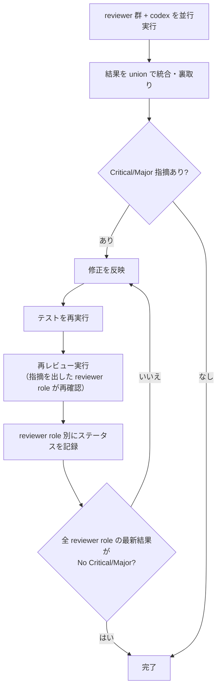

# PDH Dev — Product Delivery Hierarchy 開発ワークフロー

Epic → Ticket → 実装 → クローズの全フローを管理する。

## 最重要原則

@docs/product-delivery-hierarchy.md の定義に従い、プロダクトの価値を届けるために必要な作業を、必要なだけ、必要な品質で行うこと。

PDH は **ヒエラルキー** である。

- **Product Brief** = 人間の意思。解きたい問題と目指す状態
- **Epic** = その意思を「届けられる価値の単位」に切った仮説
- **Ticket** = Epic の成果物を構成する実装単位

Epic は Product Brief のゴールへ導くために書き、Ticket は Epic の Outcome を実現するために書く。常に **「誰の」「どんな問題を解くか」** を意識し、そこに貢献するために Epic / Ticket / コード / テストを書くこと。

### AC / Exit Criteria 未達のまま close しないこと（絶対禁止）

- **Acceptance Criteria / Exit Criteria は close 前に全件 verified にすること**。`unverified` が 1 件でもあれば close できない
- **mock / スタブ / 機能無効化での確認は、その AC が mock で verified と明記されている場合に限る**。「実プロバイダで動く」「実環境で日本語ヒットする」等が AC なら、mock テスト通過では verified にできない
- **follow-up ticket への逃がしは deferral ルールに従うこと**。PM / PdM が自発的に「future-list に入れれば close できる」と判断してはならない。deferral はユーザの明示承認事項
- **環境的に裏取りが難しい AC は、着手前（PD-C-1）にユーザに必要な環境・credential を確認すること**。close 直前になって「環境がないので future-list」は禁止

---

# Part 1: リファレンス

辞書的に引くセクション。フロー実行中に必要に応じて参照する。

## 用語

- **flow** = Light / Full の進め方
- **step** = `PD-A`、`PD-B-0`、`PD-B`、`PD-C-*`、`PD-D-*` の単位
- **review loop** = 同じ step 内で、修正 → テスト → 再レビューを繰り返すこと
- **gate** = 次の step に進むための完了条件

この skill では、flow と step と review loop を分けて扱う。  
**事実の進捗** と **step の完了** を混同してはならない。

## 役割

- **PM（リード）** = 進行管理、dispatch、統合、ユーザ報告を担う。**ディスパッチと進行に専念し、機械的タスクとプロダクト判断は全て委譲する**
- **PdM（プロダクト判断）** = `product-brief.md` との整合、AC 変更の妥当性、Epic 目的の妥当性確認、follow-up の優先度判断を担う。PM が spawn して呼ぶ。**常に Opus で実行する**
- **Coding Engineer** = 実装・コード修正を担う
- **QA Engineer** = テスト実行、E2E 確認、ドキュメント再生成など機械的な検証タスクを担う
- **Surface Observer** = 外部に露出した surface（UI / HTTP API / SDK）を **consumer 視点で実際に叩いて観察する** 役割。PD-C-9 完了検証後・PD-C-10 クローズ承認の **直前** に起動する。実機ブラウザ（agent-browser）・`curl` / `httpie` / 実 SDK 呼び出しを使い、自動テスト (playwright / pytest / vitest) では拾えない **視覚崩れ・レスポンスボディの違和感・エラーメッセージの分かりにくさ・情報ヒエラルキーの破綻** を目視する。**Sonnet で実行する**（操作と観察記述のバランスが取れる）。外部 surface を触らない純 backend ロジックのみのチケットでは skip してよい
- **Devil's Advocate** = 計画レビュー、品質レビューで、ユーザの立場に立って厳しい指摘をする役割
- **Code Reviewer** = 品質レビューで、コードの観点から指摘をする役割。実装内容に精通している必要がある

### PM の責務と禁止事項

PM がやること:
- レビュー結果のトリアージ（severity 判定、採否決定、修正方針）
- Agent の spawn・dispatch
- note/ticket 更新、コミット、ユーザ報告

**PM がやらないこと（必ず委譲する）:**
- ソースコードの直接編集 → Coding Engineer
- テスト実行（pytest, vitest, playwright, test-all.sh） → QA Engineer
- ドキュメント再生成（OpenAPI, SDK モデル） → QA Engineer
- PD-C-7 修正後のコード修正 → Coding Engineer（PM が直接 Edit しない）
- プロダクト判断（product-brief 整合・AC 変更の妥当性・follow-up 優先度） → PdM

## Light / Full フロー

PD-C-1 で flow を判定する。  
**Light の適用条件をすべて満たす場合のみ、ユーザに Light / Full を確認する。1 つでも満たさなければ確認なしで Full にする。**  
判定結果は `current-note.md` の Status と `current-ticket.md` に記録する。

### Light の適用条件（すべて満たす場合に選択可能）

- Acceptance Criteria が **3 項目以下**
- 変更対象ファイルが **5 ファイル以下**（テスト含まず）
- **DB スキーマ変更（migration）なし**
- **API の破壊的変更なし**
- **新しい外部依存の追加なし**

1 つでも満たさない場合は Full。判断に迷う場合も Full。

### ステップ比較

| step | Full | Light | Light での変更点 |
|---|---|---|---|
| PD-C-1. 開始前チェック | ✓ | ✓ | flow 判定を含む |
| PD-C-2. 調査 | ✓ | — | PD-C-3 に統合 |
| PD-C-3. 計画 | ✓ | ✓ | 調査を含む簡易版 |
| PD-C-4. 計画レビュー | ✓ | — | スキップ |
| PD-C-5. 実装承認 | ✓ | ✓ | 同じ（ユーザ gate） |
| PD-C-6. 実装 | ✓ | ✓ | Coding Engineerは 1 つでよい |
| PD-C-7. 品質検証 | ✓ | ✓ | Devil's Advocate×1 + codex×1 のみ |
| PD-C-8. 目的妥当性確認 | ✓ | — | スキップ |
| PD-C-9. 完了検証 | ✓ | ✓ | AC チェックの裏取りを簡略化 |
| PD-C-10. クローズ | ✓ | ✓ | 同じ（ユーザ gate） |

### Light のノート運用

- スキップした step のセクションは削除してよい。残す場合は `Light スキップ` と 1 行書く
- プロセスチェックリストの Full のみ対象項目は `- [N/A] ... (Full only)` の書式で統一する

### flow 昇格ルール

Light で開始しても、実装中に以下が判明した場合は **Full に昇格する**:

- 影響範囲が想定を超えた
- 設計判断が必要になった
- セキュリティ上の懸念が出た

昇格時は PD-C-3 に戻り、`current-note.md` の Status 行を `Full（Light から昇格）` に更新する。

## ステップ遷移の宣言

step を移動するたびに、次の形式でユーザに宣言すること:

```text
[PD-A-1] -> [PD-A-2]
```

レビューを含む step では、ラウンドを `(N回目)` で表現する:

```text
[PD-C-3] -> [PD-C-4]               — 計画完了、レビュー開始
[PD-C-4] -> [PD-C-4(1回目)]        — レビュー実行
[PD-C-4(1回目)] -> [PD-C-4(2回目)] — Critical 修正後の再レビュー
[PD-C-4(2回目)] -> [PD-C-5]        — 全 reviewer PASS、実装承認へ
```

差し戻しも明示的に宣言する。省略や暗黙の遷移は禁止。

## step の運用ルール

- 選択された flow 内の step は省略しない
- `実装済み`、`テスト通過`、`反映済み` は事実の記述であり、step 完了を意味しない
- `完了` は、その step の gate を満たした場合にのみ使う
- `進めた`、`入った`、`終わった` は step 遷移を伴う言葉として扱い、gate 未達では使わない
- ある step の完了条件を満たすまで、後続 step を `進めた`、`入った`、`完了した`、`反映した` と表現してはならない
- 後続 step に触れる必要がある場合は、`未着手` または `次に行う予定` としてのみ述べる
- 現在地・次 step・差し戻し先を常に明示する

## 進捗報告フォーマット

進捗を報告する時は、必ず以下の順で書く。

```text
Current Step:
Step Status: 未着手 / 進行中 / 完了
Gate Remaining:
Evidence:
Next Step:
```

`Gate Remaining` が空でない限り、その step は完了ではない。

## step 完了ルール

各 step 完了時にコミットする。コミットメッセージは `[step 名] 概要` の形式（例: `[PD-C-3] Planning`）。  
セッション中断時の作業損失を防ぎ、step ごとの進捗を git 履歴で追跡する。

## ticket と note の役割分担

| ファイル | 役割 | 残す情報 |
|---|---|---|
| **current-ticket.md** | 後世への記録。`ticket.sh close` 時のコミットメッセージの元にもなる | Why / What / プロダクト AC / Implementation Notes（設計判断）/ Related Links |
| **current-note.md** | 今の作業のノート。セッションをまたぐ引き継ぎ資料 | Status / 調査結果 / 計画 / レビュー結果 / プロセス通過証跡 / Discoveries |

- **プロダクト AC**（振る舞い）→ ticket に書く
- **プロセス要件**（レビュー済み、テストパス等）→ note のプロセスチェックリストに書く

**AC に書いてよいもの / 書いてはいけないものの例:**

- OK: 「`/api/services` が 200 を返し、レスポンスに description フィールドが含まれる」
- OK: 「画面幅 375px 以下でメニューがハンバーガーに切り替わる」
- NG: 「計画レビューで Critical/Major が解消済み」 → note のプロセスチェックリスト
- NG: 「テストが全件パスする」 → note のプロセスチェックリスト
- NG: 「PM が直接コードを書いていない」 → note のプロセスチェックリスト

---

# Part 2: フロー

上から順に読む。各 step の詳細定義。

## 前提

- **Codex モード自動検出**: セッションで初めて pdh-dev を起動する際、ユーザが明示的にモードを指定していなければ `which codex` を実行する。codex CLI が存在する場合は「Codex モードで起動しますか？」とユーザに確認する。ユーザが既に「codex モード」または「通常モード」と指示済みの場合は確認不要
- **flow は Light / Full の 2 段階。** PD-C-1 で判定し、ノートとチケットに記録する。詳細は「Light / Full フロー」セクション参照
- **選択された flow 内の step は省略しない。** Full なら Full の定義された step、Light なら Light の定義された step を実行する
- **最初に `./ticket.sh help` を実行して、チケット操作の使い方を確認する**
- `product-brief.md` を最初に読む
- `docs/product-delivery-hierarchy.md` の運用ルール・テンプレートに従う
- CLAUDE.md のチーム運用ルール・コードマップ・repo ルールに従う
- チケットの作成・開始・中止・クローズは必ず `./ticket.sh` を使う
- `ticket.sh` が Ticket ごとに `features/<ticket-name>` ブランチを自動作成し、close 時に Epic の `branch` フィールドで指定されたブランチにマージする
- **Epic ブランチが基本**。Epic 作成時に `branch: epic/<epic-name>` を frontmatter に記載し、Epic 完了時に PR → main にマージする。振り返り・差分確認・ロールバックが容易になる
- 小規模な改善・hotfix など Epic ブランチが不要な場合は `branch: main` を指定してよい。判断は Epic 作成時にユーザに確認する
- 仕様変更が入った場合、コードやレビューを続ける前に `current-ticket.md` と `current-note.md` の What / Acceptance Criteria / 計画を最新化する
- ローカル文脈で判断できる論点は先に洗い出し、真にローカルから解けない blocker だけを短く相談する

## 全体フロー


## PD-A. Epic 作成・レビュー

> **Epic の作成・レビューは `epic-creator` スキルで行う。**

PDH 開始時に合致する Epic がない場合は、先に Epic を作る。  
Epic がない状態で PD-C に進んではならない。

## PD-B-0. ユーザに確認

開始時に、作業対象の Epic / Ticket の前提を確認する。

1. 合致する Epic があるか確認する
2. Epic がない場合は、新規 Epic を作るか、既存 Epic に割り当てるかをユーザに確認する
3. 作業対象 Ticket がない場合は、Epic から Ticket を切り出す
4. Epic と Ticket が揃ってから PD-C に進む

## PD-B. Epic から Ticket 切り出し

> **Ticket 切り出しは `epic-creator` スキルで行う。**

作業対象 Ticket は、必ず Epic から切り出す。  
pdh-dev の開始時に Ticket が存在しない場合は、先に Ticket を作る。`./ticket.sh` で開発を始めるのは Ticket が存在してから。

---

## PD-C. Ticket 開発

### PD-C 内部フロー


### PD-C-1. 開始前チェック

0. **Worktree アイソレート (複数 Epic 並列時のみ)**: このセッションが Epic 専用 worktree に入っていなければ `EnterWorktree({name: "<epic-slug>"})` で入る。既に入室済ならスキップ。単一 Epic の serial 運用なら不要。詳細は CLAUDE.md 「multi-worktree 並列運用」参照
1. `current-ticket.md` が存在するか確認する
   - **存在しない場合**: `./ticket.sh list` で TODO ticket を表示し、どの Ticket を開始するかユーザに確認する。選択後、複数 Epic 並列時は `flock -x /tmp/<project>-ticket.lock ./ticket.sh start <ticket-name>`、単独運用なら `./ticket.sh start <ticket-name>`
   - **存在する場合**: 内容を読んで作業を続行する
2. `current-note.md` を確認する
   - 作業中の調査結果、計画、レビュー結果はすべて `current-note.md` に記録する
   - セッションをまたいで作業を再開する際の引き継ぎ資料になる
   - ノートの構造は `current-note.md` の初期テンプレートに従う
3. Acceptance Criteria が明確か確認する。曖昧な場合はユーザに確認して具体化する
4. **AC のプロセス / 機能分離**: AC にプロセス要件（`レビュー済み` `テストパス` `PM が直接コードを書いていない` 等）が混入していたら、note のプロセスチェックリストに移し、AC にはプロダクトの観察可能な振る舞いのみを残す
5. **AC の裏取り手段分類（必須）**: 各 AC 項目に対し、裏取りに必要な手段を以下の 3 分類のいずれかでタグ付けする。note の `AC 裏取り計画` セクションに記録する:
   - `unit-test-sufficient` — mock / 自動テストだけで verified にできる項目
   - `integration-required` — DB / subprocess / internal service を含む統合テストが必要な項目
   - `real-env-required` — 実プロバイダ / 実外部サービス / 実環境前提の項目（API key・ネット・実モデル・ハードウェア等を要する）
   `real-env-required` の項目は、裏取り手段（実行コマンド・必要な環境変数・credential）を **この step で明示的に洗い出し、ユーザに確認する**。「API key が必要」「実モデルのダウンロードが必要」「特定 OS 拡張が必要」等、環境的に難しい前提は着手前に解決する（後述 PD-C-9 / PD-D-1 の deferral ルールも参照）
6. **自動進行モードでの前置確認**: ユーザから「自動で判断して進めて」等の一任指示を受けた場合でも、AC に `real-env-required` 項目や解釈の余地がある項目があれば、**着手前に必ずユーザに確認する**（必要な API key・credential・環境・解釈の明確化）。一任指示を理由に未解決のまま先に進んではならない
7. Dependencies に未完了のブロッカーがあれば、着手せずユーザに報告する
8. **flow 判定**:
   - Light 適用条件を 1 つでも満たさない場合は **Full** とする
   - すべて満たす場合のみ、ユーザに **Light / Full** を確認する
9. 選択結果をノートの Status 行と ticket に `Flow: Light` または `Flow: Full` として記録する
10. 選択された flow 内の step は省略しない
11. ユーザが特定 step の再実施を指示した場合、通過済みでも再実施する

### ノートの記録ルール

`current-note.md` は以下のセクション構成で記録する（`./ticket.sh start` が初期テンプレートを生成する）。

| セクション | 記録タイミング | 内容 |
|---|---|---|
| **PD-C-2. 調査結果** | PD-C-2 完了時 | 調査結果の統合。技術的な懸念事項も記録する |
| **PD-C-3. 計画** | PD-C-3 完了時 | 実装計画（タスクリスト・ファイル所有権・テスト計画） |
| **PD-C-4. 計画レビュー結果** | PD-C-4 完了時 | reviewer 別ステータステーブル + 指摘と対応結果 |
| **PD-C-7. 品質検証結果** | PD-C-7 完了時 | reviewer 別ステータステーブル + 指摘と対応結果 |
| **PD-C-8. 目的妥当性確認** | PD-C-8 完了時 | AC の実質的達成・成果物の十分性・抜け漏れの棚卸し結果 |
| **PD-C-9. プロセスチェックリスト** | PD-C-9 完了時 | プロセス要件のチェック（レビュー通過、テストパス、実動確認等） |
| **Discoveries** | 随時 | 実装中に発見した想定外の事実 |

**必須ルール:**

- **Status 行を冒頭に維持する**
- **タイムスタンプは必須**
- **Flow を Status に含める**
- 空セクションを残さない。スキップした場合は理由を 1 行書く
- 同じ step を再実行した場合は、`PD-C-4(2回目)` `PD-C-7(3回目)` のようにセクションを追加する
- セッションをまたぐ引き継ぎ資料として機能させるため、判断の根拠や却下した代替案も記録する
- **gate 未達のまま次 step 名へ Status を更新してはならない**
- セッション終了時、作業が途中の場合は現在の状態と次にやるべきことを `current-note.md` に記録してから終了する

Status 形式:

```text
## Status: PD-C-6 (Implementation) | Flow: Light — 2026-04-08T03:45:00Z
```

### PD-C-2. 変更対象の調査

変更対象ファイルの現在の実装・設計経緯・影響範囲を調査する。

**調査内容:**

- 変更対象ファイルの `git log --oneline` で最近の ticket 名を調べる
- 関連 ticket があれば `tickets/done/` で背景・設計判断を読む
- `git blame <file>` でコミットを特定し、ticket → Epic → `product-brief.md` の順に辿る
- 変更対象ファイルの現在の実装を読み、影響範囲を把握する
- **実行パス追跡**: 変更箇所がどこから呼ばれ、データがどう流れるかをトレースする
- **懸念事項の記録**: 技術的な注意点、外部依存の制約、実環境確認が必要な点を記録する
- **blast radius** は少なくとも、アプリ本体、テスト、frontend、SDK / CLI、migration、docs / specs、repo rule files、examples などの関連レイヤーを確認する

**調査方法は規模で選ぶ:**

- **対象ファイルが少ない**: PM が直接読んで整理する
- **対象ファイルが多い / 何がどこにあるか不明**: 調査用サブエージェントを並行 spawn して分担する

調査結果は `current-note.md` の「PD-C-2. 調査結果」に記録し、コミットする（例: `[PD-C-2] Investigation`）。

### PD-C-3. 計画

調査結果をもとに、PM が以下を含む実装計画を立てる（`current-note.md` に記録）:

- **パターン分析**: 類似機能が既存コードでどう実装されているかを調べ、同じ規約・パターンに従う
- 実装するファイルと変更内容、ファイル所有権の分担
- **ファイル別コンテキスト**: 変更対象ファイルごとに、直近の設計判断・注意点を 2〜3 行でまとめる
- 仕様から見たテスト計画（エンドポイント、エラーケース、境界値）
- 実行可能な成果物がある場合の E2E / 実環境確認手順
- 設計判断は **一つ選んで決め、選択理由を記録する**。複数案を並べてユーザに丸投げしない
- 設計判断は ticket の Implementation Notes に理由を記録する
- **懸念事項への対処**: PD-C-2 で記録した懸念事項への対処方針を計画に反映する

計画を `current-note.md` に記録し、コミットする（例: `[PD-C-3] Planning`）。

### PD-C-4. 計画レビュー

Full のみ必須。

以下を並行実行する。各 reviewer には **計画の目的（何を解決するか）** を伝え、「現状の問題点」ではなく「計画の修正方針の妥当性」を評価させる:

- **Devil's Advocate ×2**: 計画の修正方針に矛盾・見落としがないか
- **Coding Engineer ×1**: 技術的実現可能性、依存関係、実装量の妥当性
- **codex ×1**: 致命的な点のみ指摘

ユーザが reviewer role を指定した場合は、その role 名をそのまま使う。  
結果を → 「レビューパターン（共通）」に従って統合・裏取りする。

完了条件:

- **全 reviewer role の最新回答が `No Critical/Major`**
- または未解消点についてユーザ同意済み

レビュー結果を `current-note.md` に記録し、コミットする（例: `[PD-C-4] Plan review`）。

### PD-C-5. 実装承認

計画レビュー完了後、実装に進む前にユーザに確認して承認を得る。  
**承認はユーザの明示的な意思表示のみ有効。**

報告内容:

- 計画内容
- 設計判断
- テスト計画
- 実環境確認手順
- 懸念事項

**差し戻しの場合**: ユーザが計画の修正を求めたら PD-C-3 に戻る。

### PD-C-6. 実装

> **前提条件**: PD-C-3 が完了し、PD-C-5 で承認を得ていること（Full の場合は PD-C-4 も完了）。

PM は CLAUDE.md「チーム構成・モデル設定」に従い、Coding Engineer を spawn する。Coding Engineer は `pdh-coding` スキルに従って実装する。

**Full**: Coding Engineer を 1 つ以上 spawn する。変更対象をファイル所有権で分割できる場合は並列実装。各 Coding Engineer の指示には、担当ファイルの「ファイル別コンテキスト」を含めること。

**Light**: Coding Engineer を 1 つ spawn する。PM は統合、差分確認、追加指示を担当する。

**完了チェック（QA Engineer に委譲）:**

PM は QA Engineer を spawn し、以下を実行させる:
- 自動テスト（全件パス必須）— CLAUDE.md のテストセクションに従い全スイートを実行
- 影響レイヤーをカバーするテスト
- 実環境確認（E2E テスト、curl による API 確認）
- `scripts/test-all.sh` 全スイートパス確認

QA Engineer の結果を受けて:
- 全パスなら実装チームを解散し、コミットする（例: `[PD-C-6] Implementation`）
- 失敗があれば Coding Engineer に差し戻す

テストが 1 件でも失敗、未実行、環境不備なら完了扱いにしない。

### PD-C-7. 品質検証

**Full** — 以下を並行実行する。各 reviewer には **チケットの目的と変更内容の概要** を伝える:

- **Devil's Advocate ×2**: セキュリティ脆弱性、設計上の論理バグ
- **Code Reviewer ×1 + Code Reviewer ×1**: コード品質、回帰、認可漏れ、整合性の問題
- **codex ×1**: 致命的な点のみ指摘

**Light** — 以下を並行実行する:

- **Devil's Advocate ×1**: セキュリティ脆弱性、設計上の論理バグ
- **codex ×1**: 致命的な点のみ指摘

結果を → 「レビューパターン（共通）」に従って統合・裏取りし、以下の観点で確認する:

- `product-brief.md` との整合性
- Acceptance Criteria の達成状況
- セキュリティ
- エラーハンドリングの網羅性
- 影響レイヤーの漏れ
- テスト手法と実動確認手法が変更内容に見合っているか

Critical / Major があれば:
1. **修正** → Coding Engineer に委譲（PM が直接コードを編集しない）
2. **テスト再実行** → QA Engineer に委譲。**中間 round では変更の影響範囲に限定して再実行する**（変更ファイルと import chain 上で依存する test のみ）。フルスイート (`scripts/test-all.sh`) / E2E / 長時間走るスイートは中間 round ではスキップしてよい。フル実行は PD-C-9 の最終確認で 1 回だけ行い、regression 検出はそこで担保する。
3. **再レビュー** を行い、全 reviewer role の最新結果が `No Critical/Major` になるまでループする。

完了条件:

- **全 reviewer role の最新回答が `No Critical/Major`**
- または未解消点についてユーザ同意済み

品質検証結果を `current-note.md` に記録し、コミットする（例: `[PD-C-7] Quality verification`）。

### PD-C-8. 目的妥当性確認

Full のみ必須。

PD-C-7 は **「書いたコードにバグ・脆弱性・設計問題がないか」** を見る。  
PD-C-8 は **「書くべきだったのに書いていないものがないか」** を見る。

**PM は PdM（Opus）を spawn してこのステップを実施する**。PdM に `product-brief.md`・Epic・Ticket・実装結果を渡し、product-brief との整合を判断させる。

**PdM への指示は反証要求型で与える**。「close してよいか判断して」ではなく「**close してはいけない理由を全 AC について探せ**」として spawn する。PdM は:

- 全 Acceptance Criteria を走査し、各項目ごとに `verified` / `unverified` / `deferred` のいずれかを判定する
- `verified` には実動証跡（コマンド出力・ログ・screenshot・テスト結果のファイルパス）を添える。mock テストだけで verified とするのは、AC が `unit-test-sufficient` 分類の場合に限る
- `unverified` が 1 件でもあれば **close を reject する**（PdM が自発的に「follow-up で済ませる」を提案してはならない）
- PdM 自身の判断で「follow-up 化で close 可」と結論してはならない。deferral の可否はユーザ判断事項

確認観点:

1. **Acceptance Criteria の実質的達成**: 形式的に満たすだけでなく、Why を満たしているか
2. **成果物の十分性**: テストなら主要フローが網羅されているか、機能ならユーザが使える状態か
3. **抜け漏れの棚卸し**
4. **懸念事項の確認**: PD-C-2 で記録した懸念事項が問題化していないか
5. **AC 分類との整合**: PD-C-1 で `real-env-required` とタグ付けされた項目が、実環境で裏取りされているか

不足がある場合:

- この ticket 内で対応すべきもの → PD-C-6 に戻る
- 別 ticket に切り出すべきもの → ユーザに確認する
- 実環境裏取り未実施のもの → **「follow-up で済ませる」を PdM / PM が自発的に選択してはならない**。可能な限りその場で解決する（必要な credential・環境をユーザに確認して裏取りを実施）

目的妥当性確認結果を `current-note.md` に記録し、コミットする（例: `[PD-C-8] Purpose validation`）。

確認完了後、以下をテキストで報告する:
- **テスト結果**: 自動テスト・E2E テストの結果
- **AC 達成状況**: 各 Acceptance Criteria の達成/未達
- **実環境動作確認結果**
- **懸念事項・残課題**: 既知の制限、スコープ外にした項目

### PD-C-9. 完了検証

1. `current-ticket.md` の **プロダクト Acceptance Criteria** を一つずつ確認し、各項目に `[x]` を付ける
2. `current-note.md` の **プロセスチェックリスト** を一つずつ確認し、各項目に `[x]` を付ける
3. **Acceptance Criteria 裏取り表（必須）**: `current-note.md` の `AC 裏取り結果` セクションに以下の表を記録する。全 AC 項目ごとに 1 行。空欄があってはならない:

   | AC 項目 | 分類 | Status | 証跡 | Deferral ticket |
   |---|---|---|---|---|
   | <AC 本文> | unit-test / integration / real-env | verified / deferred | <テストファイル:行, ログ path, screenshot, コマンド出力 等> | — or <ticket slug> |

   判定ルール:
   - `verified` — 実際の証跡がある。`unit-test-sufficient` は test path で可。`integration-required` は実 DB / 実 subprocess の結果で可。`real-env-required` は実プロバイダ / 実環境のコマンド出力 or screenshot が必須（mock では `verified` にできない）
   - `deferred` — close 前に follow-up ticket を実際に切り（ticket slug を記入）、**かつユーザの明示承認を得ている** 場合のみ許容。「future-list に入れる」だけでは deferred にできない
   - `unverified` — **この状態が 1 件でもあれば PD-C-10 に進めない**。PD-C-6 に戻って裏取り手段を実装するか、実環境で確認するか、ユーザに deferred 承認を取る
4. **Acceptance Criteria チェックの裏取り（agent）**:
   - **Full**: Review Agent を並行 spawn し（モデルは CLAUDE.md「チーム構成・モデル設定」参照）、各 AC 項目が実際に達成されているかコード・テスト結果・ノート・証跡表を読んで検証させる。リードの自己判断だけで「達成済み」としない。NOT VERIFIED が返った項目は証拠を補完してから進む
   - **Light**: PM が AC 項目と証跡表を確認する（裏取り agent なし）
5. **ドキュメント sweep**: 変更内容に名前・パス・URL の rename / delete が含まれる場合、全ドキュメントを走査し、旧名称・旧パスの残骸がないか確認する
6. CLAUDE.md のテストセクションに従い全スイートを最終確認として実行する
7. 必要なら `update-docs` スキルを実行する
8. **Surface Observer の起動（PD-C-10 の直前、必須）**: 外部 surface (UI / HTTP API / SDK) に変更があったチケットでは Surface Observer を spawn し、自動テストでは拾えない consumer 視点の違和感を観察させる。観察項目:
   - UI: 視覚崩れ・反応速度・情報ヒエラルキー・エラー表示の視認性（実機ブラウザ、agent-browser など）
   - HTTP API: `curl` / `httpie` でのレスポンスボディ・エラー文言・ステータスコードの自然さ
   - SDK: 実 SDK 呼び出しで import 経路・型ヒント・例外メッセージの consumer 体験

   純 backend ロジックのみで外部 surface 変更がないチケットでは skip 可。skip する場合はその判断を `current-note.md` に 1 行記録する。Surface Observer の観察報告に blocker 指摘があれば PD-C-6 / PD-C-7 に戻る
9. Acceptance Criteria チェック済みの ticket ファイルを含めてコミットする

### PD-C-10. クローズ

1. **AC 裏取り表の確認（必須）**: `current-note.md` の `AC 裏取り結果` 表を確認する。**`unverified` が 1 件でもあれば close 不可**。PD-C-6 / PD-C-9 に戻って裏取りを完了する。`deferred` がある場合は、follow-up ticket が実際に作成済みで、かつユーザ承認があることを確認する
2. `./ticket.sh list` で Epic の残り TODO Ticket を確認する
3. ユーザに以下を報告し、クローズ承認を得る。**承認はユーザの明示的な意思表示のみ有効**:
   - **AC 裏取り表**: 各 AC の Status / 証跡 / deferral ticket を全件提示する。未達があれば理由を明示
   - **確認手順**: ユーザが自分で動作確認する方法
   - **作業サマリ**: 主な変更を 3〜5 行で
   - **実施したテスト手法と結果の概要**
   - **懸念事項・残課題**
   - **チケット化候補**
   - **Epic 残チケット状況**
3. **差し戻しの場合**: PD-C-6 に戻る。修正後は PD-C-7 から再走する。差し戻し理由を note の Discoveries に記録する
4. 承認後、複数 Epic 並列時は `flock -x /tmp/<project>-ticket.lock ./ticket.sh close`、単独運用なら `./ticket.sh close` でチケットをクローズ
5. **Epic ファイルの更新**: Epic ファイルの `Tickets` セクションで、クローズしたチケットにチェックを付ける（`- [ ]` → `- [x]`）
6. ユーザの Epic 完了判断に応じて:
   - **Epic 未完了**: `/clear` → `/pdh-dev` で次の作業を開始するよう促す
   - **Epic 完了**: ゼロベースレビュー用のチケットを切り（`./ticket.sh new`）、PD-D に進む

---

## PD-D. Epic クローズ判定

> PD-C-10 でユーザが「Epic 完了」と判断した場合に、このフローを実行する。

### PD-D-1. Exit Criteria 確認

1. Epic の Exit Criteria を全て確認する
2. **Exit Criteria 裏取り表（必須）**: Epic の `verification.md`（または同等の Close Summary 内セクション）に全 Exit Criterion を 1 行ずつ書いた表を作成する。列は PD-C-9 の AC 裏取り表と同じ（`Criterion` / `分類` / `Status` / `証跡` / `Deferral ticket`）。`unverified` が 1 件でもあれば PD-D-2 に進めない
3. **mock 不可ルール**: `real-env-required` 分類の Exit Criterion（実プロバイダ・実外部サービス・実モデル・実 OS 拡張などを前提とするもの）は、mock / スタブ / `provider=none` による確認で `verified` にできない。実環境で実行した証跡（コマンド出力・screenshot・ログ）を添付する
4. **裏取り困難時の扱い**: 実環境裏取りに credential / 特定ハードウェア / 外部サービスが必要で PM が単独で実施できない場合、**「follow-up で済ませる」を PM / PdM が自発的に選択してはならない**。以下を順に試す:
   1. ユーザに必要な credential / 環境を確認し、その場で提供してもらえれば実施する
   2. 提供困難であれば、代替の裏取り手段（別 provider での等価確認、検証用 stub を本番と結線した統合テスト等）をユーザに提案する
   3. どうしても不可能な場合のみ、`deferred` とし follow-up ticket を作成してユーザの明示承認を取る
5. 満たしていない条件があれば、追加 Ticket が必要かユーザに確認する
6. 全条件を満たしていれば PD-D-2 に進む

### PD-D-2. ゼロベースレビュー

**「ゼロから自由に再設計できるとしたら、どうするか」** という観点で Epic 全体を振り返る。  
目的は、Ticket 単位のレビューでは見落としがちな **設計レベルの改善機会** を発見すること。

以下を並行実行する:

- **Devil's Advocate ×2**: 「今の実装を白紙にして再設計するなら何を変えるか」— アーキテクチャ・データモデル・API 設計の改善点。加えて「過剰な複雑さはないか、より少ないコード・シンプルな設計で同じ目的を達成できなかったか」も検証する
- **Code Reviewer ×1 + Code Reviewer ×1**: 「コードベース全体を見て、技術的負債や構造上の問題はないか」— 重複コード・責務の混在・拡張性の課題
- **codex ×1**: 致命的な設計問題のみ指摘

コード重複の検出には `similarity-ts` / `similarity-py`（`cargo install` で導入）を活用し、構造的な重複を定量的に把握する。

コードレビューに加えて、**実環境でのスモークテストも必ず実施する**:

- API 変更がある場合: curl で実際にエンドポイントを叩いて確認
- UI 変更がある場合: browser automation で操作確認
- 外部サービス連携がある場合: 実モデル / 実プロバイダで 1 回は実行確認

結果を → 「レビューパターン（共通）」に従って統合する。**Critical / Major の採否と future-list 振り分けの判断は PdM（Opus）を spawn して委譲する**。PdM への指示は **反証要求型**（「close してはいけない理由を探せ」）で与える。PdM に `product-brief.md`・Epic・レビュー結果一覧を渡し、以下の分類を判断させる:

- **今すぐ修正すべき問題**（Critical / Major）→ 追加 Ticket を切って対応
- **将来の改善候補** → `docs/future-list.md` に記録
- **問題なし** → そのまま PD-D-3 へ

**PdM が未達の Exit Criterion や `unverified` AC を発見した場合は、future-list に回さず「close 不可」として報告すること**。future-list は「改善候補」であって「未達の AC を逃がす場所」ではない。

レビュー結果は Epic ファイルの **Close Summary** に記録する。

### PD-D-3. ユーザケーステストとドキュメント整備

**ユーザ視点** で Epic の成果物を検証する。**PD-D-2 のゼロベースレビュー (静的コード) は「コードに欠陥がないか」を見る。PD-D-3 は「実際に動かして意図通りに動くか、ユーザとして使えるか」を見る**。両方必須。片方だけでは既往の closed Epic で後から runtime 起因の regression が発覚する事例あり。

#### 1. ユーザケーステスト (QA Engineer が実施、PM は結果を読んで判断)

**QA Engineer** が Epic の Outcome / Exit Criteria に基づき、主要ユーザジャーニーを実環境で端から端まで実行する。PM は結果を読んで判断する:

- **実行主体**: **QA Engineer** が実施する。プロジェクトのチーム構成設定 (CLAUDE.md 等) に従い、通常モードは Claude/Sonnet、codex モードは Codex を起動する。複数の視点を確保したい場合は両者を並行起動し結果を union で統合してよい
- **実環境の起動**: local server / demo モード等、プロダクトとして実動する環境を用意する
- **ブラウザ UI は実際に開いて操作する**: agent-browser CLI / 実ブラウザで URL 移動・click・form 入力を実際に行う。画面遷移のアニメーション・レイアウト・エラー表示を目視
- **エッジケース**: 空データ / 不正入力 / 長文 / 権限境界 / race condition 再現を意図的に試す
- **検証のための一時的なコード / seed 改変は許可**: 認証バイパス、特殊 seed (edge 再現用)、一時的な log 挿入など。検証後は改変を revert する
- **記録は note** として `epics/done/<slug>/verification.md` に残す。「何を試したか・何が見えたか・気になった点」を書く。Screenshot も残す

問題が見つかった場合の判定フロー:

1. **Epic の Outcome / Exit Criteria / `product-brief.md` の記述 (Problem, Solution, Success Metrics, Who 等のどのセクションでも) に直接関わるか** → Yes: 現 Ticket 内で修正 (PM が Coding Engineer / QA Engineer に委譲し、修正後 PD-D-3 を再実行)
2. **Epic が touch した code path (修正ファイル・新規ファイル・呼び出し経路) に存在するバグか** → Yes: 現 Ticket 内で修正
3. **どちらでもないが consumer 体験を壊すレベル** (API が 500 で落ちる、UI が操作不能になる、データ破壊) → ユーザに確認して判断 (多くは現 Ticket 内で修正、修正量が Epic 規模を大きく超える場合のみ別 Ticket に切る)
4. **どちらでもなく consumer 体験は壊さない** (文言ゆれ、ログフォーマット、未使用 import、軽微な UX 改善案など) → `docs/future-list.md` に記録 (本 Ticket で触らない)

判断に迷う場合は 1 → 4 の順に当てはめ、最初に当てはまった扱いとする。Epic scope 外に見えても 1 / 2 に該当するなら現 Ticket 内で fix するのが既定。

#### 2. ドキュメント整備

以下の必要性を検討し、必要なものを作成・更新する:

- リリースノート
- 操作マニュアル / ガイド
- API ドキュメント
- 内部ドキュメント

不要な場合は理由を Close Summary に 1 行書く。

結果を Epic ファイルの **Close Summary** に追記する。`verification.md` の存在も Close Summary に明記する。

#### 3. 既存 closed Epic の retrospective 検証 (必須)

**SKILL / レビュー基準が更新されたら、過去に close された全 Epic を新基準で再検証する**。検証深度が Epic ごとに揃っていないと、古い Epic に未検出の実動問題が残り、それが後続 Epic の regression 原因になる。

具体ルール:

- 新基準導入時、`epics/done/` 配下の全 Epic について `verification.md` の有無を確認する
- `verification.md` が無い Epic は **まだ完了していないもの** として扱い、PM が retrospective に本節 #1 のユーザケーステストを実施し `verification.md` を作成する
- 検証中に発見した runtime 問題は以下で対応:
  - **Critical / Major** → 追加 Ticket を切って修正。複数 Epic に渡る小修正は bundle ticket で集約可
  - **軽微・改善案** → `docs/future-list.md` に記録
- 全 Epic が `verification.md` を持つ状態を「真の完了」と定義する。それまで次の大型 Epic に進まないことも選択肢

### PD-D-4. Epic クローズ

1. Epic ファイルの YAML frontmatter に `zero_base_reviewed: true` を追加する
2. Close Summary にゼロベースレビュー結果の要約を記録する
3. ユーザに以下を報告し、**Epic クローズの明示的な承認** を得る。**承認はユーザの明示的な意思表示（「OK」「y」「yes」「閉じて」等）のみ有効。曖昧な返答や方向性の指示だけでは承認とみなさない**:
   - **Close Summary**: 達成した Outcome、完了 Ticket 一覧
   - **未完了 Ticket**: スコープ外にしたもの、キャンセルしたものとその理由
   - **未達 Exit Criteria**: 残っている条件とその対応方針案
   - **ゼロベースレビュー結果**: Critical / Major の有無、future-list に記録した改善候補
   - **残課題・リスク**: Epic クローズ後に対応が必要なもの
4. 承認後、`closed_at` を追加し `epics/done/` に移動する
5. **Epic ブランチを main にマージする**: `git checkout main && git merge epic/<name> --no-edit`。コンフリクトがあれば解決し、全テストパスを確認する。Epic の `branch` が `main` の場合はこのステップをスキップする。複数 Epic 並列時は `flock -x /tmp/<project>-ticket.lock` で排他
6. **Worktree の後片付け (並列運用時のみ)**: `ExitWorktree({action: "remove"})` で Epic 専用 worktree を削除。PD-C-1 で `EnterWorktree` していない場合はスキップ
7. **差し戻しの場合**: ユーザが追加対応を求めたら PD-D-1 に戻る
8. **PD-D-3 で追加 Ticket を切った場合**: それらの Ticket の完了状況を Close Summary に含める

---

# Part 3: 横断ルール

フロー内から参照される共通ルール。

## チーム運用・サブエージェント運用

### 原則

- 「読むだけ」のタスク（レビュー）は Review Agent を並行実行し、「書く」タスク（実装）は TeamCreate でチームを作る
- **PM（リード）がソースコードを直接編集しないこと。実装は必ず Coding Engineer で行う**

### spawn のルール

- チームメイトはリードの会話履歴を引き継がない。spawn プロンプトに以下を必ず含めること:
  - タスクの目的と背景
  - 対象ファイルパス
  - 該当 Ticket の Acceptance Criteria
  - 担当するファイルの範囲（他のチームメイトとの衝突を避けるため）
  - 担当ファイルの「ファイル別コンテキスト」（PD-C-3 計画で作成した、直近の設計判断・注意点）
  - **`pdh-coding` スキルを読んでから作業開始すること**（実装品質・テスト設計ルール）
- 同一ファイルを複数のチームメイトが編集しないよう、ファイル所有権を分けること
- チームが解散する時は不必要な Team は閉じること
- Haiku モデルは使わない。各役割のモデルは CLAUDE.md「チーム構成・モデル設定」に従う
- **Worktree 運用時**: PM が `EnterWorktree` 済みなら spawn される subagent は cwd を継承するため追加の cwd 指定は不要。ただし Codex exec 等の外部プロセス起動は `cd <worktree> && codex exec` 形式を spawn プロンプトに明記する

### サブエージェント委譲ルール

- **メインコンテキスト汚染を避けるため**、調査・レビュー・長時間テスト・実動確認は、利用可能なら可能な限り積極的にサブエージェントへ委譲する
- レビュー系は読み取り専用にする
- ユーザが指定した review role / review loop / gate / subagent 構成は、省略・短縮・言い換え・統合で代替してはならない
- ユーザが複数 reviewer を求めた場合、各 reviewer は**同じ差分全体**を見る。担当分けレビューは補助であり、代替ではない
- 各サブエージェントには、目的・対象ファイル・AC・担当範囲・ファイル別コンテキストを必ず渡す
- 特に以下はサブエージェント優先:
  - blast radius 用の大規模検索
  - `git log` / `git blame` / ticket / epic の履歴調査
  - PD-C-4 計画レビューの観点別レビュー
  - PD-C-7 品質レビューの観点別レビュー
  - **テスト全件実行** → QA Engineer に委譲（PM が直接 pytest / vitest / playwright を実行しない）
  - **ドキュメント再生成**（OpenAPI validate/export, SDK モデル生成） → QA Engineer に委譲
  - API や frontend の実動確認をまとめて行う検証タスク
- サブエージェントから戻す内容は、要約・結論・失敗点・次アクションだけに絞る
- 失敗時は `失敗した suite / 主要エラー / 再現コマンド / 修正要否` だけを要約して返す
- 実動確認を委譲する場合は、対象 URL / endpoint、期待結果、確認対象ファイル、失敗時の扱いを明示する

## レビューパターン（共通）

PD-A・PD-C-4・PD-C-7・PD-D-2 はすべて同じレビュー構造で動く。  
ラウンドは `(N回目)` で表現する。



### レビュアーへの指示ルール

レビュアーを spawn する際、以下を指示に含めること:

- **計画・変更の目的**: 何を解決するための計画 / 変更か
- 対象ファイル・スコープ
- レビュー観点（role ごとの責務）
- Critical / Major を優先し、瑣末な点は後回しにしてよいこと

### レビューループの必須ルール

1. **修正したら必ず再レビューする** — 修正内容を反映した後、同じ reviewer role で再レビューして確認する
2. **完了条件: 全 reviewer role の最新回答が `No Critical/Major` であること**
3. **指摘のクローズ権限はレビュアーにある** — 指摘を出した reviewer role が再レビューで `解消済み` と判断して初めて閉じられる
4. **レビューループが 6 回終わっても収束しない場合はユーザに確認する**
5. **Round N で PASS した reviewer は、Round N+1 で差分が影響しない限り再実行不要**

### PM の裏取りルール

PM がレビュー結果を統合する際の「裏取り」の範囲を厳密に定義する。

#### 許可される操作

- 複数 reviewer の同一指摘を統合する
- コード上の事実誤認を除外する

#### 禁止される操作

- `計画に書いてあるから問題ない` という理由での却下
- PM の判断で指摘の重要度を下げる
- PM が `対応済み` とみなしてクローズする
- 既存の問題とみなして、現在の問題を無視する
- ユーザが指定した role / gate / 承認条件を、近い意味の別手順で満たしたと扱う

### スコープ外の既存問題の扱い

レビューやテスト実行で発見した既存問題（今回のチケットの変更によるものでない問題）は、**原則として同じチケット内で片付ける方針**を既定とする。別チケット化・先送りは「今やると本筋の目的を損なう場合」の例外扱い。

判断フロー:

1. **既存問題を `current-note.md` に記録する**（問題の内容・発見箇所・影響範囲・原因が本 ticket か pre-existing か）
2. **自動分類**: 以下のいずれかに当てはまれば **PM 判断で同一チケット内修正を進めてよい**（ユーザ確認不要）:
   - テストの期待値が実装実挙動と乖離している（実装を変えずテスト側を追従させる修正）
   - 環境セットアップ不足（依存関係インストール・editable install・ツール初期化など）による CI / フルスイート失敗
   - 明らかな typo・設定ミス・パス解決起因のエラー
   - リネーム / 削除の残骸（grep 1 発で検出できる範囲）
   - ticket 変更で暴露されただけの軽微なバグで、修正量が数十行以内
3. **ユーザ確認が必要なケース**: 以下は自動分類せず選択肢を添えてユーザに聞く:
   - **スコープが広がる変更**（新機能追加・API 契約変更・別エピック相当の改修）
   - **実装ロジックの挙動変更**（テストではなく実装側を直す必要がある場合）
   - **AC 追加相当の修正**（ユーザに見せる振る舞いが変わる）
   - **セキュリティ上の重大な問題**（常に即相談）
4. 同一チケット内で修正する場合は `current-note.md` の Discoveries / PD-C-7 結果欄に「pre-existing として検出 → 本 ticket 内で修正 → 修正 commit hash」の証跡を残す。ticket の AC は追加しない（pre-existing 修正は AC ではなく副次対応として扱う）
5. 同一チケットで拾わないと決めた場合のみ、従来どおり別チケット化 / `docs/future-list.md` 記録 / 対応不要 を選ぶ

このルールは PD-C-4、PD-C-7、PD-C-8 のすべてに適用する。

**背景**: 別チケット化は切り出しコスト・文脈ロストが高く、1 人 + AI 開発体制では「今ここで直せば 10 分」の問題を翌週まで放置する動機にしかならない。同一チケットで拾う方が全体速度が上がる。

### レビュー品質ルール

- LLM レビューは実行ごとに指摘の 6-7 割が入れ替わる。複数回実行して union（和集合）を取る
- reviewer と codex は並行実行する（依存関係なし）
- 検出頻度は「信頼度のヒント」であり「重要度の指標」ではない

### codex レビュー

Bash ツールで `codex exec` を `run_in_background` で直接実行する。Agent で wrap しないこと（stdin フリーズの原因になる）。CLAUDE.md「codex の起動方法」を参照。

## ユーザ相談ルール

以下の場合にユーザに確認する:

1. **判断に迷う・取り消しコストが高い場合**: スコープ変更、仕様変更、AC の変更など。選択肢と推奨案を添える
2. **レビューループが収束しない場合**: 同じ指摘が修正後も解消しないとき
3. **既存問題でスコープが大きく広がる場合**: 軽微な既存問題は §スコープ外の既存問題の扱い の自動分類で PM 判断で同一チケット内修正してよい。新機能相当・実装挙動変更・AC 追加相当に該当する場合のみユーザに聞く
4. **重大なセキュリティ問題が見つかった場合**
5. **AC / Exit Criteria の裏取りに環境・credential が必要な場合**: API key、実プロバイダ、特定 OS 拡張、ハードウェア、外部サービスが必要な項目は、**PD-C-1 / PD-D-1 の着手時点で** 必要な環境をユーザに確認する。着手後に気づいても未着手扱いで確認する
6. **AC の解釈に余地がある場合**: 「日本語で意味ヒットする」「適切に degrade する」等の定性的な AC は、裏取り基準（具体的にどのクエリで何が返れば verified とするか）をユーザに確認してから着手する
7. **deferral 承認**: AC / Exit Criterion を `deferred` にしたい場合、必ずユーザの明示承認を得る。PM / PdM 単独で deferred を決定してはならない

### 自動進行モードでの事前確認（必須）

ユーザから「自動で判断して」「任せる」「適当に進めて」等の一任指示を受けた場合でも、以下は **着手前に必ずユーザに確認する**:

- AC / Exit Criterion に `real-env-required` 分類の項目があり、裏取りに credential / 外部サービス / 特定環境が必要な場合 → 必要な環境を列挙して確認
- AC の解釈に余地がある場合 → 裏取り基準を提示して確認
- 複数 Epic / Ticket を跨ぐ影響が疑われる場合 → スコープ境界を確認

一任指示は「上記を確認せずに進めてよい」という意味ではない。**未解決の前提を抱えたまま着手すると後の段階で裏取り不能になる**ため、着手前に潰す。

承認が必要な場面では、`OK`、`yes`、`進めて`、`閉じて` などの明示応答だけを承認とみなす。

## 中止フロー

Epic / Ticket を中止する場合:

- **Ticket**: `./ticket.sh cancel` を実行する
- **Epic**: frontmatter に `cancelled_at` を追加し、本文に中止理由を記録してから `epics/done/` に移動する
- `done/` 内のファイルは消さない。判断の履歴として残す

上位レイヤ（Product Brief / Epic）の前提が崩れた場合は、下位の作業を止めて上位を先に更新する。
