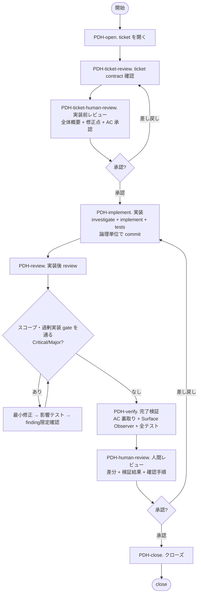

# PDH Dev — Stage Flow

## 前提

- 最初に`./ticket.sh help`を実行してticket操作を確認する
- `product-brief.md`を最初に読み、project規約のcode mapとrepo ruleに従う
- ticketの作成、開始、中止、closeは`./ticket.sh`を使う。ticket branchとmerge先はticket.shとfrontmatterに従う
- 仕様変更時はcodeやreviewを続ける前にticket file（`ticket.sh start`/`restore`出力の`ticket:`パス。互換symlink: `current-ticket.md`）のACと確定判断を最新化する
- local contextで解ける論点を先に洗い出し、localでは解けないblockerだけを短く相談する

## 全体フロー

---

## PDH-open. Ticket を開く

1. `./ticket.sh start`/`restore`出力の`ticket:`パス（互換symlink: `current-ticket.md`）を確認する
   - 出力が無ければ`./ticket.sh list`を実行する。新規なら`./ticket.sh new <slug>`、標準構造の記入、`./ticket.sh start <ticket-name>`の順で開始する
   - あれば内容を読んで続行する
2. 同じ出力の`note:`パス（互換symlink: `current-note.md`）を確認する
   - `./ticket.sh start`が生成した構造に従う
   - ACをcopyしない。ACのsource of truthはticketだけとする

このstageでは読むticketとnoteだけを確定する。
妥当性checkとAC承認は後続stageへ分ける。

## PDH-ticket-review. Ticket contract check

1. WhyとAC
   - Whyを`product-brief.md`の目的へ接続する。症状から翻訳した要求がbriefと矛盾する場合は実装せず提起する
   - 曖昧なACを具体化する
   - review済みやtest pass等のprocess要件はnote checklistへ移し、ACには観察可能なproduct動作だけを書く
   - runtimeでUXまたはSecurity invariantを強制するticketは、runtime enforceの保証mechanismをACへ1行明記する
   - ACが触るconsumer surfaceをnoteへ列挙する。カテゴリと具体項目：UI（画面・component・form・modal・navigation）、HTTP API（endpoint path・request/response schema・status code・error message）、SDK（class/method/type・例外・README example。複数言語ある場合は全言語）、CLI（command名・option/flag・help・exit code・出力フォーマット）、Config（設定キー・環境変数・default値・validation message）、生成物（OpenAPI・自動生成SDK model・docsページ・migration script）、観測surface（logフォーマット・metrics名・event payload・trace span属性）
   - Surface Observerは列挙surfaceを最低限すべて観察し、追加の違和感も報告する。surfaceなしなら該当なしを1行記録する
2. User journeyとregression
   - close直後にuserができることを1文で宣言する
   - main HEAD比で失われるuser-observable機能を1行判定する。ある場合はmigrationを本ticketへ含めるか、別ticketを同一close gateへbundleする
3. `product-brief.md`のArchitectural Invariantsと矛盾しないことをticketへ1行宣言する
4. Design DecisionsとOut-of-scopeが実装workerに十分か確認し、未確定判断は実装前にユーザへ確認する
5. 未完了Dependencyがあれば着手せず報告する
6. human review用に修正点、概要、user journey、AC、Out-of-scope、判断点を整理する。このstageではAC承認を得ない

## PDH-ticket-human-review. Ticket human review

1. noteのStatusを`PDH-ticket-human-review`へ更新し、ticket修正点と未確定判断がnoteにあることを確認する
2. 会話で全体概要、ticket reviewでの修正点、達成内容、AC、やらないこと、判断点、おすすめを先頭にした選択肢を示す
3. **ユーザの明示承認まで`PDH-implement`へ進まない。**
4. 差し戻しは`PDH-ticket-review`へ戻し、ticket更新後にhuman reviewを再実行する

## PDH-implement. 実装

前提は`PDH-ticket-human-review`でticket contractとACが承認済みであること。

investigate、implement、testsは1つの作業文脈で完遂する。
別plan artifactは作らず、設計判断をnoteの実装logとcommit messageへappendする。
commitは論理単位ごとに`[<ticket-name>] <type>(<scope>): 
`形式で行い、各commitでtest pass状態を保つ。

### 実行指示の必須内容（worker への spawn prompt に含める）

`_subagent-context.md`の共通contextと役割別指示にtask固有依頼を加える。
土台を毎回書き写さない。

### 整合性 gate (実装後、完了チェックに渡す前)

- 変更identifier、field、API path、enum値を実装、test、公開層、生成層、doc、spec、sampleの全layerで追従させる
- sync/async、input/output、初回/cache等の対称pairに片側未修正を残さない
- derived type、implementation type、wrapper、facadeで内部値が公開層から落ちていないか確認する

### 完了チェック

- 影響layerをcoverするtestと実環境確認を行う
- **全suiteは`scripts/test-all.sh`を1回実行し、subtestや影響なし判断で代替しない。** commandと最終合否の実出力をverbatimでnoteへ貼る。pre-existing failureにはtest名とticket無関係の根拠を添える
- provider、wire format、data変換ticketではinputとoutputの意味関係をtestする。machine-verifiable基準をtest code化し、user journey実機を1経路通す
- semantic verificationでは、同じpromptのinputなしとinputありを比較し、output差を確認する
- 全test pass時だけ実装完了とする。1件でも失敗、未実行、環境不備なら完了扱いにしない

## PDH-review. 品質検証 (実装後 review)

review前にticket frontmatterの`branch`をbase branchとしてfetchし、未指定ならrepoのdefault branchへfallbackして、`git merge-base --is-ancestor origin/<base> HEAD`を確認する。
falseなら`git merge origin/<base> --no-edit`で取り込み、conflict解消後にreviewする。

### 独立レビュー必須トリガ

次のdiffは独立reviewを省略しない。

- auth、authorization、session、token、scope、ACL、group判定
- 破壊的または不可逆操作とその到達経路
- DB migrationまたはschema変更
- deploy手順、secret、外部API契約
- 新endpoint、新MCP tool、新CLI subcommand等の公開surface新設

reviewerには正常系より先にfail-openと誤操作を探させる。

### 実装後 review 特有 gate

- Ticket不可侵：implementorがAC、Out-of-scope、Architectural Invariantsを変更していないか
- scope逸脱：未記載の公開surface、破壊操作、権限変更を機械的に列挙する。見つけたらCriticalとしてhuman gateへ出す（実装済みであることを採用理由にしない）
- commit cadence：論理単位に分かれ、mega-commitでなく、blocker等のstate遷移がdurableか。commit数はgateにしない
- E2E：外部provider pathを実APIで確認したか。deferredなら明記したか
- 全test PASS：影響するbackend、frontend、E2E、SDKが全てpassしたか

### review 観点

`_review.md`の網羅探索checklistに加え、product brief整合、AC、security、error handling、影響layer、検証手法を確認する。
Why E2E無バイアスlensとAC conformanceおよび妥当性lensをpersona matrix込みで実施し、結論の矛盾は前提差を確認して裁定する。

### 修正ループ

1. findingをseverity、scope、複雑度gateで分類し、採用findingだけを最小修正する
2. 中間attemptでは変更fileとimport chain上の影響testだけを実行する
3. 元finding、再現条件、修正diffだけを同じreviewerへ渡し、対象SHA付きで確認する

完了条件は、最新SHAで採用CriticalとMajorが解消し、非採用理由がnoteにあること。
未解消をユーザが受容してもPASSにせず、risk、理由、承認文を残す。

## PDH-verify. 完了検証

`VERIFIED`、`PASS`、AC check済みを報告する前に、対応stateがticket、note、git historyへ実在しcommit済みでなければならない。

1. ticket file（`ticket.sh start`/`restore`出力の`ticket:`パス。互換symlink: `current-ticket.md`）の各ACを1項目ずつ確認してcheckする
2. note file（同出力の`note:`パス。互換symlink: `current-note.md`）のprocess checklistを1項目ずつ確認してcheckする
3. UIまたはAPI verifyは`./scripts/dev-server.sh --seed`を使う
   - 再現可能なproduct検証条件が不足する場合だけshared scriptまたはseed hookを更新する
   - sandbox、端末path、local login等はlocal設定または一時commandで扱い、区別できなければ確認する
   - server不要なら`seed-pdh-verify.sh`を使い、seed不要ならno-opで成功させる
   - ticket固有checkはticket-local testディレクトリ（`ticket.sh start`/`restore`出力の`tests_dir`パス。互換: 旧flatレイアウトは`tests/tickets/<ticket-id>/`）配下の`test-ticket-local.sh`と`./scripts/test-ticket-local.sh`へ分離する
   - 恒久testはBrief、Invariants、継続contract、一般regressionだけにする
4. AC裏取りAgentが各ACの形式だけでなくWhyの実質達成を検証する。`NOT VERIFIED`の証拠を補完するまで進まない
   - user-facing Whyは、実上流data、終端user操作、反証1回の全てで確認する
   - 合成入力だけでcheckせず、data出所と操作をnoteへ残す
5. renameまたはdeleteがあれば全docをsweepし、旧name、path、URLの残骸を確認する
6. **資産メンテナンス** — close前に恒久資産を現在形に保つ。この ticket の差分に因果がある範囲だけ触り、他ticket由来の記述・検査は消さず削除候補としてnoteに記録する
   - technical-reference.mdとの突合: 因果がある記述を追記・上書きする。出荷済み挙動は確定事実としてその場で書く（承認待ちで先送りしない）。該当なしならnoteに「該当なし」と1行記録
   - 再発の恒久検査化: 出荷済み不具合の修正なら、決定論検査（fast-check/lint/テスト）で再発を恒久検出できるか1回問う。追加できないなら理由をnoteに1行
   - briefへの事実追記: 達成したDone項目・解消したOpen Questionsを反映する（方針変更はしない）
   - 刈り込み: 自分の差分が置き換えた記述・検査を削除する（より強いゲートで守れるようになった検査の削除も含む）
7. 最終HEADで`scripts/test-all.sh`を再実行して実出力をnoteへ貼る。後続commitまたはmergeが影響し得る古い証拠は取り直す
8. 必要なticket noteとdocsは直接更新し、通常doc sweepに`pdh-update`を使わない
9. human review直前に外部surfaceをconsumer視点で観察する
   - browserはseed後の実composed pageで主要caseを1本以上実行し、renderer単体や`curl`で代替しない
   - lightとdark対応時は両方確認し、対象SHAと操作結果、snapshotまたは実行不能理由をnoteと会話に残す
   - `agent-browser`を使う直前に`agent-browser --help`を見る
   - 外部surfaceなしの純backendはskipできるが、理由をnoteへ1行残す
   - blockerがあれば`PDH-implement`または`PDH-review`へ戻る
10. AC check済みticket fileを含めてcommitする

## PDH-human-review. 人間レビュー

1. note Statusを`PDH-human-review`へ更新し、verifyまでの証拠がcommit済みであることを確認する
2. 会話で達成内容、diff、主要file、AC、test、ユーザ操作手順、判断点、選択肢、残課題を示す
   - **noteの`### Findings`表から判定がfollow-upと棄却の行を抜き出し、件数と理由つきで会話へ提示する。noteへ記録するだけで会話から省かない。**「何を直したか」と同じだけ「何を直さなかったか」がユーザの判断材料であり、scope判断が妥当かはここでしか検証されない。0件なら0件と明示する
   - UIは`./scripts/dev-server.sh`のURL、操作、期待表示を示す
   - APIは`curl`と期待statusおよびresponseを示す
   - authが必要なら方式、cookieやhelperの取得方法、secretを会話へ貼らない方針、cleanupを説明する
   - `agent-browser`のcommand列だけをユーザ向け確認手順にしない
3. **明示承認までcloseしない。**
4. 差し戻しはimplementへ戻し、reviewから再走する。途中blockerは直ちに確認する

## PDH-close. クローズ

前提は`PDH-human-review`でのユーザ明示承認である。

1. 承認内容とclose時点のmerge、push、deploy状態を記録する

   ### 完了報告の必須要素

   - literalな1行目へ、user journeyで何ができるようになったかを書く
   - 各ACの内容、達成状態、検証方法、data出所を報告する。user-facing ACが合成のみなら実data未確認のclose blockerとする
   - 主要な変更fileを列挙する
   - main想定状態のuser journey実機証拠をUI screenshot、API response、SDK sample、CLI output等のsurface相応の形で示す
   - test、E2E、検証はcommandとstdoutまたはstderrをverbatimで貼る。長い場合も合否件数とfailure箇所が分かる末尾を残す
   - merge直後に失うuser-observable機能をyesまたはnoで判定する。yesはdownstream復旧予定でもclose blockerとする
   - 何がどう変わり何ができるかを専門語なしで1〜2行にする
   - commit数等の内部mechanicsを価値要約へ並べず、注意事項だけNotesへ書く
   - 懸念事項と残課題を報告する
   - ticket候補は既定ゼロとする。実際に触れて見つけた欠陥、gap、deferredだけを、diff、note、test証拠とともに挙げる
2. 差し戻し理由をDiscoveriesへ記録して`PDH-implement`へ戻り、修正後は`PDH-review`から再走する
3. 承認後に`./ticket.sh close`を実行する
