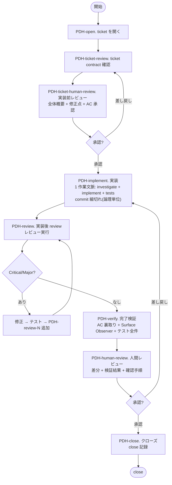

# PDH Dev — Stage Flow

## 前提

- **最初に `./ticket.sh help` を実行して、チケット操作の使い方を確認する**
- `product-brief.md` を最初に読む
- プロジェクトの規約（各 engine が自動ロードする規約ファイル等）のコードマップ・repo ルールに従う
- チケットの作成・開始・中止・クローズは必ず `./ticket.sh` を使う
- `ticket.sh` が ticket ごとに `features/<ticket-name>` ブランチを自動作成する。close 時のマージ先は ticket frontmatter の `branch` フィールド (default `main`)
- 仕様変更が入った場合、コードやレビューを続ける前に `current-ticket.md` の AC / 確定判断を最新化する
- ローカル文脈で判断できる論点は先に洗い出し、真にローカルから解けない blocker だけ短く相談する

## 全体フロー

---

## PDH-open. Ticket を開く

1. **`current-ticket.md` の確認**
   - **存在しない場合**: `./ticket.sh list` で TODO ticket を表示。新規作成なら `./ticket.sh new <slug>` で作成し、ticket 標準構造 (Why / AC / Architectural Invariants check / 確定判断 / out-of-scope) を埋める。`./ticket.sh start <ticket-name>` で開始
   - **存在する場合**: 内容を読んで作業を続行する
2. **`current-note.md` の確認**
   - ノートの構造は `./ticket.sh start` が生成した初期テンプレートに従う
   - **AC を note にコピーしない**。AC の source of truth は ticket.md のみ。note.md は調査メモ / 状態遷移ログ / Discoveries / checklist 用で、AC snapshot を作らない。

`PDH-open` は「読む対象を確定する」だけ。ticket の妥当性確認は `PDH-ticket-review`、AC 承認は `PDH-ticket-human-review` で行う。

stage 完了時に必要ならコミット (例: `[PDH-open] Start <ticket-name>`)。

---

## PDH-ticket-review. Ticket contract check

1. **Why / AC の明確化**
   - **Why は症状ではなく `product-brief.md` の目的・利益に紐付ける** (詳細は `_principles.md`「症状ではなく目的から解く」)。Issue が症状ベース/要望ベースの場合、brief の該当目的に翻訳してから AC を派生させる。翻訳結果が brief の Invariants や目的と矛盾する場合は実装に進まず提起する
   - AC が曖昧な場合は確認して具体化する
   - AC にプロセス要件 (`レビュー済み` `テストパス` 等) が混入していたら、note のプロセスチェックリストに移し、AC にはプロダクトの観察可能な振る舞いのみを残す
   - runtime で UX/Security invariant を強制する ticket では、AC に **runtime enforce の保証メカニズム** を 1 行明記する。例: 「editor で警告される」だけでなく「runtime で 422 reject される」「render context から物理的に除外される」など、動作レベルの要求を書く
   - **AC が触る consumer surface の列挙**: AC が外部から観察される interface (= consumer surface) に影響する場合、影響範囲を以下のカテゴリで列挙し、note の `Consumer surface` セクションに記録する。列挙された surface は PDH-verify の Surface Observer が網羅観察する対象になる:
     - **UI**: 画面・コンポーネント・フォーム・モーダル・ダッシュボード・ナビゲーション
     - **HTTP API**: endpoint path・request / response body schema・status code・error message
     - **SDK**: class / method / type 定義・例外・docstring・README example (複数言語ある場合は全言語)
     - **CLI**: command 名・option / flag・help text・exit code・出力フォーマット
     - **Config**: 設定ファイルキー・環境変数・default 値・validation message
     - **生成物**: OpenAPI / 自動生成 SDK モデル・wiki / docs ページ・migration script
     - **観測 surface**: log フォーマット・metrics 名・events payload・trace span 属性

     列挙が薄い ticket は close 後に「機能としては動くが consumer 体験が破綻している」周辺欠落の発見数が増える傾向がある。**Surface Observer はここに列挙された範囲を最低ラインとして観察し、それ以外で気づいた違和感も追加で報告する** (列挙は最小保証であり、上限ではない)。surface に該当しないチケット (純内部 refactor 等) では「該当なし」と 1 行記録する
2. **User journey 宣言 (必須、1 行) + regression check**
   - 「この ticket が close した直後、user は何ができるようになるか」を 1 文で宣言する (例: 「user は Process Editor で reference image を選んで gpt-image-2 経由で画像編集できる」)
   - **regression check**: 「直前の main HEAD と比べて、user-observable な機能で **失われるもの**があるか」を 1 行で答える。「ある」場合は consumer surface migration を本 ticket に含めるか、別 ticket を **同一 close gate に bundle** する (片方だけ close 不可、PDH-close で再判定)
3. **Architectural Invariants check**
   - `product-brief.md` の Invariants と矛盾しないことを ticket 内で 1 行宣言する
4. **Design Decisions / Out-of-scope**
   - 実装 agent に渡すべき確定判断とやらないことが ticket に書かれているか確認する
   - 未確定判断が残る場合は実装へ進まずユーザに確認する
5. **Dependencies**
   - 未完了のブロッカーがあれば、着手せず報告する
6. **Ticket human review payload の準備**
   - ユーザへ提示する「ticket review で修正した点」「全体概要」「達成するもの / user journey」「AC」「out-of-scope」「判断ポイント」を整理する
   - AC 承認はここでは得ない。`PDH-ticket-human-review` でユーザに説明し、明示承認を得る

stage 完了時に必要ならコミット (例: `[PDH-ticket-review] Prepare ticket contract`)。

---

## PDH-ticket-human-review. Ticket human review

`PDH-ticket-review` で整えた ticket を、実装前にユーザとすり合わせる human gate。目的は、ticket review 後の内容がユーザの想定と合っているかを確認し、AC 承認を得ること。ここは省略不可。

1. `current-note.md` の Status を `PDH-ticket-human-review` に更新し、ticket review での修正点と未確定判断が note に残っていることを確認する
2. ユーザに以下を会話上で提示する:
   - **全体概要**: この ticket が何を扱うか
   - **ticket review で修正した点**: Why / AC / out-of-scope / Design Decisions など、agent が整えた箇所
   - **達成するもの**: close 直後に user が何をできるようになるか
   - **AC**: 観察可能な振る舞いとして何を満たすか
   - **やらないこと / 判断ポイント**: out-of-scope、deferred、未確定事項
   - **次の選択肢**: 一番上におすすめを置き、各選択肢に tradeoff / 影響を 1 行で添える
3. ユーザの明示承認 (`OK` / `yes` / `この内容で進めて` 等) を得るまで `PDH-implement` へ進まない
4. 差し戻しがあれば `PDH-ticket-review` に戻り、ticket を更新してから再度 `PDH-ticket-human-review` を実行する

stage 完了時に必要ならコミット (例: `[PDH-ticket-human-review] Approve ticket contract`)。

---

## PDH-implement. 実装

> **前提条件**: `PDH-ticket-human-review` で ticket contract と AC 承認を得ていること。

**1 つの作業文脈で investigate + implement + tests を 1 session で通す**。計画を別 artifact に書かない (設計判断は note の「実装ログ」と commit message に append)。`pdh-coding` skill に従って実装する。

実行モデル依存の手順（誰が実装するか / spawn するかなど）は `_execution-*.md` に従って実行する。

**1 作業文脈で investigate + implement + tests を通す**。以下を達成すべき:
- 実装は論理単位の境界ごとに incremental に commit すること (1 commit = 1 論理単位、mega-commit 禁止。commit 数は gate ではない)。push は `CLAUDE.md` の no-push-without-request ルールに従う
- commit は `[<ticket-name>] <type>(<scope>): 
` 形式
- commit 時点でテストパス状態を維持

### 実行指示の必須内容（worker への spawn prompt に含める）

worker への prompt は **共通コンテキスト + 役割別追加**で組み立てる（実行モデル依存の組み立て方は `_execution-*.md`「worker prompt の組み立て」）。土台は `.claude/skills/pdh-dev/_subagent-context.md` にあり、そこに次が含まれる:
- 全 worker 共通: PDH 前提 / 最初に読むファイル（`product-brief.md`・`docs/product-delivery-hierarchy.md`・ticket）/ ファイル位置 / **不可侵** / 担当範囲 / 出力先 / 言語
- Coding Engineer 追加: `.claude/skills/pdh-coding/SKILL.md を読んでから着手` / commit cadence (論理単位ごと、mega-commit 禁止) / テスト全件 PASS gate / E2E gate / Open Questions protocol / 実装ログを note に追記
- reviewer / AC 裏取り / QA / Surface Observer 追加: それぞれの観点（`_review.md` 参照など）

PM はこの土台に**そのタスク固有の依頼**（対象・狙い）を足して渡す。土台の内容を毎回手で書き写さない。

### 整合性 gate (実装後、完了チェックに渡す前)

実装完了後、完了チェックに進む前に以下を確認する:

- 修正対象 identifier / フィールド名 / API パス / enum 値が全レイヤー (実装 / テスト / 公開層 / 自動生成 layer / ドキュメント / spec / サンプル) で追従完了している
- 対称ペア (sync ⇔ async / 入力 ⇔ 出力 / 初回 ⇔ キャッシュ など) の片方だけ修正が残っていない
- 派生型 / 実装型 / wrapper / facade で「内部実装は正しいが公開層で値が捨てられている」状態がない

### 完了チェック

以下を実行する（誰が実行するか = 実行モデル依存の手段は `_execution-*.md` に従う）:
- 影響レイヤーをカバーするテスト
- 実環境確認 (E2E テスト、curl による API 確認)
- **全スイートパス確認 (必須・代替不可・固定コマンド)**: 全テストは PDH 規約の一括スクリプト **`scripts/test-all.sh`** に固定されている（現状は `npm run check`。詳細は `CLAUDE.md`）。**この 1 本を実行する**。サブセットや「影響なし」という自己判断で代替しない。プロジェクト固有のスイートは `scripts/test-all.sh` 側に追加する
  - **証拠バインディング (gate)**: この項目は、実行コマンドと最終サマリ (`Passed: N / N` の合否行) の **実出力を verbatim で note に貼って初めて完了**とみなす。要約・記憶・部分実行で done にしない。pre-existing failure がある場合は、その test 名と「本 ticket と無関係」である根拠を 1 行添える
- **Semantic verification (必須)**: 外部 provider / wire format / data transformation を含む ticket は、status_code = 200 / non-zero bytes のような mechanical signal だけでなく、**「input → output の意味的な関係」が成立している** ことを verify するテストを含めること:
  - **before/after 比較**: 同じ prompt で reference / input なし版とあり版の 2 通り invoke し、output が異なることを確認 (response hash 差分 / output token 数 / 機械判定 signal)
  - **ticket / spec に machine-verifiable な検証基準** (例: silent drop 判定条件) が明記されている場合、**それを必ずテストコード化** する。spec を読んで「知っているつもり」で済ませない
  - **user journey 実機 verify**: 実機操作 (UI で input upload → prompt 投入 → 出力を目視 / 自動比較) を 1 経路は通すこと。mechanical 200 OK を semantic 動作確認の代替にしない

全パスなら実装作業を完了し、コミット (例: `[PDH-implement] Implementation`)。失敗があれば修正する。

テストが 1 件でも失敗、未実行、環境不備なら完了扱いにしない。

---

## PDH-review. 品質検証 (実装後 review)

**開始前条件 (必須)**: ticket の base branch を作業ブランチに取り込み済みであること。

- base branch は ticket frontmatter の `branch` フィールドが正 (`./ticket.sh` がこの値を ticket 開始時の派生元・close 時の merge 先として使う)。`branch` が空 / 未指定の場合は repo の default branch にフォールバックする
- 確認手順: ticket frontmatter から base 名を取得 → `git fetch origin <base>` → `git merge-base --is-ancestor origin/<base> HEAD` を確認。false なら `git merge origin/<base> --no-edit` で取り込んでから PDH-review に進む
- **なぜ必須か**: 並行 ticket が base branch に merge された状態で本 ticket が PDH-review に入ると、`git diff <base>..HEAD` 上で他 ticket の変更が **revert として混入** し、reviewer の集中を奪う + 誤検知 Critical を生む原因になる (複数 ticket で実発生)。Conflict が出た場合は解消してから review を開始する

レビューを実施する。実行モデル依存の reviewer 構成・起動手段は `_execution-*.md` に従って実行する。

各 reviewer には **チケットの目的と変更内容の概要** を伝える。

### 独立レビュー必須トリガ

以下のいずれかに触れる diff は、実装者と独立した reviewer (実装 context を持たない別 agent。可能なら `strong-judge` 相当) によるレビューを省略できない。docs-only 等の軽量化判断はこのトリガ非該当の場合のみ:

- 認証・認可・session・token・scope・ACL・グループ判定
- **破壊的・不可逆操作** (物理削除・purge・force 上書き・retention 短縮・一括変更) とその到達経路 (UI ボタン / API / MCP tool / cron)
- DB migration・スキーマ変更
- デプロイ手順・secret の扱い・外部 API 契約
- 公開 surface の新設 (新 endpoint / 新 MCP tool / 新 CLI サブコマンド)

reviewer への指示には「正常系より先に fail-open (許してはいけないものが通る経路) と誤操作シナリオを探す」ことを含める。

### 実装後 review 特有 gate

以下を必ず check する:

- **Ticket 不可侵**: implementor が AC / out-of-scope / Architectural Invariants を変更していないか
- **Scope 逸脱検査**: diff に ticket (AC / 確定判断 / Implementation Notes) に記載のない新規公開 endpoint・MCP tool・CLI サブコマンド・破壊的/不可逆操作・権限変更が含まれていないか、route 定義・tool 登録・権限判定の diff を機械的に列挙して照合する。未記載のものが見つかったら Critical 扱いとし、採用可否をユーザ human gate に出す (実装済みであることを採用理由にしない)
- **commit cadence**: 論理単位で分割され mega-commit になっていないか / blocker など state 遷移が独立 commit で durable に残っているか (commit *数* は合否基準にしない)
- **E2E gate**: 外部 provider 経由 path は実 API 200 確認済みか、deferred なら明示記録されているか
- **テスト全件 PASS**: backend + frontend + e2e + SDK 全部 PASS している事実が確認できるか

### review 観点

`_review.md` の「reviewer の網羅探索チェックリスト」に従って確認し、以下を確認する:

- `product-brief.md` との整合性
- Acceptance Criteria の達成状況
- セキュリティ
- エラーハンドリングの網羅性
- 影響レイヤーの漏れ
- テスト手法と実動確認手法が変更内容に見合っているか

さらに `_review.md` の「Why 直結レビュー（2 レンズ）と AC 妥当性」を回す。AC 達成状況の確認だけでは「AC は全緑だが上位 Why は未達 / AC が緩すぎる」を取りこぼすため、**Why end-to-end（無バイアス・ticket/note を渡さない）** と **AC 妥当性（緩すぎ AC の検出）** を persona マトリクス込みで実施し、reviewer 間の矛盾は深掘りで裁定する。

### 修正ループ

Critical / Major があれば:
1. **修正**（誰が修正するか = 実行モデル依存の手段は `_execution-*.md` に従う）
2. **テスト再実行**（中間 attempt では変更の影響範囲に限定 — 変更ファイルと import chain 上で依存する test のみ。フルスイート / E2E / 長時間スイートは PDH-verify の最終確認で 1 回だけ実行）
3. **review attempt 追加** → `PDH-review-2` などの子ログとして影響する reviewer に確認し、対象 commit SHA を記録する。影響しない reviewer の既存 PASS を維持する場合は、PM が影響なしの根拠を note に 1 行残す

完了条件: `_review.md` の SHA 条件を満たして全 reviewer が `No Critical/Major`。未解消 Critical/Major をユーザが明示的に受容した場合は例外として進められるが、PASS と記録せず、未解消リスク・理由・承認文を note と `PDH-human-review` に残す。

品質検証結果を `current-note.md` に記録し、コミット (例: `[PDH-review] Quality verification`)。

---

## PDH-verify. 完了検証

> **Report ↔ reality contract**: `PDH-human-review` のレビュー依頼または `PDH-close` の記録に `VERIFIED` / `PASS` / `[x] AC1` 等を書ける条件は「報告作成時点で対応する持続状態が ticket.md / note.md / git history に**実在し、commit 済み**」。報告は state の view であって state の作成ではない。下の checklist を踏まずに完了宣言コメントを書くと違反になる。host に TODO ツール (`TaskCreate` / `update_plan` 等) があれば、各 checklist を trackable item として乗せると drift しにくい。

1. `current-ticket.md` の **AC** を一つずつ確認し、各項目に `[x]` を付ける
2. `current-note.md` の **プロセスチェックリスト** を一つずつ確認し、各項目に `[x]` を付ける
3. **PDH verify dev server / seed hook**: UI / API surface の verify には `./scripts/dev-server.sh --seed` を使う。`--seed` は local 環境をリセットして `scripts/seed-pdh-verify.sh` を実行する。`--port <port>` があれば固定 port、未指定なら script が空き port をランダム選択する。ログイン・ローカルデータ・fixture が必要な surface はこの script で再現可能にし、出力された URL / cookie / コマンドを note に残す。**ticket の再現可能な product 検証条件**が不足する場合は script / seed hook を更新する。sandbox、端末パス、local login など **実行環境固有の制約**は共有 script / repository 設定へ取り込まず、local 設定か一時コマンドを使う。どちらか判別できなければユーザに確認する。server 不要で seed だけ必要な場合は `scripts/seed-pdh-verify.sh` を使い、repo / ticket に無ければ作る。seed 不要なら no-op として成功終了させる。実行不能なら理由を note と会話に出し、必要ならユーザに確認する
   - **`ticket-local-test` と恒久テストの分離**: ticket 固有の一時的な確認は、`test/` や `scripts/test-all.sh` に入れない。実行可能なものは `tests/tickets/<ticket-id>/test-ticket-local.sh` に置き、`./scripts/test-ticket-local.sh [ticket-id]` で呼ぶ。seed / `tmp/` helper / `agent-browser` / `curl` の実行証跡は note に残す。恒久テストへ入れるのは、Product Brief、Architectural Invariants、継続的な product contract、または一般化された regression だけ。迷ったら「ticket 名や一時 fixture なしで今後も product contract として説明できるか」で判断する
4. **AC 裏取り**: 実行モデル依存の手段で (`_execution-*.md` 参照) 各 AC 項目が実際に達成されているかコード・テスト結果・ノートを読んで検証する。**実装が AC を実質達成しているか** を厳しく見る (形式的に満たすだけでなく、Why を満たしているか)。NOT VERIFIED が返った項目は証拠を補完してから進む
   - **Reality Check (合成での pass 禁止)**: AC の Why が user-facing な結果 (リンクが開く・通知が届く・画面が変わる・外部副作用) なら、完了判定は次を全て満たす — (1) **実上流が出す実データ**で検証する (自作の合成入力を流し込まない)、(2) **終端のユーザ操作を実際に行う** (リンクは実際にクリックして着地まで・通知は実イベントを起こして受信まで。「描画 / 生成された」だけでは pass にしない)、(3) **反証を 1 回試す** (「実トリガでも本当に出るか」「上流に当該フィールドが無い場合どうなるか」をわざと確認してから `[x]`)。**user-facing な Why の AC を合成入力だけで `[x]` にしない。** 各 `[x]` には何を・どの実データ / 実操作で確認したか (合成か実データかを明記) を note に 1 行残す
5. **ドキュメント sweep**: 変更内容に名前・パス・URL の rename / delete が含まれる場合、全ドキュメントを走査し、旧名称・旧パスの残骸がないか確認する
6. **全スイート最終確認 (必須)**: PDH-implement と同じ **`scripts/test-all.sh`** を最終確認として再実行し、実出力 (`Passed: N / N` の合否サマリ) を note に貼る。PDH-implement で貼った証拠が**最終 HEAD のものでない** (その後 commit / main merge した) 場合は必ず再実行する (**証拠の鮮度 gate**)
7. 必要な ticket note / docs を直接更新する。`pdh-update` は上流 PDH 取り込み専用なので、PDH-verify の通常 doc sweep では使わない
8. **Surface Observer の起動 (PDH-human-review 直前、必須)**: 外部 surface (UI / HTTP API / SDK / CLI 等) に変更があった場合、consumer 視点の違和感を観察する（実行モデル依存の手段は `_execution-*.md` 参照）
   - 観察 focus: UI 視覚崩れ・反応速度・情報ヒエラルキー、HTTP API レスポンスボディ / エラー文言 / ステータスコードの自然さ、SDK / CLI import 経路 / 型ヒント / 例外メッセージ / ヘルプテキストの consumer 体験
   - 観察手段はプロジェクト固有のツールに従う (実機ブラウザ / browser automation CLI / `curl` / `httpie` / 実 SDK 呼び出し / CLI 実行)
   - UI / browser surface がある場合は、seed hook 実行後に **実 dev-server が返す composed page** (shared shell / CSS / auth を含む) で主要ユースケースを 1 本以上実行する。renderer 単体の HTML は代替証拠にしない。`curl` 等の HTTP-level 確認も browser surface の証拠として無効 (client JS — drag & drop / FormData 構築 / レンダリング / フォーム送信 — を通らない)。実ブラウザでの主要ユースケース実行の証跡が note に無い限り `PDH-human-review` へ進まない。light / dark をサポートする UI は両方確認し、対象 commit SHA と snapshot / screenshot / 操作結果または実行不能理由を note と会話に記録する。`agent-browser` を使う場合は直前に `agent-browser --help` を実行する
   - 純 backend ロジックのみで外部 surface 変更がない場合は skip 可。skip する場合は note に判断を 1 行記録
   - blocker 指摘があれば PDH-implement / PDH-review に戻る
9. AC チェック済みの ticket ファイルを含めてコミット

---

## PDH-human-review. 人間レビュー

`PDH-review` と `PDH-verify` までの自動工程が完了したら、この stage で人間にレビューを依頼する。ここは省略不可の human gate。目的は、coding agent がやったこと・達成したことをユーザが見て、それがユーザの想定と合っているかをすり合わせること。レビュー可能な UI / API がある場合は開発サーバを起動して確認手順を提示する。

1. `current-note.md` の Status を `PDH-human-review` に更新し、`PDH-verify` までの証拠が commit 済みであることを確認する
2. ユーザに以下を提示する。内容は下の「完了報告の必須要素」を満たす:
   - **やったこと**: user journey に沿って、何ができるようになったか
   - 差分の要約と主要変更ファイル
   - AC 達成状況と検証方法
   - 実行したテスト / 検証コマンドと結果
   - ユーザが確認すべき手順。これは agent の検証コマンドではなく、**ユーザ自身が触って判断するための手順**として書く。レビュー可能な UI / API がある場合は `./scripts/dev-server.sh` で開発サーバを起動して確認手順を提示する。UI はブラウザで開く localhost URL、または localhost 以外から確認する必要がある場合は `./scripts/dev-server.sh --no-localhost` で得た URL、クリック/入力/目視すべき箇所、期待表示を含める。`--no-localhost` の実装はアプリごとに異なるため、agent は script の出力に従う。API は `curl` コマンドと期待 status / response を含める。認証・cookie・fixture 等が手作業では難しい場合は `tmp/` 配下に一時スクリプトを作り、実行方法と何をしているかを説明する。認証が必要な surface では dev mode で dummy login を用意し、localhost 以外へ出す場合は Basic Auth や一時 token 等で保護し、レビュー依頼前に、認証方式、必要な cookie / token / helper / cookie jar、秘密値を会話に貼らない方針、ユーザが実行する具体手順、確認後のサーバ停止や一時ファイルの扱いを説明する。`agent-browser` のコマンド列だけを人間向け確認手順にしない
   - **判断ポイント**: 人間が判断すべき論点、deferred、未確認事項
   - **次の選択肢**: 一番上におすすめを置き、各選択肢に tradeoff / 影響を 1 行で添える
   - 残課題・deferred・未確認事項
   note への記録は必要だが、note だけで済ませず必ず会話上で説明する。
3. ユーザの明示承認 (`OK` / `yes` / `閉じて` 等) を得るまで `PDH-close` へ進まない
4. 差し戻しがあれば `PDH-implement` に戻る。修正後は `PDH-review` から再走する

途中で疑問・判断不能・blocker・完了見込みが立たない状態になった場合は、`PDH-human-review` まで待たず、その時点でユーザに確認する。

---

## PDH-close. クローズ

> **前提条件**: `PDH-human-review` でユーザの明示承認を得ていること。承認なしにこの stage へ進まない。

1. `PDH-human-review` の承認内容と close 時点の merge/push/deploy 状態を記録する。必要なら以下の完了報告要素を再掲する:

   ### 完了報告の必須要素

   - **冒頭 1 行: user は今何ができるようになったか** (必須、report の literal な 1 行目): PDH-open で宣言した user journey が close で達成されたことを 1 文で書く (例: 「user は Process Editor で reference image を 1 枚以上選び、prompt と組み合わせて gpt-image-2 で編集結果を取得できる」)。実装の話や test の話より前に書く
   - **AC 達成報告**: 番号だけでなく**各 AC の簡単な内容を併記**する。読み手はチケットを覚えていない前提で書く（例: `AC1: ルート / で "Hello, World!" を返す → 達成`）。各 AC に**検証方法と使用データの出所**（実データ / 実操作 か、unit / 合成 か）を併記する。**合成のみで確認した user-facing AC は「実データ未確認」と明示し close blocker 扱い**（deferred なら明示承認を取る）
   - **変更したファイルを明示する**: 読み手が中身をたどれるよう、主要な変更ファイルを列挙する（報告媒体に応じたリンク整形などは実行モデル側に委ねる）
   - **User journey 実機 verify** (必須、PDH-open 宣言の達成証跡): screenshot / curl 出力 / SDK 呼び出しサンプルのいずれかで、user journey が **main 想定状態で動作** する証跡を提示する:
     - UI 変更 → スクリーンショット（実機または browser automation CLI で撮影）
     - HTTP/API 変更 → `curl` の実行例とレスポンスログ
     - SDK / ライブラリ変更 → 使い方のサンプルコード（before/after があれば対比）
     - CLI 変更 → 実行コマンドと出力例
   - **テスト/検証結果は実際の出力をそのまま貼る**: テスト・E2E・検証コマンドの結果は、**実行したコマンドと実際の stdout/stderr を verbatim で貼る**。「✓ 全件パス (X/X)」のような要約だけに置き換えない（読み手が実結果を見て信頼できるように）。出力が長い場合はコマンド + pass/fail 件数と失敗箇所が分かる末尾を貼る。捏造・言い換えで省略しない
   - **Consumer surface regression check (必須、明示判定)**: 「main に merge した直後の状態で、user-observable な機能で **失われるもの**があるか」を yes/no で明示。**「yes (downstream ticket で復旧予定)」は close blocker** とする。downstream ticket を bundle するか、本 ticket 内で consumer surface migration を完了するまで close 不可。clean break migration (旧 field 名削除・API rename 等) で UI / SDK / seed / examples が stale のまま main 着地することは禁止
   - **平易な要約**: 専門用語に頼らず「何が・どう変わって・何ができるようになったか」を**平易に 1〜2 行で要約**する
   - **内部メカニクスを要約に並べない**: 「commit を N 件 push した」「追加依存はない」のような作業手順は読み手に価値が無い。書くのは「何ができるようになったか」「どう確認できるか」。依存追加など本当に注意が要る事項のみ Notes に簡潔に書く
   - **懸念事項・残課題**
   - **チケット化候補（既定: ゼロ）**: 挙げてよいのは「今回**実際に触れて発見した**具体的な欠陥・gap・明示的に deferred したスコープ」のみ。diff / note / テスト結果のうち**該当する証拠を 1 つ示せないものは投機**として挙げない。「あったら便利」「将来のため」「一般には〜すべき」は候補にしない。疑わしきは省略側へ（YAGNI、→ `_principles.md`）

2. **差し戻しの場合**: PDH-implement に戻る。修正後は PDH-review から再走する。差し戻し理由を note の Discoveries に記録する
3. 承認後 `./ticket.sh close` でチケットをクローズ
