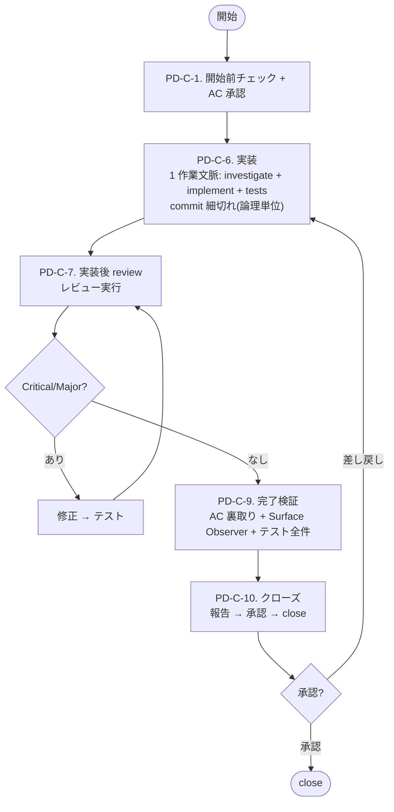

# PDH Dev — フロー (PD-C step 定義)

## 前提

- **最初に `./ticket.sh help` を実行して、チケット操作の使い方を確認する**
- `product-brief.md` を最初に読む
- プロジェクトの規約（各 engine が自動ロードする規約ファイル等）のコードマップ・repo ルールに従う
- チケットの作成・開始・中止・クローズは必ず `./ticket.sh` を使う
- `ticket.sh` が ticket ごとに `features/<ticket-name>` ブランチを自動作成する。close 時のマージ先は ticket frontmatter の `branch` フィールド (default `main`)
- 仕様変更が入った場合、コードやレビューを続ける前に `current-ticket.md` の AC / 確定判断を最新化する
- ローカル文脈で判断できる論点は先に洗い出し、真にローカルから解けない blocker だけ短く相談する

## 全体フロー

---

## PD-C-1. 開始前チェック + AC 承認

1. **`current-ticket.md` の確認**
   - **存在しない場合**: `./ticket.sh list` で TODO ticket を表示。新規作成なら `./ticket.sh new <slug>` で作成し、ticket 標準構造 (Why / AC / Architectural Invariants check / 確定判断 / out-of-scope) を埋める。`./ticket.sh start <ticket-name>` で開始
   - **存在する場合**: 内容を読んで作業を続行する
2. **`current-note.md` の確認**
   - ノートの構造は `./ticket.sh start` が生成した初期テンプレートに従う
   - **AC を note にコピーしない**。AC の source of truth は ticket.md のみ。note.md は調査メモ / 状態遷移ログ / Discoveries / プロセスチェックリスト用で、承認待ち AC や承認済み AC を再掲するセクション（例: `## PD-C-1. 承認待ち AC`）は作らない。snapshot を作ると、後で AC が更新された時に片方が腐る（drift する）。AC を読みたい reviewer / 裏取り agent / 後続フェーズは ticket.md を参照する
3. **AC の明確化**
   - AC が曖昧な場合は確認して具体化する
   - AC にプロセス要件 (`レビュー済み` `テストパス` 等) が混入していたら、note のプロセスチェックリストに移し、AC にはプロダクトの観察可能な振る舞いのみを残す
   - runtime で UX/Security invariant を強制する ticket では、AC に **runtime enforce の保証メカニズム** を 1 行明記する。例: 「editor で警告される」だけでなく「runtime で 422 reject される」「render context から物理的に除外される」など、動作レベルの要求を書く
   - **AC が触る consumer surface の列挙**: AC が外部から観察される interface (= consumer surface) に影響する場合、影響範囲を以下のカテゴリで列挙し、note の `Consumer surface` セクションに記録する。列挙された surface は PD-C-9 の Surface Observer が網羅観察する対象になる:
     - **UI**: 画面・コンポーネント・フォーム・モーダル・ダッシュボード・ナビゲーション
     - **HTTP API**: endpoint path・request / response body schema・status code・error message
     - **SDK**: class / method / type 定義・例外・docstring・README example (複数言語ある場合は全言語)
     - **CLI**: command 名・option / flag・help text・exit code・出力フォーマット
     - **Config**: 設定ファイルキー・環境変数・default 値・validation message
     - **生成物**: OpenAPI / 自動生成 SDK モデル・wiki / docs ページ・migration script
     - **観測 surface**: log フォーマット・metrics 名・events payload・trace span 属性

     列挙が薄い ticket は close 後に「機能としては動くが consumer 体験が破綻している」周辺欠落の発見数が増える傾向がある。**Surface Observer はここに列挙された範囲を最低ラインとして観察し、それ以外で気づいた違和感も追加で報告する** (列挙は最小保証であり、上限ではない)。surface に該当しないチケット (純内部 refactor 等) では「該当なし」と 1 行記録する
4. **User journey 宣言 (必須、1 行) + regression check**
   - 「この ticket が close した直後、user は何ができるようになるか」を 1 文で宣言する (例: 「user は Process Editor で reference image を選んで gpt-image-2 経由で画像編集できる」)
   - **regression check**: 「直前の main HEAD と比べて、user-observable な機能で **失われるもの**があるか」を 1 行で答える。「ある」場合は consumer surface migration を本 ticket に含めるか、別 ticket を **同一 close gate に bundle** する (片方だけ close 不可、PD-C-10 で再判定)
5. **Architectural Invariants check**
   - `product-brief.md` の Invariants と矛盾しないことを ticket 内で 1 行宣言する
6. **Dependencies**
   - 未完了のブロッカーがあれば、着手せず報告する
7. **AC 承認 (gate)**
   - ticket の AC を提示し、明示承認を得る (これが唯一の実装前 gate)。実行モデル依存の承認手段は `_execution-*.md` に従う
   - 承認なしに PD-C-6 に進まない

step 完了時にコミット (例: `[PD-C-1] Start <ticket-name>`)。

---

## PD-C-6. 実装

> **前提条件**: PD-C-1 で AC 承認を得ていること。

**1 つの作業文脈で investigate + implement + tests を 1 session で通す**。計画を別 artifact に書かない (設計判断は note の「実装ログ」と commit message に append)。`pdh-coding` skill に従って実装する。

実行モデル依存の手順（誰が実装するか / spawn するかなど）は `_execution-*.md` に従って実行する。

**1 作業文脈で investigate + implement + tests を通す**。以下を達成すべき:
- 実装は論理単位の境界ごとに incremental に commit + push すること (1 commit = 1 論理単位、mega-commit 禁止。commit 数は gate ではない)
- commit は `[<ticket-name>] <type>(<scope>): 
` 形式
- commit 時点でテストパス状態を維持

### 実行指示の必須内容（worker への spawn prompt に含める）

worker への prompt は **共通コンテキスト + 役割別追加**で組み立てる（実行モデル依存の組み立て方は `_execution-*.md`「worker prompt の組み立て」）。土台は `.claude/skills/pdh-dev/_subagent-context.md` にあり、そこに次が含まれる:
- 全 worker 共通: PDH 前提 / 最初に読むファイル（`product-brief.md`・`docs/product-delivery-hierarchy.md`・ticket）/ ファイル位置 / **不可侵** / 担当範囲 / 出力先 / 言語
- Coding Engineer 追加: `.claude/skills/pdh-coding/SKILL.md を読んでから着手` / commit cadence (論理単位ごと、mega-commit 禁止) / テスト全件 PASS gate / E2E gate / Open Questions protocol / 実装ログを note に追記
- reviewer / AC 裏取り / QA / Surface Observer 追加: それぞれの観点（`_review.md` 参照など）

PM はこの土台に**そのタスク固有の依頼**（対象・狙い）を足して渡す。土台の内容を毎回手で書き写さない。

### 整合性 gate (実装後、完了チェックに渡す前)

実装完了後、完了チェックに進む前に以下を確認する:

- 修正対象 identifier / フィールド名 / API パス / enum 値が全レイヤー (実装 / テスト / 公開層 / 自動生成 layer / ドキュメント / spec / サンプル) で追従完了している
- 対称ペア (sync ⇔ async / 入力 ⇔ 出力 / 初回 ⇔ キャッシュ など) の片方だけ修正が残っていない
- 派生型 / 実装型 / wrapper / facade で「内部実装は正しいが公開層で値が捨てられている」状態がない

### 完了チェック

以下を実行する（誰が実行するか = 実行モデル依存の手段は `_execution-*.md` に従う）:
- 影響レイヤーをカバーするテスト
- 実環境確認 (E2E テスト、curl による API 確認)
- **全スイートパス確認 (必須・代替不可・固定コマンド)**: 全テストは PDH 規約の一括スクリプト **`scripts/test-all.sh`** に固定されている (README §6 / `templates/test-all.sh`)。**この 1 本を実行する**。`pytest`（backend のみ）等のサブセットや「frontend は無変更だから影響なし」という自己判断で代替しない。プロジェクト固有のスイートは `scripts/test-all.sh` 側に追加する
  - **証拠バインディング (gate)**: この項目は、実行コマンドと最終サマリ (`Passed: N / N` の合否行) の **実出力を verbatim で note に貼って初めて完了**とみなす。要約・記憶・部分実行で done にしない。pre-existing failure がある場合は、その test 名と「本 ticket と無関係」である根拠を 1 行添える
- **Semantic verification (必須)**: 外部 provider / wire format / data transformation を含む ticket は、status_code = 200 / non-zero bytes のような mechanical signal だけでなく、**「input → output の意味的な関係」が成立している** ことを verify するテストを含めること:
  - **before/after 比較**: 同じ prompt で reference / input なし版とあり版の 2 通り invoke し、output が異なることを確認 (response hash 差分 / output token 数 / 機械判定 signal)
  - **Epic / spec に machine-verifiable な検証基準** (例: silent drop 判定条件) が明記されている場合、**それを必ずテストコード化** する。spec を読んで「知っているつもり」で済ませない
  - **user journey 実機 verify**: 実機操作 (UI で input upload → prompt 投入 → 出力を目視 / 自動比較) を 1 経路は通すこと。mechanical 200 OK を semantic 動作確認の代替にしない

全パスなら実装作業を完了し、コミット (例: `[PD-C-6] Implementation`)。失敗があれば修正する。

テストが 1 件でも失敗、未実行、環境不備なら完了扱いにしない。

---

## PD-C-7. 品質検証 (実装後 review)

**開始前条件 (必須)**: ticket の base branch を作業ブランチに取り込み済みであること。

- base branch は ticket frontmatter の `branch` フィールドが正 (`./ticket.sh` がこの値を ticket 開始時の派生元・close 時の merge 先として使う)。`branch` が空 / 未指定の場合は repo の default branch にフォールバックする
- 確認手順: ticket frontmatter から base 名を取得 → `git fetch origin <base>` → `git merge-base --is-ancestor origin/<base> HEAD` を確認。false なら `git merge origin/<base> --no-edit` で取り込んでから PD-C-7 に進む
- **なぜ必須か**: 並行 ticket が base branch に merge された状態で本 ticket が PD-C-7 に入ると、`git diff <base>..HEAD` 上で他 ticket の変更が **revert として混入** し、reviewer の集中を奪う + 誤検知 Critical を生む原因になる (複数 ticket で実発生)。Conflict が出た場合は解消してから review を開始する

レビューを実施する。実行モデル依存の reviewer 構成・起動手段は `_execution-*.md` に従って実行する。

各 reviewer には **チケットの目的と変更内容の概要** を伝える。

### 実装後 review 特有 gate

以下を必ず check する:

- **Ticket 不可侵**: implementor が AC / out-of-scope / Architectural Invariants を変更していないか
- **commit cadence**: 論理単位で分割され mega-commit になっていないか / blocker など state 遷移が独立 commit で durable に残っているか (commit *数* は合否基準にしない)
- **E2E gate**: 外部 provider 経由 path は実 API 200 確認済みか、deferred なら明示記録されているか
- **テスト全件 PASS**: backend + frontend + e2e + SDK 全部 PASS している事実が確認できるか

### review 観点

`_review.md` の「reviewer の網羅探索チェックリスト」に従って確認し、以下を確認する:

- `product-brief.md` との整合性
- Acceptance Criteria の達成状況
- セキュリティ
- エラーハンドリングの網羅性
- 影響レイヤーの漏れ
- テスト手法と実動確認手法が変更内容に見合っているか

### 修正ループ

Critical / Major があれば:
1. **修正**（誰が修正するか = 実行モデル依存の手段は `_execution-*.md` に従う）
2. **テスト再実行**（中間 round では変更の影響範囲に限定 — 変更ファイルと import chain 上で依存する test のみ。フルスイート / E2E / 長時間スイートは PD-C-9 の最終確認で 1 回だけ実行）
3. **再レビュー** → 同じ reviewer role で再実行、全 reviewer の最新結果が `No Critical/Major` になるまでループ

完了条件: 全 reviewer の最新回答が `No Critical/Major`、または未解消点についてユーザ同意済み。

品質検証結果を `current-note.md` に記録し、コミット (例: `[PD-C-7] Quality verification`)。

---

## PD-C-9. 完了検証

1. `current-ticket.md` の **AC** を一つずつ確認し、各項目に `[x]` を付ける
2. `current-note.md` の **プロセスチェックリスト** を一つずつ確認し、各項目に `[x]` を付ける
3. **AC 裏取り**: 実行モデル依存の手段で (`_execution-*.md` 参照) 各 AC 項目が実際に達成されているかコード・テスト結果・ノートを読んで検証する。**実装が AC を実質達成しているか** を厳しく見る (形式的に満たすだけでなく、Why を満たしているか)。NOT VERIFIED が返った項目は証拠を補完してから進む
4. **ドキュメント sweep**: 変更内容に名前・パス・URL の rename / delete が含まれる場合、全ドキュメントを走査し、旧名称・旧パスの残骸がないか確認する
5. **全スイート最終確認 (必須)**: PD-C-6 と同じ **`scripts/test-all.sh`** を最終確認として再実行し、実出力 (`Passed: N / N` の合否サマリ) を note に貼る。PD-C-6 で貼った証拠が**最終 HEAD のものでない** (その後 commit / main merge した) 場合は必ず再実行する (**証拠の鮮度 gate**)
6. 必要なら `update-docs` skill を実行する
7. **Surface Observer の起動 (PD-C-10 直前、必須)**: 外部 surface (UI / HTTP API / SDK / CLI 等) に変更があった場合、consumer 視点の違和感を観察する（実行モデル依存の手段は `_execution-*.md` 参照）
   - 観察 focus: UI 視覚崩れ・反応速度・情報ヒエラルキー、HTTP API レスポンスボディ / エラー文言 / ステータスコードの自然さ、SDK / CLI import 経路 / 型ヒント / 例外メッセージ / ヘルプテキストの consumer 体験
   - 観察手段はプロジェクト固有のツールに従う (実機ブラウザ / browser automation CLI / `curl` / `httpie` / 実 SDK 呼び出し / CLI 実行)
   - 純 backend ロジックのみで外部 surface 変更がない場合は skip 可。skip する場合は note に判断を 1 行記録
   - blocker 指摘があれば PD-C-6 / PD-C-7 に戻る
8. AC チェック済みの ticket ファイルを含めてコミット

---

## PD-C-10. クローズ

1. 承認者（実行モデル依存 — `_execution-*.md` 参照）に以下を報告し、クローズ承認を得る。**承認は明示的な意思表示 (`OK` / `yes` / `閉じて` 等) のみ有効**:

   ### 完了報告の必須要素

   - **冒頭 1 行: user は今何ができるようになったか** (必須、report の literal な 1 行目): PD-C-1 で宣言した user journey が close で達成されたことを 1 文で書く (例: 「user は Process Editor で reference image を 1 枚以上選び、prompt と組み合わせて gpt-image-2 で編集結果を取得できる」)。実装の話や test の話より前に書く
   - **AC 達成報告**: 番号だけでなく**各 AC の簡単な内容を併記**する。読み手はチケットを覚えていない前提で書く（例: `AC1: ルート / で "Hello, World!" を返す → 達成`）
   - **変更したファイルを明示する**: 読み手が中身をたどれるよう、主要な変更ファイルを列挙する（報告媒体に応じたリンク整形などは実行モデル側に委ねる）
   - **User journey 実機 verify** (必須、PD-C-1 宣言の達成証跡): screenshot / curl 出力 / SDK 呼び出しサンプルのいずれかで、user journey が **main 想定状態で動作** する証跡を提示する:
     - UI 変更 → スクリーンショット（実機または browser automation CLI で撮影）
     - HTTP/API 変更 → `curl` の実行例とレスポンスログ
     - SDK / ライブラリ変更 → 使い方のサンプルコード（before/after があれば対比）
     - CLI 変更 → 実行コマンドと出力例
   - **テスト/検証結果は実際の出力をそのまま貼る**: テスト・E2E・検証コマンドの結果は、**実行したコマンドと実際の stdout/stderr を verbatim で貼る**。「✓ 全件パス (X/X)」のような要約だけに置き換えない（読み手が実結果を見て信頼できるように）。出力が長い場合はコマンド + pass/fail 件数と失敗箇所が分かる末尾を貼る。捏造・言い換えで省略しない
   - **Consumer surface regression check (必須、明示判定)**: 「main に merge した直後の状態で、user-observable な機能で **失われるもの**があるか」を yes/no で明示。**「yes (downstream ticket で復旧予定)」は close blocker** とする。downstream ticket を bundle するか、本 ticket 内で consumer surface migration を完了するまで close 不可。clean break migration (旧 field 名削除・API rename 等) で UI / SDK / seed / examples が stale のまま main 着地することは禁止
   - **平易な要約**: 専門用語に頼らず「何が・どう変わって・何ができるようになったか」を**平易に 1〜2 行で要約**する
   - **内部メカニクスを要約に並べない**: 「commit を N 件 push した」「追加依存はない」のような作業手順は読み手に価値が無い。書くのは「何ができるようになったか」「どう確認できるか」。依存追加など本当に注意が要る事項のみ Notes に簡潔に書く
   - **懸念事項・残課題**
   - **チケット化候補（既定: ゼロ）**: 挙げてよいのは「今回**実際に触れて発見した**具体的な欠陥・gap・明示的に deferred したスコープ」のみ。diff / note / テスト結果のうち**該当する証拠を 1 つ示せないものは投機**として挙げない。「あったら便利」「将来のため」「一般には〜すべき」は候補にしない。疑わしきは省略側へ（YAGNI、→ `_principles.md`）

2. **差し戻しの場合**: PD-C-6 に戻る。修正後は PD-C-7 から再走する。差し戻し理由を note の Discoveries に記録する
3. 承認後 `./ticket.sh close` でチケットをクローズ
