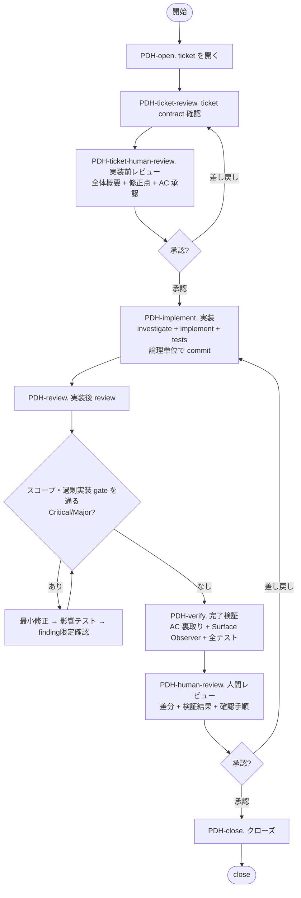

# PDH Dev — Stage Flow

## 前提

- 最初に`./ticket.sh help`を実行してticket操作を確認する
- `product-brief.md`を最初に読み、project規約のcode mapとrepo ruleに従う
- ticketの作成、開始、中止、closeは`./ticket.sh`を使う。ticket branchとmerge先はticket.shとfrontmatterに従う
- 仕様変更時はcodeやreviewを続ける前にticket file（`ticket.sh start`/`restore`出力の`ticket:`パス。互換symlink: `current-ticket.md`）のACと確定判断を最新化する
- local contextで解ける論点を先に洗い出し、localでは解けないblockerだけを短く相談する

## 全体フロー

```mermaid
flowchart TD
    Start([開始]) --> PDC1["PDH-open. ticket を開く"]
    PDC1 --> PDTR["PDH-ticket-review. ticket contract 確認"]
    PDTR --> PDTHR["PDH-ticket-human-review. 実装前レビュー<br/>全体概要 + 修正点 + AC 承認"]
    PDTHR --> PDTHRq{"承認?"}
    PDTHRq -- "差し戻し" --> PDTR
    PDTHRq -- "承認" --> PDC6["PDH-implement. 実装<br/>investigate + implement + tests<br/>論理単位で commit"]
    PDC6 --> PDC7["PDH-review. 実装後 review"]
    PDC7 --> PDC7q{"スコープ・過剰実装 gate を通る<br/>Critical/Major?"}
    PDC7q -- "あり" --> PDC7fix["最小修正 → 影響テスト → finding限定確認"] --> PDC7q
    PDC7q -- "なし" --> PDC9["PDH-verify. 完了検証<br/>AC 裏取り + Surface Observer + 全テスト"]
    PDC9 --> PDHR["PDH-human-review. 人間レビュー<br/>差分 + 検証結果 + 確認手順"]
    PDHR --> PDC10q{"承認?"}
    PDC10q -- "差し戻し" --> PDC6
    PDC10q -- "承認" --> PDC10["PDH-close. クローズ"]
    PDC10 --> Done([close])
```

---

## PDH-open. Ticket を開く

1. `./ticket.sh start`/`restore`出力の`ticket:`パス（互換symlink: `current-ticket.md`）を確認する
   - 出力が無ければ`./ticket.sh list`を実行する。新規なら`./ticket.sh new <slug>`、標準構造の記入、`./ticket.sh start <ticket-name>`の順で開始する
   - あれば内容を読んで続行する
2. 新規記入では、ACを箇条書きで書き始める前に`What`の冒頭へ1文を書く — 「この ticket が終わると、〈誰〉が、いままでできなかった〈何〉をできるようになる」。各ACはこの1文の分割としてだけ書く。非退行のACだけは例外で、〈誰〉のみ必須とし「いままでできなかった」を求めない
3. 同じ出力の`note:`パス（互換symlink: `current-note.md`）を確認する
   - `./ticket.sh start`が生成した構造に従う
   - ACをcopyしない。ACのsource of truthはticketだけとする

このstageでは読むticketとnoteだけを確定する。妥当性checkとAC承認は後続stageへ分ける。

## PDH-ticket-review. Ticket contract check

1. WhyとAC
   - Whyを`product-brief.md`の目的へ接続する。症状から翻訳した要求がbriefと矛盾する場合は実装せず提起する
   - 曖昧なACを具体化する。具体化とは「いま調べれば確定できることを、調べてから書く」である。次の4つはいずれも調べれば消えるので、ACへ残さない — 未測定の数値目標／可否を条件にした分岐／文面のない「◯◯が入る」／対象を列挙しない件数
   - **ACを承認者が読める言葉にする。**[_reference.md](_reference.md)「AC に書いてよいもの / 書いてはいけないもの」の判定を、**AC全件に当てる。**⚠ **この工程でACを書き換えたら、書き換え後の行にも当て直す** — 実装の言葉へ寄るのはこの書き換えの時点である
   - **調べる対象はACだけではない。ticket全体から次を機械的に洗い出し、書き手が測れるものは測って確定させる。**記憶に頼って「もう調べ終わった」と判定しない

     | 調べる場所 | 確認すること |
     |---|---|
     | `Open Questions` | 全件出す。**書き手が測れるものは測って消す。**残すのは承認者にしか決められないものと、実装しないと分からないものだけ |
     | 未確認を表す語 | 「未確認」「要確認」「見込み」「はず」「思われる」「かもしれない」をgrepする。**自覚していない未確定はここに出る** |
     | contract / data model の記述 | 「変更なし」「不変の見込み」と書いた行を、実体を開いて確かめる |
     | 影響レイヤーの列挙 | 挙げた各レイヤーをgrepする。**挙げなかったレイヤーが本当に無関係かも確かめる** |
     | **ticketが事実として断定する文** | フィールド名・関数名・呼び出し元の数・件数を**元の実体に当たる。**ticketにそう書いてあることは正しさの証明ではない |
     | 合意に使われた画像 | **開く。**完成形のmockup・試作・変更前後の比較は、合意した文章と同じ重さで扱い、決めている文言・色・導線・並び順を文字にも起こす |

     **最も多く出るのは「ticketが事実として断定する文」である。**起票時の理解がそのままACへ運ばれ、**ACでは「確かめた事実」の顔をする。存在しないフィールドを指すACは、実装する人が別のものに読み替えるので、承認した約束と出荷されるものが食い違う。**

     **この洗い出しを`PDH-ticket-human-review`の材料づくりまで先送りしない。**材料を作る段階で欠陥が出ると、ticket・材料・推奨をまとめて作り直すことになる
   - ACごとに「この判定は、実装が対象を取り違えても満たせてしまわないか」を確認する
   - ACごとに「達成できると確かめたか」を判定する。確かめていなければ、確かめる手段をnoteの`Required Probes`へ書き、**PDH-ticket-human-reviewの前に実行して結果をnoteへ書く**。実行できないもの（実装しないと分からないこと）は、ACに結果を書かず「測って記録する＋この値を下回ったら止めて報告する」の形にする。**未確認の結果をACの達成条件にしない**
   - review済みやtest pass等のprocess要件はnote checklistへ移し、ACには観察可能なproduct動作だけを書く
   - runtimeでUXまたはSecurity invariantを強制するticketは、runtime enforceの保証mechanismをACへ1行明記する
   - ACが触るconsumer surfaceをnoteへ列挙する。カテゴリと具体項目：UI（画面・component・form・modal・navigation）、HTTP API（endpoint path・request/response schema・status code・error message）、SDK（class/method/type・例外・README example。複数言語ある場合は全言語）、CLI（command名・option/flag・help・exit code・出力フォーマット）、Config（設定キー・環境変数・default値・validation message）、生成物（OpenAPI・自動生成SDK model・docsページ・migration script）、観測surface（logフォーマット・metrics名・event payload・trace span属性）
   - Surface Observerは列挙surfaceを最低限すべて観察し、追加の違和感も報告する。surfaceなしなら該当なしを1行記録する
   - **ACが確定したら、読めるかを«書いていないagent»に測らせる。**`What`冒頭の1文とAC全件だけを渡し（ticket本体・note・実装・この工程の経緯は渡さない）、**「終わると誰が何をできるようになるか」を復元させる。**復元できないACが出たら書き直し、書き直した分だけをもう一度渡す。役割別指示は`pdh-verifying` skill「AC 読み手（復元テスト）」にある
     - ⚠ **書き手が自分に1問を当てるのとは別の検査である。**実装の言葉へ寄せるのはこの工程で書き換えた本人なので、同じ人が「読める」と判定すると寄りが残る
2. User journeyとregression
   - **`What`冒頭の1文が、close直後にuserができることになっているかを確認する。**別の1文を新しく立てない — 立てると読める1行と読めないACが並び、承認者は1行を読んでACを承認することになる
   - main HEAD比で失われるuser-observable機能を1行判定する。ある場合はmigrationを本ticketへ含めるか、別ticketを同一close gateへbundleする
3. `product-brief.md`のArchitectural Invariantsと矛盾しないことをticketへ1行宣言する
4. Design DecisionsとOut-of-scopeが実装workerに十分か確認し、未確定判断は実装前にユーザへ確認する
5. 未完了Dependencyがあれば着手せず報告する
6. human review用に修正点、概要、user journey、AC、Out-of-scope、判断点、計画を無効化しうるriskとdependencyを整理する。このstageではAC承認を得ない

## PDH-ticket-human-review. Ticket human review

1. **`./ticket.sh check --require "Required Probes"` を実行し、測る工程が片付いていることを確認する。**未了があれば板を出さず、先に測る（測る対象が無いなら `- [-] ... - skip: <理由>` と書いて理由を残す）
2. noteのStatusを`PDH-ticket-human-review`へ更新し、ticket修正点と未確定判断がnoteにあることを確認する
3. 会話へ渡す材料は`pdh-decision-board` skill（実装前gateは`ticket-gate.md`）に従う。ACは承認対象の文言そのままを引用し、要約に置き換えない
4. **ユーザの明示承認まで`PDH-implement`へ進まない。**
5. 差し戻しは`PDH-ticket-review`へ戻し、ticket更新後にhuman reviewを再実行する

## PDH-implement. 実装

前提は`PDH-ticket-human-review`でticket contractとACが承認済みであること。

実装workerの規則は`pdh-coding` skillにある — 1つの作業文脈での完遂、論理単位commit、整合性gate、完了チェックを含む。PMは委譲と検品だけを行う。

### 実行指示の必須内容（worker への spawn prompt に含める）

`_subagent-context.md`の共通contextと役割別指示にtask固有依頼を加える。土台を毎回書き写さない。

### 出口検品（PM）

- `pdh-coding`「整合性 gate と完了チェック」の実施証跡がnoteにあるか — `scripts/test-all.sh`のcommandと最終合否の実出力がverbatimで貼られ、pre-existing failureに根拠が添えてあるか
- 全test pass時だけ実装完了とする。1件でも失敗、未実行、環境不備なら完了扱いにしない

## PDH-review. 品質検証 (実装後 review)

review前にticket frontmatterの`branch`をbase branchとしてfetchし、未指定ならrepoのdefault branchへfallbackして、`git merge-base --is-ancestor origin/<base> HEAD`を確認する。 falseなら`git merge origin/<base> --no-edit`で取り込み、conflict解消後にreviewする。

### 独立レビュー必須トリガ

trigger一覧とcross-model要件は`PDH-AGENTS.md`「Verification」のIndependent review triggersに従う。該当するdiffでは独立reviewを省略しない。

### 実装後 review 特有 gate

- 独断の変更：implementorがAC、Out-of-scope、Architectural Invariantsを再合意なく変更していないか（規則は`.claude/skills/pdh-coding/SKILL.md`「ticket の変更は再合意で行う」にある）
- 確定判断が1件ずつ実装に落ちているか。**対応する実体を名指しできない判断は未実装として差し戻す**（脱落はdiffに現れないので、数えないと通る）。実装中に変わっているなら、元の判断・崩れた前提・新しい判断がticketに残っているか（記録の無い変更は差し戻す）
- scope逸脱：未記載の公開surface、破壊操作、権限変更を機械的に列挙する。見つけたらCriticalとしてhuman gateへ出す（実装済みであることを採用理由にしない）
- commit cadence：`pdh-coding`「Commit cadence 契約」を満たすか。commit数はgateにしない
- E2E：外部provider pathを実APIで確認したか。deferredなら明記したか
- 全test PASS：影響するbackend、frontend、E2E、SDKが全てpassしたか

### review 観点

`pdh-reviewing` skillの網羅探索チェックリストに加え、product brief整合、AC、security、error handling、影響layer、検証手法を確認する。 Why E2E無バイアスlensとAC conformanceおよび妥当性lensをpersona matrix込みで実施し、結論の矛盾は前提差を確認して裁定する。

### 修正ループ

1. findingをseverity、scope、複雑度gateで分類し、採用findingだけを最小修正する
   - **直す前に、そのコードが正しく扱えていた入力を1つ実行して出力を記録する**（`pdh-coding` skill「指摘を直すとき、壊していないことを反例で固定する」）。直したあと同じ入力を流し、前後の出力を報告へ載せる
2. 中間attemptでは変更fileとimport chain上の影響testだけを実行する
3. 元finding、再現条件、修正diff、前後の出力だけを同じreviewerへ渡し、対象SHA付きで確認する

完了条件は、最新SHAで採用CriticalとMajorが解消し、非採用理由がnoteにあること。未解消をユーザが受容してもPASSにせず、risk、理由、承認文を残す。

## PDH-verify. 完了検証

`VERIFIED`、`PASS`、AC check済みを報告する前に、対応stateがticket、note、git historyへ実在しcommit済みでなければならない。

1. ticket file（`ticket.sh start`/`restore`出力の`ticket:`パス。互換symlink: `current-ticket.md`）の各ACを1項目ずつ確認してcheckする
2. note file（同出力の`note:`パス。互換symlink: `current-note.md`）のprocess checklistを1項目ずつ確認してcheckする
3. UIまたはAPI verifyは`./scripts/dev-server.sh --seed`を使う。dev-server / seed hookの契約は`PDH-AGENTS.md`「Dev Server And Seed」に、`application-test`と`ticket-local-test`の分け方と置き場所は`pdh-coding` skill「テスト設計ルール」に従う
   - sandbox、端末path、local login等はlocal設定または一時commandで扱い、区別できなければ確認する
4. AC裏取りAgentが各ACの実質達成を検証する（worker規則は`pdh-verifying`「AC 裏取り Agent」）。`NOT VERIFIED`の証拠を補完するまで進まない
5. renameまたはdeleteがあれば全docをsweepし、旧name、path、URLの残骸を確認する
6. **資産メンテナンス** — close前に恒久資産を現在形に保つ。この ticket の差分に因果がある範囲だけ触り、他ticket由来の記述・検査は消さず削除候補としてnoteに記録する
   - technical-reference.mdとの突合: 因果がある記述を追記・上書きする。出荷済み挙動は確定事実としてその場で書く（承認待ちで先送りしない）。該当なしならnoteに「該当なし」と1行記録
   - 再発の恒久検査化: 出荷済み不具合の修正なら、決定論検査（fast-check/lint/テスト）で再発を恒久検出できるか1回問う。追加できないなら理由をnoteに1行
   - briefへの事実追記: 達成したDone項目・解消したOpen Questionsを反映する（方針変更はしない）
   - 刈り込み: 自分の差分が置き換えた記述・検査を削除する（より強いゲートで守れるようになった検査の削除も含む）
7. 最終HEADで`scripts/test-all.sh`を再実行して実出力をnoteへ貼る。後続commitまたはmergeが影響し得る古い証拠は取り直す
8. 必要なticket noteとdocsは直接更新する
9. human review直前に外部surfaceをconsumer視点で観察する（worker規則は`pdh-verifying`「Surface Observer」、観察方法と証拠の要件は`PDH-AGENTS.md`「Browser And Surface Checks」）
   - 外部surfaceなしの純backendはskipできるが、理由をnoteへ1行残す
   - blockerがあれば`PDH-implement`または`PDH-review`へ戻る
10. AC check済みticket fileを含めてcommitする

## PDH-human-review. 人間レビュー

1. note Statusを`PDH-human-review`へ更新し、verifyまでの証拠がcommit済みであることを確認する
2. 会話へ渡す材料は`pdh-decision-board` skill（close前gateは`close-gate.md`）に従う。未対応findingは、全attemptの`### Findings (PDH-review-N)`表を横断して判定が起票・記録のみ・棄却の行を抜き出して作る。ユーザ確認用のURLは`./scripts/dev-server.sh`で用意する
3. **明示承認までcloseしない。**
4. 差し戻しはimplementへ戻し、reviewから再走する。途中blockerは直ちに確認する

## PDH-close. クローズ

前提は`PDH-human-review`でのユーザ明示承認である。

1. 承認内容とclose時点のmerge、push、deploy状態を記録する

   ### 完了報告の必須要素

   土台は`pdh-decision-board`（`close-gate.md`）の主線4面と裏付けの一覧と同じ。close報告では次を追加する。

   - literalな1行目へ、user journeyで何ができるようになったかを書く
   - 各ACのdata出所を報告する。user-facing ACが合成dataのみなら実data未確認のclose blockerとする
   - main想定状態のuser journey実機証拠をUI screenshot、API response、SDK sample、CLI output等のsurface相応の形で示す
   - merge直後に失うuser-observable機能をyesまたはnoで判定する。yesはdownstream復旧予定でもclose blockerとする
   - 何がどう変わり何ができるかを専門語なしで1〜2行にする
   - commit数等の内部mechanicsを価値要約へ並べず、注意事項だけNotesへ書く
   - ticket候補は既定ゼロとする。実際に触れて見つけた欠陥、gap、deferredだけを、diff、note、test証拠とともに挙げる
2. 差し戻し理由をDiscoveriesへ記録して`PDH-implement`へ戻り、修正後は`PDH-review`から再走する
3. 承認後に`./ticket.sh close`を実行する
