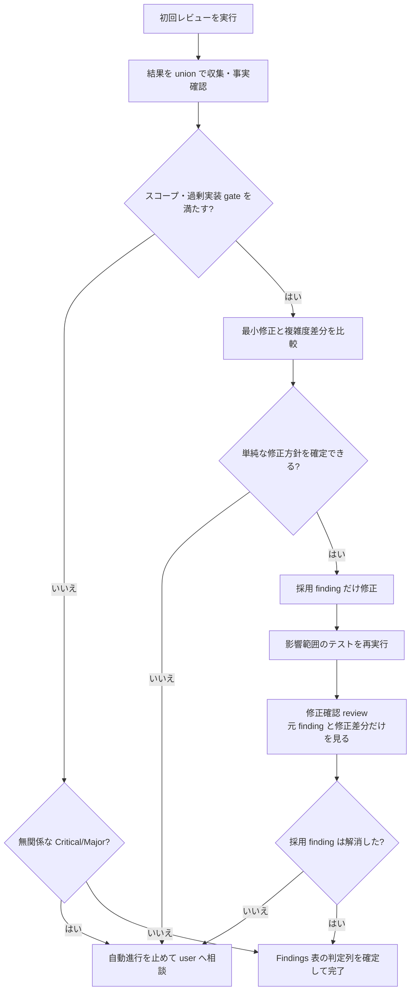

# PDH Dev — レビューパターンと観点

## レビューパターン

reviewは、初回結果のunionと事実確認、scope gate、複雑度比較、採用findingの最小修正、影響test、finding限定確認の順で行う。
attemptは`PDH-review-1`、`PDH-review-2`のようにnote file（`ticket.sh start`/`restore`出力の`note:`パス。互換symlink: `current-note.md`）の子ログへ記録する。

### Severity の運用

Critical / Major / follow-up の定義は`PDH-AGENTS.md`「Verification」のSeverityが正。運用上の補足だけをここに置く。

- 検出頻度は信頼度のヒントであって重要度ではない
- Criticalはユーザが明示受容してもPASSとは記録しない
- Minorだけでloopを再開しない

### 複雑度差分 gate

修正で永続columnまたはtable、公開endpoint、画面、権限、state名または遷移が増える場合は、既存state削除、input拒否、process制約案と比較する。
新概念を追加する場合は、単純案でACまたはsecurity contractを満たせない理由をnoteへ残す。
1 findingのため永続stateまたは公開surfaceを2つ以上増やす必要があれば、自動修正を止めてユーザへ相談する。
局所patchを足すより直前の単純designへ戻す方が小さければ、designを戻す。

### レビュアーへの指示ルール

reviewer promptには次を含める。

- 変更目的
- 対象fileとscope
- 役割ごとのreview観点
- Severity rubricに従いCriticalとMajorを優先する指示
- 後述の網羅探索checklistを参照する指示

### reviewer の網羅探索チェックリスト

reviewerは1 findingに止まらず、該当観点で同種patternを系統的に全探索する。
非該当観点はskipできる。

- 同名symbol sweep：変更identifier、field、endpoint、config keyをcodebase全体で探す
- 対称関係：input/output、sync/async、read/write、migration/rollbackなどの片側未追従を探す
- 継承と派生：base type、interface、schema変更時にsubclass、implementation、derived schemaを確認する
- 境界層の伝搬：internal、facade、wrapper、adapter、generated layer、public docsへの必要な伝搬を確認する
- test追従：test、mock、fixture、stub、hardcoded expectationを確認する
- test到達可能性：client JS、generated string、template内logicをtestからimportできるか確認する
- doc sweep：old identifier、path、enumがdoc、spec、README、comment、sample、changelogに残っていないか確認する。technical-reference.mdがある場合はdiffと突合し、更新漏れや虚偽の「該当なし」がないか確認する
- domain固有対称性：state transition、concurrency、locking、retry、idempotency、error、cleanup、observability、auth boundaryを必要に応じ確認する

finding冒頭へ`[同名 symbol sweep]`等の観点labelを付ける。

### Review attempt の必須ルール

1. 各reviewerは対象SHAを固定して結果へ明記する
2. 独立review必須triggerとcross-model要件は`PDH-AGENTS.md`「Verification」が正。代替手段と理由記録もそちらに従う
3. diff全体の網羅探索は初回だけとし、修正後は採用finding、再現条件、修正diffだけを同じreviewerへ渡す
4. reviewerは事実の再現と解消を判定し、Directorは採用、follow-up、棄却とloop終了を判定する
5. 完了には、採用CriticalとMajorが最新SHAで解消し、非採用findingの分類と理由がnoteへ必要である。全findingの実装は要求しない
6. 修正確認の新規findingを自動でloopへ加えない。修正起因CriticalまたはMajorだけscope gateへ戻し、他はfollow-upまたは棄却する
7. PASS済みreviewerは次diffがその観点へ影響する場合だけ再実行する

### Review attempt 収束性診断

同種Criticalが2 attemptで再発したらroot causeを診断してescalateする。
root causeはticketの実装詳細混入、scope肥大、reviewer prompt偏り、確定値の下流委譲を確認する。

rewind前の手順は`PDH-AGENTS.md`「Verification」のRewind disciplineが正。

`PDH-review-2`以降で初回findingが誤検出、pre-existing、Out-of-scope、user価値非直結と判明したら、追加fixを行わない。
Discoveryへ記録し、元のACとuser journeyだけをverifyする。
invariant test追加やcosmetic alignmentなどのengineering aestheticsをscope拡張理由にしない。

3 attempt以上のpatch loopへ入らない。
scope再作成、実code factと3案以上を示すescalation、戦略転換のいずれかを選ぶ。
動的言語などで入口検出だけでは同種Majorが3 attempt再発する場合は、入口除外、通過遮断、最終生成物sentinelの3段防御へ転換する。

### 裏取りルール

#### 許可される操作

- 複数reviewerの同一findingを統合する
- code上の事実誤認を除外する

#### 禁止される操作

- ticket記載を理由に却下する
- 重要度を引き下げる
- 対応済み扱いにする
- 既存問題扱いで無視する
- 指定role、gate、承認を近い別手順で代替する

## Why 直結レビュー（2 レンズ）と AC 妥当性

網羅探索に加えて次の2 lensを実施する。

### レンズ1 — Why end-to-end（無バイアス）

reviewerにはWhyとrepoだけを渡し、AC、implementorの結論、検証主張を渡さない。
ticketとnoteを閲覧対象から物理的に除外し、Whyが端から端まで成立するか追跡させる。

### レンズ2 — AC conformance + AC 妥当性

reviewerにACと完了主張を渡し、各ACに対応するroute、関数、test、doc節、config等を順方向に名指しして、完了主張が実体と一致するか確認する。
主要diffをAC、確定判断、security、stabilityへ逆方向に対応付け、未対応変更を過剰実装判定へ送る。
ACが緩くWhy未達なら、ユーザ承認の上でACを強化するか別ticketにする。

### persona / coverage マトリクス（両レンズに必須指定）

両lensは、権限差、tenant横断、session状態、成功と失敗、初回と再訪など、現実的な全分岐で確認する。

### 矛盾の裁定

reviewer間またはlens間で結論が割れたら、unionや多数決で流さず、前提差を確認して決着する。

## スコープ外問題と過剰実装の扱い

**判定基準の正は`PDH-AGENTS.md`。** reviewer出力が仮説であること、severityだけでscopeを広げないこと、無関係な実在Critical/Majorは止めてユーザへ相談することは「Execution Model」、same ticketで直す4条件と例外の記録は「Verification」のScope boundary、AC外コード・dead code誤記・governance混入・reactive-fix肥大の報告は同AC traceが正。

ここにはDirectorの記録手順だけを置く。

- 判定は 採用 / follow-up / 棄却 の3種。実在する範囲外問題はfollow-up、false positiveや前提誤りは棄却とする
- findingはnoteの`### Findings (PDH-review-N)`表へ、**検出した時点で1行追加する**。判定列と理由は後で埋めてよいが、attempt終了後にまとめて書き起こさない
- attempt 2以降は`### Findings (PDH-review-2)`のように見出しを自分で追加する
- 修正確認attemptで出た新規findingも、follow-up / 棄却にしたものを含めて同じ表へ1行追加する（`PDH-human-review`はこの表から提示分を抜き出すため、載せないと報告漏れになる）

## レビュー品質ルール

初回attemptは複数観点のunionで評価する。
PASS後に新規finding探索だけを目的としてreviewerを再実行しない。
