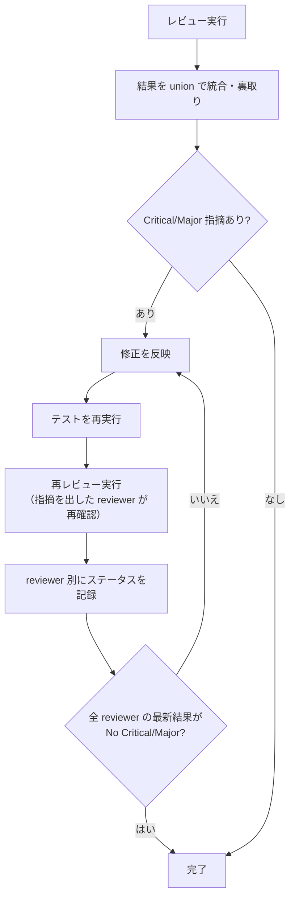

# PDH Dev — レビューパターンと観点

## レビューパターン

PD-C-7 は以下の構造で動く。ラウンドは `(N回目)` で表現する。実行モデル依存の reviewer 構成・起動手段は `_execution-*.md` に従う。

### レビュアーへの指示ルール

レビュアーを起動する際、以下を指示に含める:

- **変更の目的**: 何を解決するための変更か
- 対象ファイル・スコープ
- レビュー観点 (役割ごとの責務)
- Critical / Major を優先し、瑣末な点は後回しにしてよいこと
- `reviewer の網羅探索チェックリスト` (後述) を必ず参照する

### reviewer の網羅探索チェックリスト

各 reviewer は指摘を 1 箇所に絞らず、以下の観点で系統的に網羅探索する。1 つの問題を見つけたとき、同種パターンが他にもないか確認する責務がある。**観点はあくまで参考枠**。変更内容に該当しない観点はスキップしてよい。

- **同名 symbol sweep**: 修正対象の identifier / フィールド名 / endpoint path / 設定キー名を codebase 全体から探し、未修正・未追従の箇所がないか確認
- **対称関係**: 入力 ⇔ 出力 / sync ⇔ async / 初回 ⇔ キャッシュ / read ⇔ write / publish ⇔ subscribe / migration ⇔ rollback など、変更がペアの片方しか触れていないケースがないか
- **継承・派生関係** (該当する場合): 親型 / interface / abstract / 基底スキーマを修正・追加した時、subclass / 実装 / 派生スキーマにも同様の追従が必要でないか
- **境界層の伝搬** (該当する場合): 内部実装 → 公開 facade → wrapper → adapter → 自動生成 layer → 公開ドキュメント のうち、変更が伝搬すべきレイヤーで停止していないか
- **テスト追従**: 修正対象に対応するテスト・mock・fixture・stub・hardcoded 期待値が旧仕様のまま放置されていないか
- **ドキュメント sweep**: 旧 identifier / 旧パス / 旧 enum 値が、ドキュメント・spec・README・コード内コメント・サンプルコード・チェンジログ等に残骸として残っていないか
- **ドメイン固有対称性**: 状態遷移 / concurrency / locking / retry / idempotency / error path / cleanup / observability / 認可境界 などのドメイン固有観点

指摘を出す時は、観点ラベル (例: `[同名 symbol sweep]`) を冒頭に付けると、統合作業と再レビュー時の追跡が容易になる。

### レビューループの必須ルール

1. **修正したら必ず再レビューする** — 修正内容を反映した後、同じ reviewer で再レビューして確認する
2. **完了条件**: 全 reviewer の最新回答が `No Critical/Major` であること
3. **指摘のクローズ権限はレビュアーにある** — 指摘を出した reviewer が再レビューで `解消済み` と判断して初めて閉じられる
4. **Round N で PASS した reviewer は、Round N+1 で差分が影響しない限り再実行不要**

### レビューループ収束性診断

**2 round 同種 Critical 再発で root cause 診断 → escalation**。Direct flow は実装後 review のみで計画 review がないため、段階分けされた flow より厳しい threshold で介入する。

考えられる root cause:
- 書きすぎ (ticket に実装詳細混入) → 抽象化
- scope 肥大 → 切り直し
- reviewer プロンプト偏り → 観点を見直す
- 確定値を下流に投げる pattern → 意思決定者が決めるべき判断を確定値として書き込む、または scope を縮小

**3+ round の patch loop には絶対に入らない**。3+ round の同種再発は「scope か work の根本ミスマッチ」を示す signal。追加 patch ではなく以下のいずれかで対処:

- **scope 切り直し**: ticket cancel (`./ticket.sh cancel`)、scope を縮小して新 ticket
- **エスカレーション**: ユーザに状況を報告し判断を仰ぐ (3 案以上の選択肢を実コード fact と共に提示)
- **戦略転換 + 出口検査 (sentinel) 追加**: **「入口除外 → 通過遮断 → 出口検査」の 3 重 defense は、動的言語で security invariant を強制する一般的な設計パターンである。**

  動的言語・template・plugin など、入口側の静的検出だけで security invariant を強制している場合、同種 Major の 3 round 再発は blocklist 戦略の限界を示す。入口除外 (validation / AST blocklist) で漏れ、通過遮断 (runtime allowlist / context exclusion) へ転換しても適用範囲漏れが出る場合は、最終生成物の直前で invariant violation を検査する出口 sentinel を追加する。

  典型的な 3 段階再発パターン: Round 1 で「filter 経由 bypass」 → Round 2 で「dynamic key / method access bypass」 → Round 3 で「隠れた context 経由 bypass (例: 前段ステップが publish した internal data 経由)」。この pattern に対しては context exclusion + 該当 context の sanitize + 最終生成物 sentinel の組み合わせで provider / consumer 呼び出し前に違反を捕捉できる。

### 裏取りルール

レビュー結果を統合する際の「裏取り」範囲:

#### 許可される操作

- 複数 reviewer の同一指摘を統合する
- コード上の事実誤認を除外する

#### 禁止される操作

- 「ticket に書いてあるから問題ない」という理由での却下
- 判断で指摘の重要度を下げる
- `対応済み` とみなしてクローズする
- 既存の問題とみなして、現在の問題を無視する
- ユーザが指定した role / gate / 承認条件を、近い意味の別手順で満たしたと扱う

## スコープ外の既存問題の扱い

レビューやテスト実行で発見した既存問題 (今回の ticket の変更によるものでない問題) は、**原則として同じ ticket 内で片付ける方針** を既定とする。別チケット化・先送りは「今やると本筋の目的を損なう場合」の例外扱い。

判断フロー:

1. **既存問題を `current-note.md` に記録する** (問題の内容・発見箇所・影響範囲・原因が本 ticket か pre-existing か)
2. **自動分類**: 以下のいずれかに当てはまれば **同一チケット内修正を進めてよい** (確認不要):
   - テストの期待値が実装実挙動と乖離している (実装を変えずテスト側を追従させる修正)
   - 環境セットアップ不足 (依存関係インストール・editable install・ツール初期化など) による CI / フルスイート失敗
   - 明らかな typo・設定ミス・パス解決起因のエラー
   - リネーム / 削除の残骸 (grep 1 発で検出できる範囲)
   - ticket 変更で暴露されただけの軽微なバグで、修正量が数十行以内
3. **確認が必要なケース**: 以下は自動分類せず選択肢を添えて確認する:
   - **スコープが広がる変更** (新機能追加・API 契約変更)
   - **実装ロジックの挙動変更** (テストではなく実装側を直す必要がある場合)
   - **AC 追加相当の修正** (ユーザに見せる振る舞いが変わる)
   - **セキュリティ上の重大な問題** (常に即相談)
4. 同一チケット内で修正する場合は `current-note.md` の Discoveries / PD-C-7 結果欄に「pre-existing として検出 → 本 ticket 内で修正 → 修正 commit hash」の証跡を残す。ticket の AC は追加しない (pre-existing 修正は AC ではなく副次対応として扱う)

**背景**: 別チケット化は切り出しコスト・文脈ロストが高く、1 user + AI 開発体制では「今ここで直せば 10 分」の問題を翌週まで放置する動機にしかならない。同一チケットで拾う方が全体速度が上がる。

## レビュー品質ルール

- LLM レビューは実行ごとに指摘の 6-7 割が入れ替わる。複数回 / 複数観点で実行して union (和集合) を取る
- 検出頻度は「信頼度のヒント」であり「重要度の指標」ではない

（複数 reviewer をどう動かすか = 並行実行 / spawn / subagent などの実行手段は `_execution-*.md` に従う）
