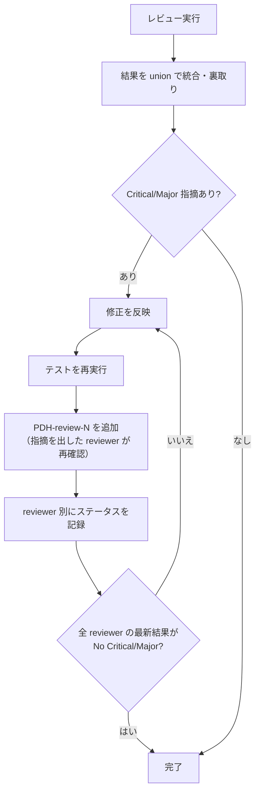

# PDH Dev — レビューパターンと観点

## レビューパターン

PDH-review は以下の構造で動く。実行回数は `PDH-review-1` / `PDH-review-2` のように `current-note.md` の子ログへ記録する。実行モデル依存の reviewer 構成・起動手段は `_execution-*.md` に従う。

### レビュアーへの指示ルール

レビュアーを起動する際、以下を指示に含める:

- **変更の目的**: 何を解決するための変更か
- 対象ファイル・スコープ
- レビュー観点 (役割ごとの責務)
- Critical / Major を優先し、瑣末な点は後回しにしてよいこと
- `reviewer の網羅探索チェックリスト` (後述) を必ず参照する

### reviewer の網羅探索チェックリスト

各 reviewer は指摘を 1 箇所に絞らず、以下の観点で系統的に網羅探索する。1 つの問題を見つけたとき、同種パターンが他にもないか確認する責務がある。**観点はあくまで参考枠**。変更内容に該当しない観点はスキップしてよい。

- **同名 symbol sweep**: 修正対象の identifier / フィールド名 / endpoint path / 設定キー名を codebase 全体から探し、未修正・未追従の箇所がないか確認
- **対称関係**: 入力 ⇔ 出力 / sync ⇔ async / 初回 ⇔ キャッシュ / read ⇔ write / publish ⇔ subscribe / migration ⇔ rollback など、変更がペアの片方しか触れていないケースがないか
- **継承・派生関係** (該当する場合): 親型 / interface / abstract / 基底スキーマを修正・追加した時、subclass / 実装 / 派生スキーマにも同様の追従が必要でないか
- **境界層の伝搬** (該当する場合): 内部実装 → 公開 facade → wrapper → adapter → 自動生成 layer → 公開ドキュメント のうち、変更が伝搬すべきレイヤーで停止していないか
- **テスト追従**: 修正対象に対応するテスト・mock・fixture・stub・hardcoded 期待値が旧仕様のまま放置されていないか
- **テスト到達可能性**: 変更が導入・変更したロジック (特に client JS・生成文字列内 script・テンプレート埋め込み) が、テストスイートから import して検証できる形にあるか。到達不能な場所に分岐ロジックが置かれていたら指摘する
- **ドキュメント sweep**: 旧 identifier / 旧パス / 旧 enum 値が、ドキュメント・spec・README・コード内コメント・サンプルコード・チェンジログ等に残骸として残っていないか
- **ドメイン固有対称性**: 状態遷移 / concurrency / locking / retry / idempotency / error path / cleanup / observability / 認可境界 などのドメイン固有観点

指摘を出す時は、観点ラベル (例: `[同名 symbol sweep]`) を冒頭に付けると、統合作業と次の `PDH-review-N` での追跡が容易になる。

### Review attempt の必須ルール

1. **対象 SHA を固定する** — 各 reviewer は対象 commit SHA を結果に明記する。修正後は、その差分が既存判定へ影響する reviewer だけ review attempt を追加し、`PDH-review-N` として記録する
2. **完了条件**: 全 reviewer の最新回答が、同一の最新対象 SHA（またはその reviewer の観点に影響しないことを PM が確認した差分）について `No Critical/Major` であること
3. **指摘のクローズ権限はレビュアーにある** — 指摘を出した reviewer が後続 attempt で `解消済み` と判断して初めて閉じられる
4. **`PDH-review-N` で PASS した reviewer は、次 attempt で差分が影響しない限り再実行不要**
5. **Minor で loop を再開しない** — Critical/Major が 0 になった後の新規 Minor は「スコープ外の既存問題の扱い」の因果基準で分類する。同一 ticket 条件を満たさなければ follow-up とし、追加修正・全 reviewer 再走を行わない

### Review attempt 収束性診断

**2 attempt 同種 Critical 再発で root cause 診断 → escalation**。ticket review は実装前に行うが、実装後に同種 Critical が繰り返す場合は scope か指示が壊れている可能性が高いため介入する。

考えられる root cause:
- 書きすぎ (ticket に実装詳細混入) → 抽象化
- scope 肥大 → 切り直し
- reviewer プロンプト偏り → 観点を見直す
- 確定値を下流に投げる pattern → 意思決定者が決めるべき判断を確定値として書き込む、または scope を縮小

**`PDH-review-2+` で reviewer 指摘が false positive と判明した場合の scope-expand 抑制**:

`PDH-review-1` で reviewer / Surface Observer が挙げた指摘が、`PDH-review-2` の調査で「誤検出 / pre-existing / out-of-scope / user-value に直結しない」と判明した場合、**その attempt 内で追加 fix を実装してはならない**。以下を実行:

- `PDH-review-1` の指摘を `current-note.md` Discoveries に「`PDH-review-1` 報告は誤検出 / pre-existing と判明」と記録
- 元の AC + user journey 動作確認に絞って PDH-verify を再走、PDH-human-review へ
- 「invariant test pin で将来 regression 防止」「registry value cosmetic alignment」「上位 spec の体裁を整える」「engineering 美学の補完」などは **scope-expand 理由として禁止**。本当に必要なら別 ticket を切る (Director / 意思決定者 承認必須)

根拠: `PDH-review-1` → `PDH-review-2` で「修正の正当化」が動機になり、user-value に寄与しない scope expansion を生む典型 anti-pattern。後続 attempt でも同じ ground truth (AC + user journey、`_principles.md` 「user journey > engineering aesthetics」) を判定基準として維持する。

**3+ attempt の patch loop には絶対に入らない**。3+ attempt の同種再発は「scope か work の根本ミスマッチ」を示す signal。追加 patch ではなく以下のいずれかで対処:

- **scope 切り直し**: ticket cancel (`./ticket.sh cancel`)、scope を縮小して新 ticket
- **エスカレーション**: ユーザに状況を報告し判断を仰ぐ (3 案以上の選択肢を実コード fact と共に提示)
- **戦略転換 + 出口検査 (sentinel) 追加**: **「入口除外 → 通過遮断 → 出口検査」の 3 重 defense は、動的言語で security invariant を強制する一般的な設計パターンである。**

  動的言語・template・plugin など、入口側の静的検出だけで security invariant を強制している場合、同種 Major の 3 attempt 再発は blocklist 戦略の限界を示す。入口除外 (validation / AST blocklist) で漏れ、通過遮断 (runtime allowlist / context exclusion) へ転換しても適用範囲漏れが出る場合は、最終生成物の直前で invariant violation を検査する出口 sentinel を追加する。

  典型的な 3 段階再発パターン: `PDH-review-1` で「filter 経由 bypass」 → `PDH-review-2` で「dynamic key / method access bypass」 → `PDH-review-3` で「隠れた context 経由 bypass (例: 前段ステージが publish した internal data 経由)」。この pattern に対しては context exclusion + 該当 context の sanitize + 最終生成物 sentinel の組み合わせで provider / consumer 呼び出し前に違反を捕捉できる。

### 裏取りルール

レビュー結果を統合する際の「裏取り」範囲:

#### 許可される操作

- 複数 reviewer の同一指摘を統合する
- コード上の事実誤認を除外する

#### 禁止される操作

- 「ticket に書いてあるから問題ない」という理由での却下
- 判断で指摘の重要度を下げる
- `対応済み` とみなしてクローズする
- 既存の問題とみなして、現在の問題を無視する
- ユーザが指定した role / gate / 承認条件を、近い意味の別手順で満たしたと扱う

## Why 直結レビュー（2 レンズ）と AC 妥当性

網羅探索（上記チェックリスト）に加え、**「AC は全緑なのに上位 Why が未達」** を捕まえるための 2 レンズを回す。AC のチェックボックス充足を Why 達成と取り違えると、**AC が緩すぎる場合に user 価値が欠けたまま close される**（典型: 「通知に deep-link が*存在*する」を AC にしたが、踏んでも目的の画面に着地しない / そもそも当該エラー種別では通知が出ない、を誰も実測していない）。

### レンズ1 — Why end-to-end（無バイアス）

- reviewer には **Why（user が得たい結果）と対象 repo だけ** を渡し、**AC・実装者の結論・「検証済み」主張は渡さない**。「この Why が、既存コードも含めて端から端まで本当に成立するか」を独立に追跡させ、成立しない / 未検証の箇所を返させる。
- **バイアス除去は構造で担保する。** 「ticket / note を読むな」という指示だけでは不十分（成果物が repo にあれば読めてしまう）。無バイアスが要るなら、reviewer の閲覧対象から **ticket / note を物理的に除外**する（ticket 書込み前に回す、または ticket ファイルを含めないチェックアウト / コピーで回す）。
- これは「ticket に書いてあるから却下禁止」（裏取りルール）とセットの予防策。実装者の主張に引きずられた追認レビューを構造的に避ける。

### レンズ2 — AC conformance + AC 妥当性

- reviewer に **AC と完了主張** を渡し、(a) 各 AC が実コードで本当に満たされるか（主張を鵜呑みにしない）、(b) **AC 自体が緩すぎないか** を判定させる。
- (b) の出力形式: 「**チェック可能なのに Why は未達**」なケースを具体的に列挙させる（どの AC が・どの user 状況で・どう価値を欠くか）。これが出たら AC を強化（ユーザ承認の上で更新）するか、別 ticket を切る。

### persona / coverage マトリクス（両レンズに必須指定）

happy path 1 ケースでなく **現実の利用者像の全分岐** で見させる。例: 権限差・マルチテナント / プロジェクト横断・セッション切れ / 期限切れ・成功 / 失敗種別の各分岐・初回 / 再訪。漏れの多くは「テストした 1 ケースだけ通る」。

### 矛盾の裁定

reviewer 間・レンズ間で結論が割れたら（例: 一方「壊れている」、他方「機能する」）、union や多数決で流さず **深掘りで決着** させてから進む。割れ＝どちらかが前提（persona / 経路）を取り違えている signal。

## スコープ外の既存問題の扱い

レビューやテスト実行で発見した問題は、件数や修正行数ではなく **ticket との因果関係** で分類する。既存問題を同じ ticket で片付けることは既定にしない。

判断フロー:

1. **既存問題を `current-note.md` に記録する** (問題の内容・発見箇所・影響範囲・原因が本 ticket か pre-existing か)
2. 次のいずれかなら **同一 ticket で修正する**:
   - 未修正では ticket の AC / Why を実質達成できない
   - 現在の差分が持ち込んだ regression
   - 同じ root cause で、実際に出荷された不具合の再発経路になる
   - Critical / Major が本 ticket の変更対象または必要な user journey に影響し、未修正では安全に `PDH-human-review` へ出せない
3. 上記以外 (pre-existing、共有基盤の構造改善、将来予防、Minor UX、lint / 開発環境改善など) は **follow-up ticket 候補**として記録し、現在の差分には含めない。
4. 境界では「この修正を外しても AC 達成・current diff の regression なしと説明できるか」を問う。説明できるなら follow-up、できないなら同一 ticket。
5. 同一 ticket に残す例外的な修正は、AC または current diff との直接の因果を `current-note.md` に 1 行で記録する。記録できなければ follow-up とする。

本 ticket と因果のない Critical / Major は同一 ticket に自動吸収せず、作業を止めて `_collaboration.md` に従い直ちにユーザへ相談する。セキュリティ問題や仕様判断を伴う場合も同様。

## レビュー品質ルール

- LLM レビューは実行ごとに指摘が変わるため、**最初の review attempt では**複数観点の結果を union (和集合) で評価する。PASS 後に新規指摘を掘る目的だけで無条件に reviewer を再実行しない
- 検出頻度は「信頼度のヒント」であり「重要度の指標」ではない

（複数 reviewer をどう動かすか = 並行実行 / spawn / subagent などの実行手段は `_execution-*.md` に従う）
