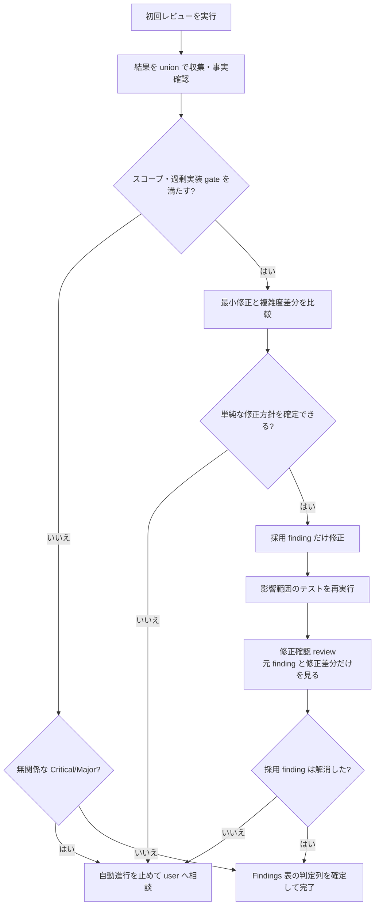

# PDH Dev — レビューパターンと観点

このファイルにはDirector（PM）側の運用だけを置く。reviewer自身がreview時に従う規則（網羅探索チェックリスト、レンズごとの確認内容、修正確認、報告形式）は`pdh-reviewing` skill（`.claude/skills/pdh-reviewing/SKILL.md`）にある。

## レビューパターン

reviewは、初回結果のunionと事実確認、scope gate、複雑度比較、採用findingの最小修正、影響test、finding限定確認の順で行う。 attemptは`PDH-review-1`、`PDH-review-2`のようにnote file（`ticket.sh start`/`restore`出力の`note:`パス。互換symlink: `current-note.md`）の子ログへ記録する。


```mermaid
flowchart TD
    RA["初回レビューを実行"] --> RB["結果を union で収集・事実確認"]
    RB --> RC{"スコープ・過剰実装 gate を満たす?"}
    RC -- "いいえ" --> RN{"無関係な Critical/Major?"}
    RN -- "はい" --> RM["自動進行を止めて user へ相談"]
    RN -- "いいえ" --> RI["Findings 表の判定列を確定して完了"]
    RC -- "はい" --> RK["最小修正と複雑度差分を比較"]
    RK --> RL{"単純な修正方針を確定できる?"}
    RL -- "いいえ" --> RM
    RL -- "はい" --> RD["採用 finding だけ修正"]
    RD --> RE["影響範囲のテストを再実行"]
    RE --> RF["修正確認 review<br/>元 finding と修正差分だけを見る"]
    RF --> RH{"採用 finding は解消した?"}
    RH -- "いいえ" --> RM
    RH -- "はい" --> RI
```

### Severity の運用

Critical / Major / Minor の定義は`PDH-AGENTS.md`「Verification」のSeverityに従う。運用上の補足だけをここに置く。

- 検出頻度は信頼度のヒントであって重要度ではない
- Criticalはユーザが明示受容してもPASSとは記録しない
- Minor相当の指摘だけでloopを再開しない

### 複雑度差分 gate

修正で永続columnまたはtable、公開endpoint、画面、権限、state名または遷移が増える場合は、既存state削除、input拒否、process制約案と比較する。新概念を追加する場合は、単純案でACまたはsecurity contractを満たせない理由をnoteへ残す。 1 findingのため永続stateまたは公開surfaceを2つ以上増やす必要があれば、自動修正を止めてユーザへ相談する。局所patchを足すより直前の単純designへ戻す方が小さければ、designを戻す。

### レビュアーへの指示ルール

reviewer promptには次を含める。

- 変更目的
- 対象fileとscope
- 対象commit SHAとdiff範囲（レンズ1を除く）
- 役割ごとのreview観点
- Severity rubricに従いCriticalとMajorを優先する指示
- 最初に`pdh-reviewing` skill（`.claude/skills/pdh-reviewing/SKILL.md`。Codexは`.agents/skills/pdh-reviewing/SKILL.md`）を読む指示

### Review attempt の必須ルール

1. 各reviewerは対象SHAを固定して結果へ明記する
2. 独立review必須triggerとcross-model要件は`PDH-AGENTS.md`「Verification」に従う。代替手段と理由記録もそちらに従う
3. diff全体の網羅探索は初回だけとし、修正後は採用finding、再現条件、修正diff、**実装が記録した「直す前の出力」と「直したあとの同じ入力の出力」**だけを同じreviewerへ渡す
4. **修正確認attemptでは、修正が直前の性質を壊していないかを最初に見る。**採用findingが解消したかの確認はそのあとでよい。突き合わせる材料は項目3の前後出力で、**記録が無いことそれ自体をfindingとして扱う**（実装側の規則は`pdh-coding` skill「指摘を直すとき、壊していないことを反例で固定する」）
5. reviewerは事実の再現と解消を判定し、Directorは採用、起票、記録のみ、棄却とloop終了を判定する
6. 完了には、採用CriticalとMajorが最新SHAで解消し、非採用findingの分類と理由がnoteへ必要である。全findingの実装は要求しない
7. 修正確認の新規findingを自動でloopへ加えない。修正起因CriticalまたはMajorだけscope gateへ戻し、他は起票 / 記録のみ / 棄却へ振り分ける
8. PASS済みreviewerは次diffがその観点へ影響する場合だけ再実行する

### Review attempt 収束性診断

同種Criticalが2 attemptで再発したらroot causeを診断してescalateする。 root causeはticketの実装詳細混入、scope肥大、reviewer prompt偏り、確定値の下流委譲を確認する。

rewind前の手順は`PDH-AGENTS.md`「Verification」のRewind disciplineに従う。

`PDH-review-2`以降で初回findingが誤検出、pre-existing、Out-of-scope、user価値非直結と判明したら、追加fixを行わない。 Discoveryへ記録し、元のACとuser journeyだけをverifyする。 invariant test追加やcosmetic alignmentなどのengineering aestheticsをscope拡張理由にしない。

3 attempt以上のpatch loopへ入らない。巡回数はnoteの`### Findings (PDH-review-N)`見出しが表す。**Nが3に達した時点でescalateする。**禁止形だけでは、既に入ってしまったloopの出口を示さないため、到達時の手順をここで定める。 scope再作成、実code factと3案以上を示すescalation、戦略転換、レビュー対象の変更のいずれかを選ぶ。レビュー対象の変更とは、diffを読むのをやめて実data・実挙動の監査へ切り替えることを指す。同じdiffを読み直すloopは、欠陥がdiffの外にあるとき原理的に収束しない。動的言語などで入口検出だけでは同種Majorが3 attempt再発する場合は、入口除外、通過遮断、最終生成物sentinelの3段防御へ転換する。

### 裏取りルール

#### 許可される操作

- 複数reviewerの同一findingを統合する
- code上の事実誤認を除外する

#### 禁止される操作

- ticket記載を理由に却下する
- 重要度を引き下げる
- 対応済み扱いにする
- 既存問題扱いで無視する
- 指定role、gate、承認を近い別手順で代替する

## Why 直結レビュー（2 レンズ）と AC 妥当性

網羅探索に加えて次の2 lensを実施する。レンズ2は通常のreviewer（Devil's Advocate等）がdiffとともに実施する。レンズ1は専用の独立reviewerを別workerとしてspawnする。渡すもの・渡さないものと役割別指示は`_execution-team.md`「worker prompt の組み立て」と`_subagent-context.md`「reviewer（レンズ1）」に従う。

### レンズ1 — Why end-to-end（無バイアス）

reviewerにはWhyとrepoだけを渡し、AC、implementorの結論、検証主張を渡さない。 ticketとnoteを閲覧対象から物理的に除外し、Whyが端から端まで成立するか追跡させる。

### レンズ2 — AC conformance + AC 妥当性

reviewerにAC・確定判断・完了主張を渡す。確認の内容は`pdh-reviewing`「レンズ2」に従う。 ACが緩くWhy未達なら、ユーザ承認の上でACを強化するか別ticketにする。

### 矛盾の裁定

reviewer間またはlens間で結論が割れたら、unionや多数決で流さず、前提差を確認して決着する。

## スコープ外問題と過剰実装の扱い

**判定基準は`PDH-AGENTS.md`にある。** reviewer出力が仮説であること、severityだけでscopeを広げないこと、無関係な実在Critical/Majorは止めてユーザへ相談することは「Execution Model」、same ticketで直す4条件と例外の記録は「Verification」のScope boundary、AC外コード・dead code誤記・governance混入・reactive-fix肥大の報告は同AC traceに従う。

ここにはDirectorの記録手順だけを置く。

- 判定は 採用 / 起票 / 記録のみ / 棄却 の4種。**実在することは起票の理由にならない。** 独立した作業単位として成立する（それ単体でスケジュールされるWhyを持つ）ものだけを起票し、成立しないが直す価値があるものは採用して現チケット内で直す。直す価値が無いものは記録のみ。false positiveや前提誤りは棄却。判定基準は`PDH-AGENTS.md`「Verification」のScope boundaryに従う
- findingはnoteの`### Findings (PDH-review-N)`表へ、**検出した時点で1行追加する**。判定列と理由は後で埋めてよいが、attempt終了後にまとめて書き起こさない。表の形式は次で固定する（noteテンプレートに無い場合はDirectorがこの見出しごと追加する）

  ```
  | # | 観点 | Sev | 要旨 | 判定 | 理由 |
  |---|---|---|---|---|---|
  ```

  観点は`pdh-reviewing`「網羅探索チェックリスト」のlabel、Sevは Critical / Major / Minor、判定は 採用 / 起票 / 記録のみ / 棄却。
- attempt 2以降は`### Findings (PDH-review-2)`のように見出しを自分で追加する
- 修正確認attemptで出た新規findingも、起票 / 記録のみ / 棄却にしたものを含めて同じ表へ1行追加する（`PDH-human-review`はこの表から提示分を抜き出すため、載せないと報告漏れになる）

## レビュー品質ルール

初回attemptは複数観点のunionで評価する。 PASS後に新規finding探索だけを目的としてreviewerを再実行しない。
