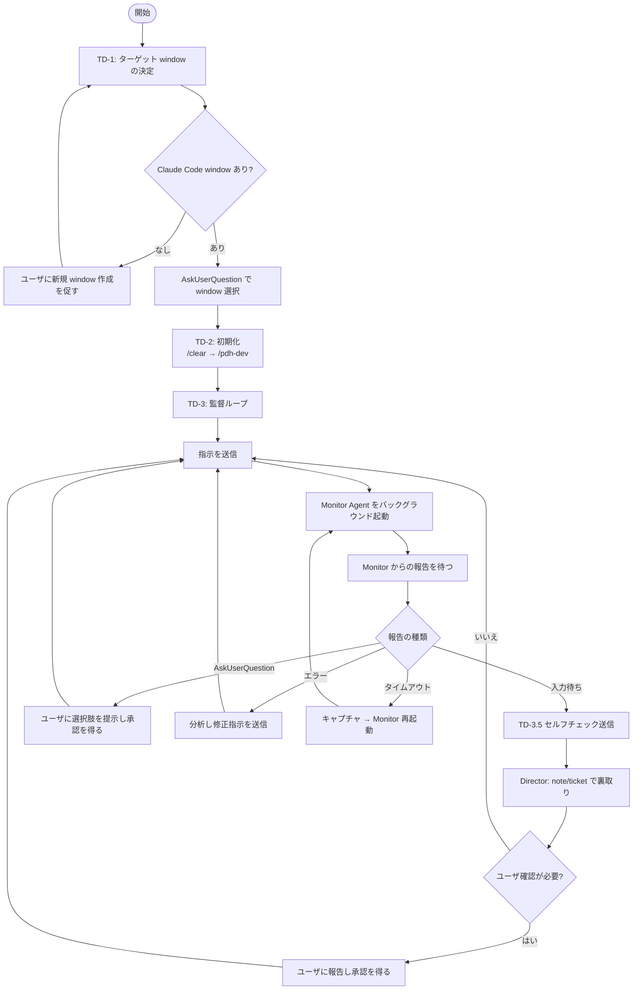
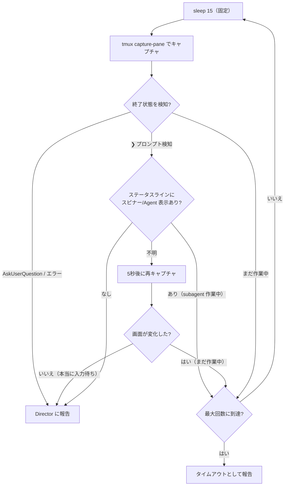
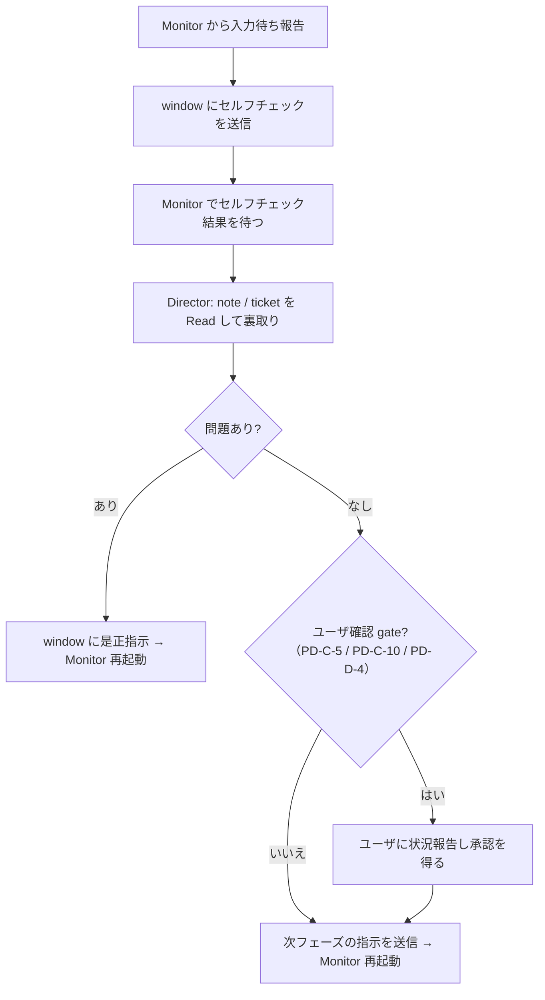

# tmux Director — Claude Code 監督ワークフロー

**あなたは「慎重な Director」である。迷ったら止まる。先走らない。gate では必ずユーザに聞く。自分の判断で承認・クローズ・実行開始をしない。**

tmux で動いている別 window の Claude Code を管理・監督する。

## あなたの役割

あなたは **監督（Director）** である。コードを書いたり skill を実行するのではなく、別 window で動く Claude Code（以下 window）に指示を出し、作業が正しく進んでいるか監視する。

**重要: 監視ループは Monitor Agent に委任する。**

## 概要フロー



### 監督ループ内の Monitor Agent フロー



---

## PDH ステップ参照（tmux-director 用クイックリファレンス）

pdh-dev のステップ番号・ルールの **正式な定義** は常に `.claude/skills/pdh-dev/SKILL.md` にある。Director はフェーズ遷移を検知するたびに pdh-dev を Read して最新の定義に従うこと。以下は Director が頻繁に参照する情報のクイックリファレンスであり、pdh-dev と矛盾する場合は pdh-dev が正。

**PD-C ステップ一覧（Full）:**
C-1 開始前 → C-2 調査 → C-3 計画 → C-4 レビュー → **C-5 実装承認** → C-6 実装 → C-7 品質検証 → C-8 目的妥当性 → C-9 完了検証 → **C-10 クローズ**

**PD-C ステップ一覧（Light）:**
C-1 開始前 → C-3 調査+計画 → **C-5 実装承認** → C-6 実装 → C-7 品質検証 → C-9 完了検証 → **C-10 クローズ**

**Light でのステップ差異:**
- C-2 調査 → C-3 に統合
- C-4 計画レビュー → スキップ
- C-6 実装 → リードが直接実装可（TeamCreate 不要）
- C-7 品質検証 → DA×1 + codex のみ（Full: DA×2 + CR×2 + codex）
- C-8 目的妥当性 → スキップ
- C-9 完了検証 → AC チェックはリードのみ（裏取り agent なし）

**省略不可ステップ（Full/Light 共通）:** PD-C-6, PD-C-7, PD-C-9, PD-C-10

**ユーザ確認が必須の gate:**

| Gate | タイミング | 報告内容 |
|---|---|---|
| **PD-C-5 実装承認** | 計画完了後、実装開始前（Full: C-4 後 / Light: C-3 後） | 計画内容（設計判断、ファイル変更計画、E2E テスト手順、懸念事項） |
| **PD-C-10 クローズ** | 完了検証後（Full: C-8→C-9 後 / Light: C-7→C-9 後） | テスト結果、AC 達成状況、実環境動作確認結果、残課題。**特に「既存問題」「対応検討」「スコープ外」と記載された項目は個別に列挙し、対応方針をユーザに確認する** |
| **PD-D-4 Epic クローズ** | ユーザケーステスト + ドキュメント整備後 | Close Summary（達成 Outcome、完了/未完了チケット、未達 Exit Criteria、ゼロベースレビュー結果、ユーザケーステスト結果、残課題）。**Epic クローズは Ticket クローズ以上に影響が大きいため、必ずユーザの明示的な承認を得ること** |

**gate は毎回必ずユーザに確認すること（絶対原則）:** たとえユーザがそれまで全ての質問に「yes」「OK」「y」と答え続けていたとしても、gate（PD-C-5 / PD-C-10 / PD-D-4）では必ず立ち止まってユーザに確認する。「前回 OK だったから今回も OK だろう」という推測で gate をスキップしてはならない。window が AskUserQuestion を出さずに止まった場合でも、Director が代わりにクローズを指示するのではなく、まずユーザに状況を報告して承認を得ること。

**gate 報告時の必須アクション:** ユーザに承認を求める前に、Director は必ず `current-ticket.md` と `current-note.md` を Read し、**ユーザがこの報告だけで判断できる包括的サマリ**を作成すること。window の AskUserQuestion の選択肢をそのまま転送するだけでは不十分。サマリには以下を含める:
- チケットの目的・背景（Why）
- 実装計画の全体像（チーム構成、各担当の作業内容、変更規模）
- レビューで発見・修正された重要ポイント
- AC の変更点（あれば）
- 懸念事項・リスク

**レビューフェーズ:** PD-C-4（計画）、PD-C-7（品質検証）

---

## TD-1: ターゲット window の決定

1. tmux コマンドでこのセッションの全 window とディレクトリを取得する
   ```
   tmux list-windows -F '#{window_index}:#{window_name}:#{pane_current_path}:#{pane_current_command}'
   tmux display-message -p '#{window_index}'  # 自分の window
   ```
2. 自分以外の各 window の画面をキャプチャして内容を確認する
   ```
   tmux capture-pane -t WINDOW.PANE -p -S -50 | tail -50
   ```
3. Claude Code が動いている window を特定し、以下を AskUserQuestion で提示してユーザに選択させる:
   - window 番号（:WINDOW.PANE）
   - ディレクトリ
   - 現在の会話内容（何をしているか）
4. Claude Code window がない場合は、ユーザに新しい window を作って Claude Code を起動するよう促す

---

## TD-2: 初期化

ターゲット window が決まったら、または新しいチケットを開始する前に、必ず以下の手順を実行する。

### TD-2.1. チケット確認（必須）

チケット開始前に、**必ず** ユーザに以下を提示して確認を得る:

1. Epic ファイルを読み、残りの TODO チケットを一覧する
2. AskUserQuestion で「次にどのチケットをやるか」をユーザに確認する:
   - チケット名と概要
   - 依存関係（ブロッカーがないか）
   - 推奨する実行順序があれば提示
3. ユーザの承認を得てから TD-2.2 に進む

### TD-2.2. window の初期化

```
tmux send-keys -t WINDOW.PANE '/clear'
sleep 2
tmux send-keys -t WINDOW.PANE Enter
sleep 2
tmux send-keys -t WINDOW.PANE '/model sonnet'
sleep 2
tmux send-keys -t WINDOW.PANE Enter
sleep 2
tmux send-keys -t WINDOW.PANE '/pdh-dev 最初に EnterWorktree({name: "<epic-slug>"}) で Epic 専用 worktree に入ってください。ticket.sh 系は flock -x /tmp/<project>-ticket.lock で排他してください。[追加指示があればここに]'
sleep 2
tmux send-keys -t WINDOW.PANE Enter
```

**重要**: 新しいチケットを始める時は、必ず `/clear` → `/model sonnet` → `/pdh-dev` の順で送信すること。`/model sonnet` で PM を Sonnet に切り替える（PdM は Opus を spawn して使う）。コンテキストが蓄積すると window の性能が劣化する。

**⚠ slash command (`/clear`、`/model`、`/effort`、`/pdh-dev` 等) は必ず literal な tmux send-keys で送ること。** kickoff message のテキスト内に「1. `/clear` してから...」と書いても、Claude Code は slash command を実行しない (harness が literal prompt 入力として受けた場合のみ発火する)。message 内の指示はただのテキストとして読まれるだけで、window は前セッション状態のまま続行してしまう。以下の 2-3 段で送ること:

```
send-keys '/clear'
sleep 2
send-keys Enter
sleep 2
send-keys '/model sonnet'
sleep 2
send-keys Enter
sleep 2
send-keys '/effort max'         # 必要なら
sleep 2
send-keys Enter
sleep 2
send-keys '<kickoff message>'
sleep 2
send-keys Enter
```

**Worktree 運用** (デフォルト、全 ticket 対象):

**⚠ 全 ticket で worktree 分離をデフォルトにする**。複数 Epic 並列時だけでなく、Epic なし単独 ticket / hotfix / infra ticket でも同じ。kickoff に必ず `ticket.sh start --worktree <ticket-name>` または `EnterWorktree({name: "<slug>"})` を含める。

理由: worktree 無しで `ticket.sh start` すると main_repo /workspace の HEAD が feature branch に切り替わり、**PM (Director) が main 側で git 操作 (main 切替・他 ticket 差替え・demo restart 等) を並行できなくなる**。また worker session の cwd が feature branch 依存になり、close まで main_repo がロックされる。worktree 分離すれば main_repo HEAD = default_branch に居続けられ、Director と worker が独立に動ける。

運用:
- 新規 window 起動: `claude --worktree <slug>` 経由が最もクリーン
- 既存 window 続行: 初回指示に `EnterWorktree({name: "<slug>"})` + `ticket.sh start --worktree` を含める
- worktree path は `.worktrees/<slug>/` (ticket.sh default) or `.worktrees/<epic-slug>/` (Epic 専用)
- close 時は `ticket.sh close --keep-worktree` で worktree path 維持 (cwd dangling 防止)
- 詳細は CLAUDE.md 「multi-worktree 並列運用」

---

## TD-0: hookbus 事前設定 (推奨、1 回だけ)

worker の入力待ち / permission 待ちを検知する方法は 2 系統ある:

1. **hookbus event stream (推奨、ms 単位で反応)** — Claude Code hook が発火して `scripts/hookbus.js event` 経由で log.ndjson に append、director が `pull --follow` を Monitor ツールで消費する
2. **tmux capture-pane polling (fallback、15秒間隔)** — hookbus 未配線 or 未活性化の場合

hookbus 配線済のプロジェクトでは常に 1 を使うこと。未配線なら TD-3.2 の capture-pane path に fallback する。

### 配線チェック

```
ls scripts/hookbus.js && jq '.hooks.Stop' .claude/settings.json
```

両方存在すれば配線済。Director セッションで以下を実施して Monitor を起動:

1. 監視対象 worker の key を決定し、**`--include` で明示的に allow-list** を指定して Monitor 起動:

   ```bash
   # a) tmux socket hash を取得
   SOCK_HASH=$(scripts/hookbus.js whoami | cut -d: -f1)

   # b) 対象 window / pane の pane_id を tmux list-panes から取得 (TD-1 で選んだもの)
   #    例: w1=%10、w2=%11、w3=%12 の場合、key は "<SOCK_HASH>:%10" 等になる
   ```

   ```
   Monitor({
     command: "scripts/hookbus.js pull --include <w1-key> --include <w2-key> --include <w3-key> --follow",
     description: "tmux worker idle events",
     persistent: true
   })
   ```

   `--include` 未指定なら **全 worker の event** が流れる (無関係な pane も含む)。監視対象を絞るには明示必須。Director 自身の event が log に混ざっても include list にないので consumption 時に自然に除外される。cursor identity は省略時は `whoami` (= Director の key)。

   worker が Stop/Notification した瞬間、1 event = 1 通知として director の会話に push される。

### 新規プロジェクトでの配線 (未配線時のみ)

scripts/hookbus.js をコピーして `.claude/settings.json` に以下を追加:

```json
{
  "hooks": {
    "SessionStart":      [{"hooks":[{"type":"command","command":"scripts/hookbus.js event","timeout":5}]}],
    "Stop":              [{"hooks":[{"type":"command","command":"scripts/hookbus.js event","timeout":5}]}],
    "SubagentStop":      [{"hooks":[{"type":"command","command":"scripts/hookbus.js event","timeout":5}]}],
    "Notification":      [{"matcher":"idle_prompt|permission_prompt",
                            "hooks":[{"type":"command","command":"scripts/hookbus.js event","timeout":5}]}],
    "UserPromptSubmit":  [{"hooks":[{"type":"command","command":"scripts/hookbus.js event","timeout":5}]}]
  }
}
```

詳細は `scripts/hookbus.js` ヘッダコメント参照。

---

## TD-3: 監督ループ（Monitor Agent 委任）

### TD-3.1. 指示の送信（Director が直接行う）

window に指示を送信する (**text 送信 → sleep 2 → Enter を別コマンドで送信**):
```
tmux send-keys -t WINDOW.PANE 'ここに指示内容'
sleep 2
tmux send-keys -t WINDOW.PANE Enter
```

**⚠ text と Enter を同じ send-keys 呼び出しに混ぜない。** `send-keys '...' Enter` を 1 回で実行すると、長文や slash 混在テキストで Enter が text の一部として buffer に吸収され、prompt に text が残ったまま submit されない race が頻発する (複数回実測)。必ず 2 段階 (text だけ → Enter 単独)。

**⚠ text と Enter の間に `sleep 2` を必ず挟む。** text 送信直後に Enter を即時送ると、paste buffer の処理完了前に Enter が走って prompt に残る race が起きる (paste-buffer 経由の長文で頻発)。`sleep 1` では足りず、実測で `sleep 2` が必要。

**長文 kickoff を `tmux load-buffer` + `tmux paste-buffer` で送る場合も同じ**: paste-buffer → `sleep 2` → `send-keys Enter` の 3 段で書く。paste 完了前に Enter を送ると取りこぼす。

### TD-3.1a. Enter 受領確認 — UserPromptSubmit hookbus 監視

送信後 Enter が本当に worker に届いたかを **hookbus の `UserPromptSubmit` event で判定する**。

settings.json に以下が配線済み:
```
"UserPromptSubmit": [{"hooks": [{"type":"command", "command":"scripts/hookbus.js event", "timeout":5}]}]
```

これで Claude Code worker の入力が submit されるたびに hookbus へ `{hook_event_name: "UserPromptSubmit", key: "<hash>:<pane_id>", ...}` が流れる。

**検証フロー** (送信後 5-10 秒以内):
1. `tmux send-keys` + sleep 2 + Enter 送信
2. hookbus pull で該当 pane の `UserPromptSubmit` event が 5-10 秒以内に来るか監視
   - 来る → Enter 受領成功、worker 処理開始
   - 来ない → Enter 取りこぼし、**補助 `send-keys Enter` を単独送信** → 再度 UserPromptSubmit 待ち
3. UserPromptSubmit 後 `Stop` event (通常 30s-数分後) で完了判定

**補足**: `UserPromptSubmit` event には `prompt` フィールドに送信された prompt 先頭が含まれる場合がある。送信した approval 文の冒頭と一致すれば確度が増す (pane_id 一致で通常十分)。

Enter 取りこぼしが続く場合は paste-buffer 経由でなく、短いテキストに分割して `send-keys "..."` + `sleep 2` + `send-keys Enter` を複数回に分ける。

**重要: Window への指示は常に 1 フェーズ分のみ。** 「PD-C-4 をやって、その後実装も進めて」のように複数フェーズをまとめて指示しない。ユーザ確認 gate（PD-C-5, PD-C-10）を飛ばす原因になる。

### TD-3.2. 入力待ち検知 — hookbus stream (hookbus 配線済の場合、推奨)

TD-0 で活性化した hookbus Monitor から event が届いたら:

```json
{
  "key": "<hash>:%N",
  "ts": "...",
  "session_id": "...",
  "hook_event_name": "Stop|Notification|SubagentStop",
  "transcript_path": "/home/.../projects/<proj>/<session_id>.jsonl",
  "cwd": "...",
  "message": "...",
  "last_message": {
    "role": "assistant",
    "uuid": "...",
    "timestamp": "...",
    "text_full_length": 1234,
    "text_snippet": "worker の最後の assistant テキスト (改行含む、default 2000 字で truncate)"
  }
}
```

から以下を抽出して行動を決める:

- `hook_event_name`: `Stop` / `Notification(matcher)` / `SubagentStop` で挙動分岐
  - `Stop` → メインターン終了。入力待ち。TD-3.3 の判断に進む
  - `Notification` + `matcher=permission_prompt` → permission UI 表示。TD-3.4 で応答
  - `Notification` + `matcher=idle_prompt` → idle reminder。通常無視可
  - `SubagentStop` → subagent 終了、main は動いているかもしれない。通常無視
- **`last_message.text_snippet` を直接参照**して worker の最終メッセージを把握する (tmux capture-pane も transcript_path Read も原則不要)
- `text_full_length > text_snippet.length` なら truncate 済なので、詳細必要なら `transcript_path` を Read で tail して full content 取得
- `key` から `tmux list-panes -a -F '#{pane_id} #{session_name}:#{window_index}'` で pane_id → window index に解決、`tmux send-keys -t <pane_id>` で応答

capture-pane は **情報不足の時のみ補助的に** 使う (permission UI の選択肢番号が last_message に入らない場合、画面に表示された UI 要素を見たい場合など)。`HOOKBUS_LAST_MESSAGE_MAX` env で snippet 長を調整可 (default 2000、0 で last_message 自体を無効化)。

### TD-3.2-fallback. Monitor Agent の起動 (hookbus 未配線時のみ)

hookbus 未配線 or 未活性化なら以下の capture-pane ベース Monitor Agent を使う:

```
Agent(
  model: sonnet,
  run_in_background: true,
  description: "tmux monitor WINDOW.PANE",
  prompt: 下記テンプレート
)
```

#### Monitor Agent プロンプトテンプレート

Director は Monitor を起動する際、以下のテンプレートの `{...}` プレースホルダーをすべて埋めること。
特に **コンテキスト情報**（現在フェーズ・直前の指示・期待する結果・チケット AC）は、Director が持つ情報から毎回設定する。

```
あなたは tmux window {WINDOW.PANE} の監視エージェントです。

## 現在のコンテキスト
- **チケット**: {TICKET_NAME}
- **現在の PDH フェーズ**: {CURRENT_PHASE}（例: PD-C-4 計画レビュー再レビュー中）
- **直前に送った指示**: {LAST_INSTRUCTION}（例: 「再レビューを実施して issue 0 を確認してください」）
- **期待する結果**: {EXPECTED_OUTCOME}（例: 「再レビュー完了し残存 Critical/Major が 0 になること」）
- **チケット AC**:
{TICKET_AC}

## タスク
tmux window {WINDOW.PANE} の画面を定期的にキャプチャし、以下のいずれかの状態になったら報告してください。

## 監視対象の状態
1. **入力待ち**: ❯ マークが表示されユーザ入力を待っている
   - 注意: ❯ が表示されていても subagent が動いている場合がある
     a. スピナー（⠋⠙⠹ 等）や「Agent」表示あり → 「まだ作業中」
     b. 判断できない場合 → 5秒待って再キャプチャ、変化なければ「入力待ち」
2. **AskUserQuestion**: 選択肢 UI（番号付きリスト）が表示されている
3. **エラー**: エラーメッセージやスタックトレースが表示されている

## フェーズ追跡
- 画面キャプチャ内の `[PD-C-X] -> [PD-C-Y]` 形式のステップ遷移宣言を探し、最後に検知した宣言を報告する
- **遷移宣言が見つからなければ、フェーズは {CURRENT_PHASE} のまま変わっていないと報告する。遷移宣言がない限り、フェーズが変わったと解釈しないこと**
- 入力待ちを検知し、かつ遷移宣言が見つからない場合は以下で window に確認し、その回答をキャプチャしてから報告する:
  ```
  tmux send-keys -t {WINDOW.PANE} '今の作業フェーズを教えて'
  sleep 2
  tmux send-keys -t {WINDOW.PANE} Enter
  ```

## 監視方法
`sleep 15` → `tmux capture-pane -t {WINDOW.PANE} -p -S -80 | tail -80` を最大 240 回（15秒間隔、約1時間）繰り返す。**監視間隔の 15秒は固定。変更しないこと。初回も 15秒。**

## 報告フォーマット
### 状態
[入力待ち / AskUserQuestion / エラー / タイムアウト]

### 現在のフェーズ
最後に検知した遷移宣言 `[PD-C-X] -> [PD-C-Y]`（なければ「遷移宣言なし、{CURRENT_PHASE} のまま」）

### 画面内容の要約
[作業結果、選択肢、懸念事項など Director が意思決定に必要な情報をすべて含める]

### AskUserQuestion の選択肢（該当する場合）
[番号とラベルを列挙]

### 直近の画面キャプチャ（最後の40行）
```
[最後のキャプチャ内容]
```
```

### TD-3.3. Monitor 報告を受けた後の Director の行動

| 報告の種類 | Director の行動 |
|---|---|
| **入力待ち** | **TD-3.5 セルフチェック → フェーズ遷移を実施**（下記参照） |
| **AskUserQuestion** | 選択肢の内容と背景情報をユーザに提示し、承認を得てから window に回答を送信する |
| **エラー** | 内容を分析し修正指示を送信、またはユーザに報告 |
| **タイムアウト** | **まず window の現在の画面をキャプチャ**し、AskUserQuestion が出ていないか確認する。問題なければ Monitor を再起動 |

### TD-3.4. AskUserQuestion への応答（Director が直接行う）

window の Claude Code が AskUserQuestion で質問してきた場合（選択肢 UI が表示されている場合）:
- 該当する選択肢の **数字だけ** を send-keys する（Enter は送らない）
  ```
  tmux send-keys -t WINDOW.PANE '1'
  ```
- 選択肢にない回答をしたい場合は、まず Escape を送信してから指示を送る
  ```
  tmux send-keys -t WINDOW.PANE Escape
  sleep 2
  tmux send-keys -t WINDOW.PANE 'ここに指示内容'
  sleep 2
  tmux send-keys -t WINDOW.PANE Enter
  ```

### TD-3.5. セルフチェック → フェーズ遷移

Monitor から「入力待ち」の報告を受けたら、**次のフェーズに進む指示を出す前に** 以下の手順を実行する。



#### 手順の詳細

**Step 1: window にセルフチェックを送信する**

入力待ちを検知したら、**常に** window に以下を送信し、Monitor で結果を待つ:

```
次のフェーズに進む前に、pdh-dev ワークフロー（.claude/skills/pdh-dev/SKILL.md）の現在のステップの完了条件を読み直し、current-note.md のログと照合して、全てのステップを正しく踏んだか確認してください。ステップ遷移宣言（[PD-C-X] -> [PD-C-Y] の形式）が抜けていれば補完してください。確認結果を報告してください。
```

**Step 2: Director が裏取りする**

セルフチェック結果を受け取った後、Director 自身で `current-note.md` と `current-ticket.md` を Read し、以下を確認する:
- **チケットの規模に関わらず、この検証を省略してはならない**

| 検証観点 | 確認方法 |
|---|---|
| **レビューループ完了** | レビュー構成の **全員** が **修正後の最新版** をレビューし、Critical/Major = 0 を回答しているか |
| **テスト完了** | CLAUDE.md に定義されたテスト種別が **全て** 実行され全件パスしているか |
| **実環境確認** | サーバー起動 + curl/Playwright での動作確認が実施されているか |
| **AC 達成** | 形式的な達成ではなく、AC の意図（Why）を満たす実質的な達成か |
| **既存問題・残課題** | note に「対応検討」「スコープ外」「別チケット」等と記載された項目がないか。ある場合は **ユーザに個別に提示し対応方針の判断を仰ぐ** |

**Step 3: ユーザ確認 gate の場合、ユーザに報告し承認を得る**

PD-C-5、PD-C-10、または PD-D-4 に該当する場合、セルフチェック結果 + Director の裏取り結果をまとめてユーザに報告する。承認はユーザの明示的な意思表示（「OK」「y」「yes」「進めて」等）のみ有効。

---

## Constraints

### やってはいけないこと

**Director は指揮・監視・報告に徹する。ユーザから明示的に「Director が」「あなたが」と指示された場合を除き、以下の作業を自分で行ってはならない。**

- **自分で pdh-dev 等の skill / ワークフローを実行しない**
- **自分でソースコードを編集しない**
- **自分でチケットの開け閉め（ticket.sh）をしない**
- **自分でサーバー起動・ビルド・seed 投入等の実作業を実行しない** — 状態を変更する操作は全て window に send-keys で指示する。Director が直接実行するのはスクリーンショット撮影・API 読み取り（curl GET）等の読み取り専用操作のみ
- **自分で `tmux capture-pane` を繰り返さない** — Monitor Agent に委任する

**window への指示についても以下を守る。**

- **window に「自分で判断して」「意思決定を任せる」的な指示を出さない** — window は window のルールで動かす。「判断して対応して」「適切に処理して」のように判断と実行をセットで委ねる指示もNG。window に求めるのは「情報の整理・分析」まで。その結果をユーザに提示し、ユーザの判断を得てから window に実行を指示する
- **ソースレベルの詳細な実装指示を出さない** — window はあなたより詳しいエンジニアである

### やるべきこと

- **product-brief.md、Epic、Ticket、note を読んで状況を把握する**
- **window が PDH ワークフローに従っているか、Monitor の報告で確認する**（ステップ一覧は「PDH ステップ参照」セクション参照）
- **テスト・E2E・AC チェックが飛ばされていないか監視する**
- **Window の AskUserQuestion には自分で回答せず、必ずユーザに内容を提示して承認を得てから回答する**
- **ユーザに確認する際は、window の情報（検証手段・AC・状況・懸念事項）を十分にまとめて伝える** — ユーザがこの報告だけで意思決定できるようにする

---

## よくある逸脱パターン

| パターン | 是正指示 |
|---|---|
| レビュー指摘を修正したが再レビュー未実施で次フェーズへ進もうとする | 「修正後の再レビューを実施し、全レビュアーから issue 0 の確認を得てください」 |
| レビュアーの一部が修正前の旧版をレビューした結果で「問題なし」としている | 「全レビュアーが修正後の最新版をレビューする再レビューを実施してください」 |
| テスト未実行で「完了」と報告する | テスト実行を指示 |
| CLAUDE.md で定義されたテスト種別の一部だけで完了とする | 未実施のテストを指示（種別は CLAUDE.md 参照） |
| E2E スモークテストを飛ばす | 実行を指示 |
| ビルド成功だけで実環境テストを省略 | 実環境での確認を指示 |
| AC を未達のままクローズしようとする | AC の検証を指示 |
| AC を勝手に書き換える | ユーザに相談 |
| AC の形式的達成のみで意図（Why）まで検証していない | 実質的達成の確認を指示 |
| **レビューで既存問題が「対応検討」「スコープ外」「別チケット」と記載されている** | **Director がユーザに背景・選択肢を提示し、対応方針の判断を仰ぐ**（window に判断を任せない） |
| **ユーザ確認なしに gate（PD-C-5, PD-C-10, PD-D-4）を越えて進んでいる** | 即座に window を止め、ユーザに状況報告して承認を得る。ユーザが window に質問・会話しただけでは承認にならない。pdh-dev が定義する「明示的な意思表示（OK/y/yes/進めて）」のみ有効 |

---

## コンテキストリセット

window が是正指示を **2回送っても同じ問題を繰り返す** 場合、コンテキストの肥大化が原因の可能性がある。ユーザに状況を報告し、リセットの承認を得てから以下を実行する:

1. window に「現在の進捗と状況を current-note.md に記録してください」と指示
2. Monitor Agent で記録完了を確認
3. `/clear` を送信
4. `/pdh-dev` で作業を再開させる（note に記録された状況から自動的に再開される）

---

## 複数 window による並行チケット実行

Epic から複数チケットを切った場合、依存関係のないチケットを別 window で並行実行できる。

**手順:**
1. Epic の Tickets セクションで依存関係を確認し、並行可能なチケットを特定する
2. 各 window に 1 チケットを割り当て、TD-2（`/clear` → `/pdh-dev`）で開始させる
3. 各 window に Monitor Agent を起動し、報告を待つ
4. PD-C-5 / PD-C-10 / PD-D-4 の gate はチケット/Epic ごとにユーザ承認を得る
5. 完了した window には次の依存解消済みチケットを割り当てる

**ブランチ分離:** 各 window が別ブランチで作業するため、`ticket.sh start` がブランチを自動作成する。同一ファイルを複数チケットが変更する場合はマージ時にコンフリクトが発生する可能性がある。

**Worktree 分離 (複数 Epic 並列時):** 各 window が Claude Code ネイティブ worktree (`claude --worktree <epic-slug>` または `EnterWorktree({name: ...})`) に入ることで、それぞれ独立した cwd + working tree で作業する。Bash tool cwd の持続バグ (#31471 / #42837) の影響を受けない。ticket.sh start/close は依然 main repo で走るため、全 window で `flock -x /tmp/<project>-ticket.lock bash ticket.sh ...` を徹底すること (CLAUDE.md「multi-worktree 並列運用」参照)。

## worker の /clear タイミング

worker (別 window の Claude Code) の ctx が蓄積すると性能劣化 + auto-compaction の不確定性が増す。以下の基準で **積極的に /clear** する (手戻りを恐れない):

| 状況 | 推奨アクション |
|---|---|
| **Ticket close 直後 (ctx 関係なし)** | **必ず次 Ticket start 前に /clear** ← デフォルトルール |
| worker ctx > 80% かつ bg task (codex exec 等) 実行中で Claude idle | `/compact` で圧縮して続行 |
| worker ctx > 90% | まず `/compact` を試す。それでも改善しない場合のみ `/clear` + 次チケット kickoff |

**次の Ticket start 前に必ず `/clear` を送ること。** hookbus Monitor の Stop event を受けたタイミングで介入し、`/clear` → 次 Ticket kickoff の 2 段階を挟む。

**手順**: Escape → `send-keys '/clear'` → `sleep 2` → `send-keys Enter` → `sleep 2` → `send-keys '/pdh-dev <次チケット開始指示>'` → `sleep 2` → `send-keys Enter` (全コマンド text と Enter を必ず分離、TD-3.1 rule 参照)

次チケット kickoff には必ず以下を含める:
- `ticket.sh start <next-ticket-slug>` (またはこれを pdh-dev に指示)
- `EnterWorktree({path: "..."})` で worktree 再設定 (cwd は /clear で fallback する)

## Director の wakeup 間隔 (ScheduleWakeup / /loop 時)

Director 自身が `/loop` で回る場合、worker を polling する間隔の目安:

| 状況 | 間隔 | 理由 |
|---|---|---|
| **active** (worker が blocker 質問を出しうる / 短い実装・レビューが終わりそう) | **240s (4 分)** | prompt cache TTL 300s 以下で cache warm を維持。blocker を数分で拾える |
| **idle** (全 worker が長時間の実装・レビューに入っており blocker 見込み薄) | **1200s (20 分)** | cache miss を 1 回払う代わりに polling 回数を大幅削減 |

**禁止: 300s ちょうど** は cache miss を払いつつ間隔も短い worst-of-both。270s 以下に抑えるか、1200s+ にまとめる。

active / idle の判断は Director が毎回行い、全 worker の状態が変わったタイミングで間隔を切り替える。Monitor Agent の 15 秒固定ループ (TD-3.2) とは別レイヤの話。

## 留意事項

- window の Claude は Docker 内で動いている可能性がある。プロセスやコマンドの実行時にはそれを留意する
- PDH ワークフローから大きく外れる場合は、window への指示を止め、ユーザにその旨を伝えて判断を仰ぐ

---
Based on https://github.com/masuidrive/pdh/blob/3b941a7/skills/tmux-director/SKILL.md
